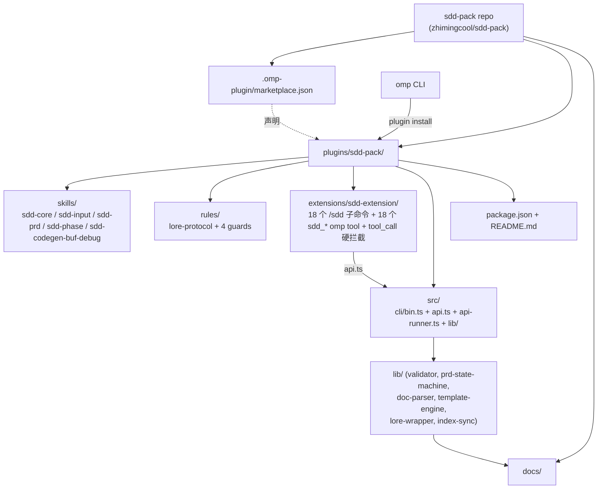
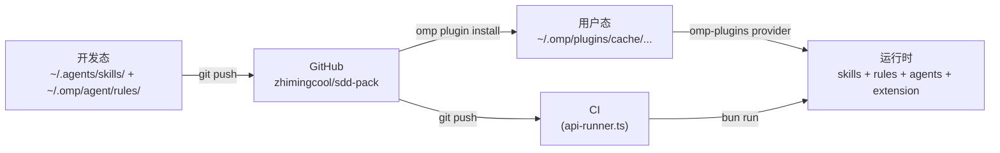

# 架构总览

> 修改记录：执行 `lore log docs/architecture/overview.md`

本文档描述 sdd-pack 仓库（`zhimingcool/sdd-pack`）当前架构。`sdd-pack` 是一个 omp marketplace 插件，由 **SDD 单范式资产**组成：

- **静态范式**：5 个 SDD skill + 5 个 rule + 3 个守门 agent
- **动态范式**：1 个 omp extension（1 个 `/sdd` 主命令 + 18 个子命令路由 + 18 个 `sdd_*` omp tool + `tool_call` 硬拦截）+ 程序化 API 层（`api.ts` re-export barrel）+ CLI 入口（`bin.ts` → `bunx sdd`）+ CI 入口（`api-runner.ts`）
- **门禁子系统**（v1.5.0 新增）：gate-config + gate-runner，把 lint → test → review → precommit → commit 变为 omp slash command / tool 调用结果阻断（详见 [sdd-gate 架构](sdd-gate.md)）

所有资产共享同一份 `src/cli/lib/*` 核心库。

## 1. 系统定位

**SDD 文档生命周期 + 三层代码质量评审 + 门禁流水线的 OMP 分发容器**。通过 omp marketplace 机制，让用户用 `omp plugin install sdd-pack@sdd-pack` 一条命令获得：SDD 技能家族（sdd-core/input/prd/phase/codegen-buf-debug）、lore 提交协议（extension `tool_call` 拦截）、PRD/Phase 状态行守门、三层守门 agent、1 个 `/sdd` 主命令 + 18 个子命令、18 个 `sdd_*` omp tool（ADR-019）、`bunx sdd` 短命令入口（ADR-019）。

## 2. 架构原则

- **静态优先 + 动态薄壳**：plugin 内容以静态 Markdown 资产（SKILL.md / rule / agent）为主；运行时逻辑集中在 `extensions/sdd-extension/index.ts`（声明式 omp 扩展，含 `tool_call` 硬拦截 + `session_start` 注入），业务逻辑下沉到 `src/cli/api.ts` re-export barrel + `api-flow.ts` + `api-legacy.ts`。
- **零副作用**（除进程内 spawnSync）：plugin 不声明 MCP servers / LSP servers；通过 `pi.registerTool` 声明 18 个 `sdd_*` omp tool（ADR-019，与 read/write/bash 同协议）；唯一进程级副作用是 `api-runner.ts` 触发的 `bun run`。
- **路径透明**：所有路径遵循 omp 标准布局（`skills/<name>/SKILL.md`、`rules/*.md`、`agents/*.md`），extension 入口遵循 `omp.extensions` manifest 约定。
- **单范式共享内核**：静态资产（skill/rule/agent）通过 OMP 协议分发，动态入口（extension/api-runner）通过 `src/cli/lib/*` 共享核心库（`validator.ts` / `prd-state-machine.ts` / `doc-parser.ts` / `template-engine.ts` / `lore-wrapper.ts`）。

## 3. 系统架构

### 3.1 仓库全景图



### 3.2 角色与入口

| 角色                 | 路径                                | 操作                                |
| -------------------- | ----------------------------------- | ----------------------------------- |
| 开发者（norman）     | 仓库根目录                          | `omp plugin link ./plugins/sdd-pack` |
| omp 加载器           | `~/.omp/plugins/cache/...`          | 装载 skills/ + rules/ + agents/ + extension |
| CI 自动化 / 外部项目  | `.github/` 或外部项目根            | `bunx sdd <cmd>`（bin.ts 入口，ADR-019）   |

### 3.3 技术栈

| 层级        | 技术选型                   | 说明                                       |
| ----------- | -------------------------- | ------------------------------------------ |
| 分发容器    | omp marketplace            | `.omp-plugin/marketplace.json`             |
| 资产描述    | Markdown + YAML frontmatter | SKILL.md / rule / agent                    |
| 扩展运行时  | TypeScript + omp API       | `pi.registerCommand` / `pi.registerTool` / `pi.on(...)` |
| 程序化层    | TypeScript + bun           | `bun --version` 验证；`bun test` 跑单测    |
| 校验脚本    | bash 3.2                   | `docs-check.sh`（兼容 macOS 默认 bash）     |
| 版本管理    | git tag = plugin version   | SemVer                                     |

## 4. 核心模块

### 4.1 模块清单

| 模块                | 职责                                       | 路径                                                          |
| ------------------- | ------------------------------------------ | ------------------------------------------------------------- |
| marketplace catalog | 声明 sdd-pack plugin                       | `.omp-plugin/marketplace.json`                                |
| SDD skills          | 5 个 SDD 技能（核心/输入/PRD/Phase/codegen-buf-debug） | `plugins/sdd-pack/skills/{sdd-core,sdd-input,sdd-prd,sdd-phase,sdd-codegen-buf-debug}/SKILL.md` |
| rules               | 5 个 rule（lore 协议 + 4 个守门）            | `plugins/sdd-pack/rules/*.md`                                 |
| 三层守门 agent      | reviewer / arch-reviewer / sdd-reviewer    | `plugins/sdd-pack/agents/{reviewer,arch-reviewer,sdd-reviewer}.md` |
| docs-check.sh       | 文档结构校验脚本（sdd-core 引用）            | `plugins/sdd-pack/skills/sdd-core/references/docs-check.sh`   |
| sdd-extension       | 1 个 `/sdd` 主命令 + 18 个子命令路由（sdd-router.ts）+ 18 个 `sdd_*` omp tool（tools.ts，ADR-019）+ 3 个 `tool_call` 拦截 + `session_start` 注入 | `plugins/sdd-pack/extensions/sdd-extension/{index,sdd-router,tools}.ts` |
| sdd-api             | api.ts 82 行 re-export barrel（api-flow.ts 1113 行 + api-legacy.ts 531 行） | `plugins/sdd-pack/src/cli/api.ts`                             |
| api-runner          | `bun run` CI 入口                          | `plugins/sdd-pack/src/cli/api-runner.ts`                      |
| **gate-config**     | gate.json 读取 + 项目类型自动检测          | `plugins/sdd-pack/src/cli/lib/gate-config.ts`                 |
| **gate-runner**     | 5 阶段门禁执行器                           | `plugins/sdd-pack/src/cli/lib/gate-runner.ts`                 |
| 核心库              | validator / prd-state-machine / doc-parser / template-engine / lore-wrapper / index-sync / orchestration/* / **gate-config / gate-runner** | `plugins/sdd-pack/src/cli/lib/` |

### 4.2 依赖方向

```
extensions/sdd-extension/index.ts
src/cli/api-runner.ts
        ↓
src/cli/api.ts
        ↓
src/cli/lib/{validator, prd-state-machine, doc-parser, template-engine, lore-wrapper, index-sync}.ts
src/cli/lib/orchestration/{git, scan, gates, archive-ops, format, parseArgs, path}.ts
src/cli/lib/api-types.ts
```

禁止反向上行：api.ts 不依赖 omp / ExtensionAPI，不调 `process.exit` / `console.*`。

## 5. 数据架构

### 5.1 Plugin catalog

```json
// .omp-plugin/marketplace.json（节选 plugins[0]）
{
  "name": "sdd-pack",
  "metadata": {
    "description": "sdd-pack 一体化开发管理工具：SDD 技能家族(sdd-core/input/prd/phase/codegen-buf-debug) + 三层守门 agent + SDD extension(/sdd 主命令) + SDD CI runner",
    "version": "1.8.0",
    "pluginRoot": "plugins"
  },
  "plugins": [
    {
      "name": "sdd-pack",
      "version": "1.8.0",
      "assets": {
        "skills": ["sdd-core", "sdd-input", "sdd-prd", "sdd-phase", "sdd-codegen-buf-debug"],
        "rules": ["lore-protocol", "docs-update-guard", "lore-commit-guard", "sdd-doc-edit-guard", "prd-change-management"],
        "agents": ["reviewer", "arch-reviewer", "sdd-reviewer"],
        "commands": ["/sdd"],
        "hooks": []
      },
      "paradigm": { "primary": "sdd" },
      "reviewer_layers": {
        "layer_1_commit": { "agent": "reviewer", "blocking": true },
        "layer_2_pr_plan": { "agent": "arch-reviewer", "blocking": false },
        "layer_3_merge_phase": { "agent": "sdd-reviewer", "blocking": false }
      },
      "rule_enforcement": { "model": "ttsr", "explanation": "5 个 rule 全部是 TTSR 软门禁；程序级硬门禁由 extension 内嵌 pi.on(\"tool_call\") 拦截提供" }
    }
  ]
}
```

### 5.2 Plugin manifest

```json
// plugins/sdd-pack/package.json
{
  "name": "sdd-pack",
  "version": "1.8.0",
  "files": ["skills", "rules", "agents", "extensions", "src", "README.md"],
  "scripts": { "test": "bun test", "gen:commands": "bun run scripts/gen-commands-json.ts" },
  "bin": { "sdd": "./src/cli/bin.ts" },
  "omp": { "extensions": ["./extensions/sdd-extension/index.ts"] },
  "devDependencies": { "@types/bun": "^1.3.14", "@types/node": "^26.1.1" }
}
```

### 5.3 存储

| 数据类型               | 存储位置                                | 说明                              |
| ---------------------- | --------------------------------------- | --------------------------------- |
| Plugin 源码            | GitHub repo                             | 唯一权威源                        |
| 已安装 plugin 缓存     | `~/.omp/plugins/cache/...`              | omp 自动管理                      |
| 用户态 skills/rules    | `~/.agents/skills/` + `~/.omp/agent/rules/` | 开发态保留，README 说明迁移    |
| `api.ts` 完整 TypeScript 契约 | `plugins/sdd-pack/src/cli/lib/api-types.ts` | 8 个 Result/Options 类型 + `ValidationResult` 等 |

## 6. 集成架构

- **与 omp 插件系统**：marketplace catalog（`.omp-plugin/marketplace.json`）声明 plugin；`package.json#omp.extensions` 注册 extension 入口；`omp plugin install/enable/disable/upgrade` 管理生命周期；`omp plugin link` 调试。
- **与 lore 提交协议**：`extensions/sdd-extension/index.ts` 在 `pi.on('tool_call')` 匹配 `(git|lore)\s+commit` 时返回 `{block:true, reason}` 硬拦截（ADR-015/020）；`src/cli/lib/lore-wrapper.ts` 封装 `lore commit` 调用。
- **与文档系统**：`extensions/sdd-extension/index.ts` 在 `write/edit` 命中 `docs/**` 时提示走 `skill://sdd-core` 流程；`api.ts` 导出的函数直接操作 `docs/prd/`、`docs/phase/`、`docs/spec/`。
- **与 CI**：`bun run src/cli/api-runner.ts <cmd>` 转发到 `api.ts`；退出码由 `ValidationResult.status` 决定（`block`→exit 2、`error`→exit 1、其他→exit 0）。

## 7. 部署架构



| 环境   | 用途                          | 入口                                            |
| ------ | ----------------------------- | ----------------------------------------------- |
| 仓库态 | GitHub `zhimingcool/sdd-pack` | git push + tag                                  |
| 链接态 | 本地开发调试                  | `omp plugin link ./plugins/sdd-pack`            |
| 用户态 | 其他用户安装                  | `omp plugin install sdd-pack@sdd-pack`          |
| CI 态  | 自动化裁决                    | `bun run src/cli/api-runner.ts <cmd>`           |

## 8. 安全架构

- **静态资产零执行**：rules / agents 是 Markdown + frontmatter，无可执行代码；`docs-check.sh` 是只读校验脚本。
- **进程级副作用**：`api-runner.ts` 是唯一外部进程入口（`bun run`），不引入新 sandbox 边界；`api.ts` 不调 `process.exit` / `console.*`，由调用方决定输出与退出码。
- **写入路径约束**：`extensions/sdd-extension/index.ts` 的 `pi.on('tool_call')` 对 `write/edit` 命中 `docs/prd|phase` 状态行返回 `{block:true}` 硬拦截（ADR-018），避免 agent 绕过 SDD 状态机。
- **Commit 守门**：`extensions/sdd-extension/index.ts` 的 `pi.on('tool_call')` 对 `git|lore commit` 返回 `{block:true}` 硬拦截（ADR-015/020），强制走 `/sdd gate commit` 流水线。
- **安装来源**：仅信任 GitHub `zhimingcool/sdd-pack` 仓库；README 明确安装命令与校验方式。
