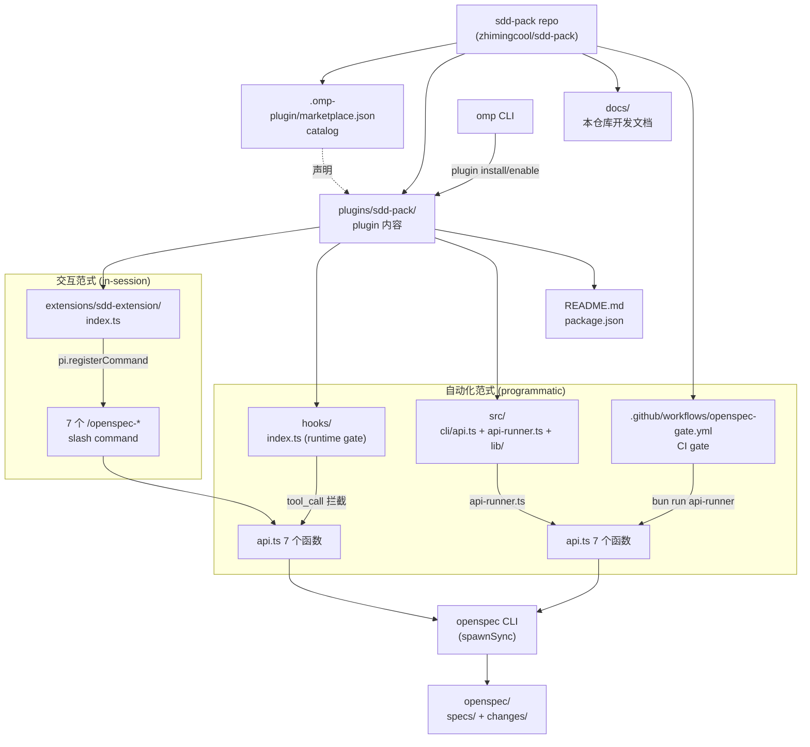
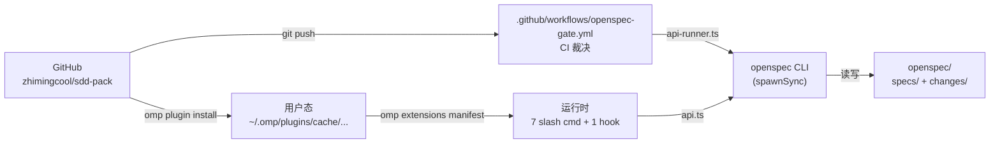

# 架构总览

> 修改记录：执行 `lore log docs/architecture/overview.md`

本文档描述 sdd-pack 仓库（`zhimingcool/sdd-pack`）当前架构。`sdd-pack` 是一个 omp marketplace 插件，其产品形态是 **OpenSpec OMP Harness**：把 OpenSpec CLI 的能力以「omp 扩展 slash command + 运行时 hook gate + CI 逃生通道」三种入口暴露给用户。

## 1. 系统定位

**OpenSpec 规范生命周期的 OMP 运行时入口集合**。通过 omp marketplace 机制，让用户用 `omp plugin install sdd-pack@sdd-pack` 一条命令获得：

- 7 个 `/openspec-*` slash command（OMP 会话内）
- 1 个运行时 hook gate（工具调用时拦截）
- 1 个 CI 逃生通道（自动化场景）

三方入口共享同一份 `src/cli/api.ts` 程序化层，对 OpenSpec CLI 做薄壳封装。

## 2. 架构原则

- **静态优先 + 程序化薄壳**：plugin 主体由 `extensions/`（声明式 omp 扩展）+ `hooks/`（声明式 omp 钩子）组成；运行时逻辑集中在 `src/cli/api.ts` 薄壳层，对 OpenSpec CLI 做 `spawnSync` 转发。
- **零副作用**（除 OpenSpec CLI 进程）：plugin 不声明 MCP servers / LSP servers / custom tools；唯一进程级副作用是 `spawnSync` 调用 `openspec` CLI。
- **路径透明**：所有路径遵循 omp 标准布局（`extensions/`、`hooks/`、`src/`），extension 入口遵循 `omp.extensions` manifest 约定。
- **双范式入口**（in-session / programmatic）：
  - **交互范式**：OMP 会话内通过 `/openspec-*` slash command 触发，handler 调 `api.ts` 函数
  - **自动化范式**：CI / hook / 脚本通过 `src/cli/api-runner.ts` 调 `api.ts` 函数；与交互范式共享同一份纯函数实现与同一份 `parseArgs` 解析

## 3. 系统架构

### 3.1 仓库全景图



### 3.2 入口与角色

| 入口类型         | 形态                              | 入口点                                      | 触发方式                                |
| ---------------- | --------------------------------- | ------------------------------------------- | --------------------------------------- |
| 交互范式         | OMP slash command                 | `extensions/sdd-extension/index.ts`         | 用户在 OMP 会话中敲 `/openspec-*`        |
| 自动化范式 — 运行时 | omp extension hook（拦截）         | `hooks/index.ts`                            | OMP 工具调用 `bash`/`write`/`edit` 触发 |
| 自动化范式 — CI   | bun CLI（薄壳）                   | `src/cli/api-runner.ts`                     | `bun run src/cli/api-runner.ts <cmd>`   |
| 自动化范式 — CI   | GitHub Actions                    | `.github/workflows/openspec-gate.yml`      | PR / push 触发                          |

### 3.3 启用条件

OpenSpec gate 启用需同时满足：

- 当前目录是 Git 仓库（存在 `.git/`）
- 已完成 OpenSpec init（存在 `openspec/specs/` 与 `openspec/changes/`）

未启用时，hook 给出 advisory 提示，不进入强阻断；slash command 返回 `status: "warn"` 并附带 `reason`。

### 3.4 技术栈

| 层级         | 技术选型                  | 说明                                                  |
| ------------ | ------------------------- | ----------------------------------------------------- |
| 分发容器     | omp marketplace           | GitHub 仓库 + `.omp-plugin/marketplace.json`          |
| 扩展声明     | TypeScript + omp API      | `pi.registerCommand` / `pi.on("tool_call", ...)`      |
| 运行时       | TypeScript + bun          | `bun --version` 验证；`bun test` 跑单测               |
| 引擎后端     | OpenSpec CLI（外部依赖）   | `spawnSync("openspec", [...args])`                    |
| 进程入口     | `bun run api-runner.ts`   | CI 场景进程入口；非 bash wrapper，bun 一行即用         |
| 版本管理     | git tag = plugin version  | 语义化版本（SemVer）                                  |

## 4. 核心模块

### 4.1 模块清单

| 模块名称                | 职责                                                | 路径                                                |
| ----------------------- | --------------------------------------------------- | --------------------------------------------------- |
| marketplace catalog     | 声明 sdd-pack plugin                               | `.omp-plugin/marketplace.json`                      |
| sdd-extension（交互范式） | 注册 7 个 `/openspec-*` slash command              | `plugins/sdd-pack/extensions/sdd-extension/index.ts` |
| hooks（自动化范式-运行时）| 拦截 `bash` / `write` / `edit` 工具调用，强制走 OpenSpec | `plugins/sdd-pack/hooks/index.ts`                |
| api.ts（共享程序化层）   | 7 个纯函数，供 extension / hook / api-runner 共享  | `plugins/sdd-pack/src/cli/api.ts`                   |
| api-runner（自动化范式-CI） | `bun run` 入口，路由到 `api.ts` 7 个函数        | `plugins/sdd-pack/src/cli/api-runner.ts`            |
| lib/（核心库）           | 类型 + OpenSpec CLI 包装 + 项目检测 + arg 解析     | `plugins/sdd-pack/src/cli/lib/`                     |
| CI workflow             | PR/push 触发 init-check + validate + status        | `.github/workflows/openspec-gate.yml`               |
| 单元测试                | extension handler + api.ts 行为                    | `plugins/sdd-pack/extensions/sdd-extension/index.test.ts` + `plugins/sdd-pack/src/cli/__tests__/` |
| README.md               | 用户面向的安装/使用/验证说明                        | `plugins/sdd-pack/README.md`                        |
| package.json            | 满足 `omp plugin link` + `omp.extensions` manifest | `plugins/sdd-pack/package.json`                     |

### 4.2 模块关系

- **`extensions/sdd-extension/index.ts`** 调 `api.ts` 7 个函数（交互范式唯一入口）
- **`hooks/index.ts`** 调 `api.ts` 的 `getInitState` / `validateProject` / `getStatus`（运行时 gate 入口）
- **`src/cli/api-runner.ts`** 调 `api.ts` 7 个函数（CI 入口）
- **`src/cli/api.ts`** → `src/cli/lib/orchestration/openspec-cli.ts`（spawnSync 包装 OpenSpec CLI）
- **`src/cli/api.ts`** → `src/cli/lib/orchestration/openspec-project.ts`（Git + OpenSpec init 产物检测）
- **`src/cli/lib/orchestration/parseArgs.ts`** 被 `extensions/sdd-extension/index.ts` 与 `src/cli/api-runner.ts` 共享（统一 arg 解析）

依赖方向（自上而下，禁止反向上行）：

```
extensions/sdd-extension/index.ts
hooks/index.ts
src/cli/api-runner.ts
        ↓
src/cli/api.ts
        ↓
src/cli/lib/orchestration/{openspec-cli, openspec-project, parseArgs}.ts
src/cli/lib/api-types.ts
```

## 5. 数据架构

### 5.1 Plugin catalog

```json
// .omp-plugin/marketplace.json
{
  "name": "sdd-pack",
  "owner": { "name": "norman" },
  "metadata": {
    "version": "1.5.0-alpha",
    "pluginRoot": "plugins"
  },
  "plugins": [
    {
      "name": "sdd-pack",
      "description": "OpenSpec OMP harness: extension slash commands + runtime hook gate + CI runner",
      "source": "./sdd-pack",
      "category": "development"
    }
  ]
}
```

### 5.2 Plugin manifest

```json
// plugins/sdd-pack/package.json
{
  "name": "sdd-pack",
  "version": "1.5.0-alpha",
  "description": "OpenSpec OMP harness: extension slash commands + runtime hook gate + CI runner",
  "files": ["hooks", "extensions", "src", "README.md"],
  "omp": {
    "extensions": [
      "./extensions/sdd-extension/index.ts",
      "./hooks/index.ts"
    ]
  }
}
```

### 5.3 `api.ts` 对外契约

```ts
// src/cli/lib/api-types.ts
export type GateStatus = "pass" | "warn" | "error" | "block";

export interface OpenSpecProjectState {
  enabled: boolean;        // isGitRepo && hasOpenSpecDirs
  isGitRepo: boolean;
  hasOpenSpecDirs: boolean;
  reason?: string;         // 未启用时的解释
}

export interface OpenSpecCommandResult<T = unknown> {
  status: GateStatus;      // exitCode 0→pass, 2→block, 其他→error; 未启用→warn
  summary: string;         // stdout/stderr 第一行
  command: string;         // 实际执行的 OpenSpec CLI 命令
  raw: T;                  // JSON 解析结果或纯文本
  stderr?: string;
}

// 7 个导出函数
export function getInitState(cwd?: string): Promise<OpenSpecProjectState>;
export function validateProject(opts?: ValidateOptions): Promise<OpenSpecCommandResult<unknown>>;
export function getStatus(): Promise<OpenSpecCommandResult<unknown>>;
export function listChanges(opts?: ListOptions): Promise<OpenSpecCommandResult<unknown>>;
export function showItem(opts: ShowOptions): Promise<OpenSpecCommandResult<unknown>>;
export function getInstructions(opts?: InstructionOptions): Promise<OpenSpecCommandResult<unknown>>;
export function archiveChange(opts: ArchiveOptions): Promise<OpenSpecCommandResult<unknown>>;
```

### 5.4 数据存储

| 数据类型                | 存储方案                              | 说明                              |
| ----------------------- | ------------------------------------- | --------------------------------- |
| Plugin 源码             | GitHub repo                           | 唯一权威源                        |
| 已安装 plugin 缓存      | `~/.omp/plugins/cache/...`            | omp 自动管理                      |
| OpenSpec 规范产物       | `openspec/specs/` + `openspec/changes/` | 由 OpenSpec CLI 管理；hook 拦截直接写入 |
| 启用状态检测            | 检测 `.git/` + `openspec/{specs,changes}/` 存在性 | 无状态文件，纯文件系统检测 |

## 6. 集成架构

### 6.1 与 omp 插件系统集成

| 集成点             | 方式                                                | 形态         |
| ------------------ | --------------------------------------------------- | ------------ |
| marketplace catalog | `.omp-plugin/marketplace.json`                      | omp 优先读取 |
| 扩展装载          | `package.json#omp.extensions`                       | omp loader 直接 require TS 入口   |
| 扩展发现          | omp extension API（`pi.registerCommand`）           | 7 个 command 在 factory 同步注册  |
| 钩子装载          | `package.json#omp.extensions`（hooks/index.ts 作为扩展） | 运行时拦截 `tool_call` 事件 |
| Plugin 生命周期   | `omp plugin install/enable/disable/upgrade`         | 标准 plugin 流程 |
| 开发模式          | `omp plugin link ./plugins/sdd-pack`                | 符号链接本地目录 |

### 6.2 与 OpenSpec CLI 集成

| 集成点          | 方式                          | 触发位置                                          |
| --------------- | ----------------------------- | ------------------------------------------------- |
| CLI 进程调用    | `spawnSync("openspec", [...args])` | `src/cli/lib/orchestration/openspec-cli.ts` |
| exit code 映射  | `0→pass`, `2→block`, 其他→`error` | `src/cli/api.ts#mapExitCode`               |
| 启用条件检测    | `isGitRepo && hasOpenSpecDirs` | `src/cli/lib/orchestration/openspec-project.ts` |
| 未启用降级      | 返回 `status: "warn"` + `reason` | `src/cli/api.ts`（每个函数的 early return）    |

### 6.3 7 个 slash command ↔ API 映射

| Slash command            | API 函数              | 用途                                  |
| ------------------------ | --------------------- | ------------------------------------- |
| `/openspec-init-check`   | `getInitState()`      | 检查当前仓库是否启用 OpenSpec gate    |
| `/openspec-status`       | `getStatus()`         | 查看 OpenSpec 项目状态                |
| `/openspec-validate`     | `validateProject({ target? })` | 校验 OpenSpec 项目（可选 target） |
| `/openspec-list`         | `listChanges()`       | 列出 OpenSpec 变更                    |
| `/openspec-show <target>`| `showItem({ target })`| 查看指定 change 或 spec               |
| `/openspec-instructions [target]` | `getInstructions({ target? })` | 获取 OpenSpec 下一步指引       |
| `/openspec-archive <change-id>` | `archiveChange({ changeId })` | 归档指定 change                |

### 6.4 CI 集成

`.github/workflows/openspec-gate.yml` 在 PR 与 push 到 main 时执行：

```bash
bun --version
bun test plugins/sdd-pack/extensions/sdd-extension/index.test.ts \
        plugins/sdd-pack/src/cli/__tests__/api.test.ts
bun run plugins/sdd-pack/src/cli/api-runner.ts init-check
bun run plugins/sdd-pack/src/cli/api-runner.ts validate
bun run plugins/sdd-pack/src/cli/api-runner.ts status
```

`api-runner.ts` 退出码映射：`status=block`→`exit 2`，`status=error`→`exit 1`，其他→`exit 0`，作为 CI 裁决依据。

## 7. 部署架构

### 7.1 分发拓扑



### 7.2 环境

| 环境   | 用途                          | 入口                                            |
| ------ | ----------------------------- | ----------------------------------------------- |
| 仓库态 | GitHub `zhimingcool/sdd-pack` | git push + tag                                  |
| 链接态 | 本地开发调试                  | `omp plugin link ./plugins/sdd-pack`            |
| 用户态 | 其他用户安装                  | `omp plugin install sdd-pack@sdd-pack`          |
| CI 态  | PR / push 自动化裁决          | `.github/workflows/openspec-gate.yml`           |

## 8. 安全架构

### 8.1 进程级副作用约束

- plugin 不声明 MCP servers / LSP servers / custom tools
- 唯一进程级副作用是 `spawnSync("openspec", [...args])`（`src/cli/lib/orchestration/openspec-cli.ts`）
- `api-runner.ts` 仅转发到 `api.ts` 纯函数；不引入新进程边界

### 8.2 写入路径约束

`hooks/index.ts#describeWriteGuard` 强制 `openspec/specs/`、`openspec/changes/`、`AGENTS.md` 的写入只能通过 `/openspec-*` slash command 或 `openspec` CLI 完成：

- **未启用 OpenSpec**：advisory 提示（不阻断，提示用户先 init）
- **已启用 OpenSpec**：硬阻断（`throw new Error`），强制走 `openspec` CLI

### 8.3 Commit gate 约束

`hooks/index.ts#runOpenSpecValidationGate` 在 `git commit` 触发时调 `validateProject()` + `getStatus()`，任一返回 `error`/`block` 即 throw 阻断：

- **未启用 OpenSpec**：不进入 gate（不误伤未初始化的项目）
- **已启用 OpenSpec**：`status=block`/`error` 时 throw，强制 OpenSpec 校验通过才能 commit

### 8.4 安装来源

仅信任 GitHub `zhimingcool/sdd-pack` 仓库。README 明确说明安装命令、CI 验证步骤与 hooks/`api-runner` 入口。
