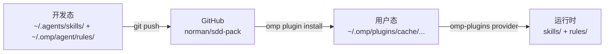

# 架构总览

> 修改记录：执行 `lore log docs/architecture/overview.md`

本文档描述 sdd-pack 仓库的架构定位、目录布局与分发机制。sdd-pack 是一个 omp marketplace 插件仓库，本身的"产品"是一个插件（`plugins/sdd-pack/`），其内容是 4 个 SDD skills + 5 个 rules + docs-check.sh + 三层守门 agent（reviewer/arch-reviewer/sdd-reviewer）。

## 1. 系统定位

sdd-pack 的核心定位：**SDD 技能家族 + lore 提交规则 + 三层代码质量守门 agent 的版本化分发容器**。通过 omp marketplace 机制，让其他用户用 `omp plugin install sdd-pack@sdd-pack` 一条命令获得完整的 SDD 工具链与代码评审能力。

## 2. 架构原则

- **静态优先**：plugin 内容以静态文件为主（SKILL.md + rule markdown + bash 脚本），同时支持 TypeScript 运行时模块（**v1.4.0 起**：`src/cli/api.ts` 程序化入口 + `extensions/sdd-extension/index.ts` omp extension 工厂 + `hooks/index.ts` 已存在的 TypeScript 聚合）。
- **零副作用**：plugin 不声明 MCP servers / LSP servers / custom tools。**v1.4.0 起**新增一个 omp extension (`pi.registerCommand` 注册 8 个 slash command + `pi.sendMessage` / `ctx.ui.notify` 输出），不引入 MCP/LSP 副作用。
- **路径透明**：所有 skills/rules 路径遵循 omp 标准布局，便于 provider 发现。extension 入口遵循 `omp.extensions` manifest 约定（[omp-extension-api.md §1.2](../reference/omp-extension-api.md)）。
- **迁移可逆**：原位置 `~/.agents/skills/` 与 `~/.omp/agent/rules/` 保留为开发态，sdd-pack 仓库为分发态，互不干扰。

## 3. 系统架构

### 3.1 仓库全景图

```mermaid
graph TB
    Repo["sdd-pack repo (norman/sdd-pack)"] --> Catalog[".omp-plugin/marketplace.json<br/>catalog"]
    Repo --> Plugin["plugins/sdd-pack/<br/>plugin 内容"]
    Repo --> Docs["docs/<br/>本仓库开发文档"]
    Plugin --> Skills["skills/<br/>sdd-core/input/prd/phase"]
    Plugin --> Rules["rules/<br/>lore-protocol + 3 guards + prd-change-management"]
    Plugin --> Agents["agents/<br/>reviewer/arch-reviewer/sdd-reviewer"]
    Plugin --> Script["skills/sdd-core/references/<br/>docs-check.sh"]
    Plugin --> Readme["README.md<br/>package.json"]
    Catalog -.声明.-> Plugin
    OMP["omp CLI"] -->|plugin install| Catalog
    OMP -->|加载| Plugin
    OMP --> Provider["omp-plugins provider<br/>(priority 90)"]
    Provider -->|发现<br/>(v1.1 hook 接管)| Rules
    Provider -->|发现| Agents
```

### 3.2 角色与流程

| 角色 | 路径 | 操作 |
|------|------|------|
| 开发者（norman） | 仓库根目录 | `omp plugin link ./plugins/sdd-pack` 调试 |
| omp-plugins provider | `~/.omp/plugins/cache/...` | 加载 plugin 内的 skills/ + rules/ + agents/ |

### 3.3 技术栈

| 层级 | 技术选型 | 说明 |
|------|---------|------|
| 分发容器 | omp marketplace | GitHub 仓库 + `.omp-plugin/marketplace.json` |
| Skills 描述 | Markdown + YAML frontmatter | 遵循 omp `skill://` 规范 |
| Rules 描述 | Markdown + YAML frontmatter | 遵循 omp `rule://` 规范 |
| Agent 描述 | Markdown + YAML frontmatter | 遵循 omp task-agent 契约（见 `docs/reference/omp-task-agent.md`） |
| 校验脚本 | bash 3.2 | `docs-check.sh` 兼容 macOS 默认 bash |
| 版本管理 | git tag = plugin version | 语义化版本（SemVer） |

## 4. 核心模块

### 4.1 模块清单

| 模块名称 | 职责 | 路径 |
|---------|------|------|
| marketplace catalog | 声明 sdd-pack plugin | `.omp-plugin/marketplace.json` |
| skills 内容 | 4 个 SDD 技能 + references + templates + evals | `plugins/sdd-pack/skills/` |
| docs-check.sh | SDD 文档结构校验脚本 | `plugins/sdd-pack/skills/sdd-core/references/` |
| agents 内容 | 3 个三层守门 agent（reviewer/arch-reviewer/sdd-reviewer） | `plugins/sdd-pack/agents/` |
| README.md | 用户面向的安装/使用/开发说明 | `plugins/sdd-pack/README.md` |
| package.json | 满足 `omp plugin link` 要求的最小 manifest | `plugins/sdd-pack/package.json` |

### 4.2 模块关系

- **marketplace catalog** 引用 **plugin 目录**（通过 `source` 字段）。
- **plugin 目录**内 skills/、rules/、agents/ 三者平级，omp-plugins provider 分别发现。
- **docs-check.sh** 是 sdd-core 技能 references 的一部分，随 sdd-core 一起分发。
- **agents/** 平级于 skills/ 与 rules/，由 omp task-agent discovery 机制从 plugin `agents/` 子目录发现（优先级 3，project/user `.omp` 同名覆盖）。`reviewer` 覆盖 bundled `reviewer`，`arch-reviewer`/`sdd-reviewer` 为新增无冲突名。

## 5. 数据架构

### 5.1 插件元数据

```json
// .omp-plugin/marketplace.json
{
  "name": "sdd-pack",
  "metadata": {
    "version": "1.4.0-alpha",
    "pluginRoot": "plugins"
  },
  "plugins": [
    {
      "name": "sdd-pack",
      "source": "./sdd-pack",
      "version": "1.2.3"
    }
  ]
}
```

### 5.2 Plugin manifest

```json
// plugins/sdd-pack/package.json（满足 omp plugin link 要求 + v1.4.0 起新增 omp extension manifest）
{
  "name": "sdd-pack",
  "version": "1.4.0-alpha",
  "files": ["skills", "rules", "hooks", "agents", "extensions", "src", "README.md"],
  "omp": {
    "extensions": ["./extensions/sdd-extension/index.ts"]
  }
}
```
### 5.3 数据存储

| 数据类型 | 存储方案 | 说明 |
|---------|---------|------|
| Plugin 源码 | GitHub repo | 唯一权威源 |
| 已安装 plugin 缓存 | `~/.omp/plugins/cache/...` | omp 自动管理 |
| 用户态 skills/rules 原位置 | `~/.agents/skills/` + `~/.omp/agent/rules/` | 开发态保留，README 说明迁移 |

## 6. 集成架构

### 6.1 与 omp 插件系统集成

| 集成点 | 方式 | 优先级 |
|--------|------|--------|
| marketplace catalog | `.omp-plugin/marketplace.json` | omp 优先读取此路径 |
| skills 发现 | omp-plugins provider | priority 90（低于 native provider 的 100） |
| rules 发现 | omp-plugins provider（v1.1 起由 hook extension 接管装载） | priority 90；`omp --hook` CLI flag 加载 `hooks/index.ts` |
| plugin 生命周期 | `omp plugin install/enable/disable/upgrade` | 标准 plugin 流程 |
| 开发模式 | `omp plugin link` | 符号链接本地目录 |

### 6.2 与现有 rules 的共存

native provider（priority 100，读取 `~/.omp/agent/rules/`）优先于 omp-plugins provider（priority 90）。dedup 策略为 first-wins。

**建议**：安装 sdd-pack 后，从 `~/.omp/agent/rules/` 移除同名 rules（`lore-protocol.md`、`docs-update-guard.md`、`lore-commit-guard.md`、`sdd-doc-edit-guard.md`），避免重复加载。

## 7. 部署架构

### 7.1 分发拓扑



### 7.2 环境规划

| 环境 | 用途 | 入口 |
|------|------|------|
| 开发态 | norman 本地修改 skills/rules | `~/.agents/skills/` + `~/.omp/agent/rules/` |
| 仓库态 | GitHub norman/sdd-pack | git push + tag |
| 用户态 | 其他用户安装 | `omp plugin install sdd-pack@sdd-pack` |
| 链接态 | 本地开发调试 | `omp plugin link ./plugins/sdd-pack` |

## 8. 安全架构

### 8.1 静态文件约束

- rules 是纯 markdown + frontmatter，无可执行代码
- agents 是纯 markdown + frontmatter（system prompt + output schema），无可执行代码
- docs-check.sh 是只读校验脚本，不修改文件
- plugin 不声明 MCP/LSP servers，无运行时副作用

### 8.2 安装来源

仅信任 GitHub `norman/sdd-pack` 仓库。README 明确说明安装命令与校验方式。

## 9. 架构决策记录

| 决策项 | 决策内容 | 原因 | 影响 |
|--------|---------|------|------|
| ADR-001 | plugin 内 4 个 skills 保持 `skills/<name>/SKILL.md` 一层深度布局 | omp skills 规范强制一层深度；嵌套不被发现 | skills 资源（references/templates）放在 skill 同级目录 |
| ADR-002 | rules 路径用 `rules/*.md`（不用 `rules/<name>/`） | omp rulebook-matching-pipeline 明确支持 `rules/*.{md,mdc}` 平铺 | rule name = 文件名（不含扩展名） |
| ADR-003 | 不引入 extension modules | 简化分发、零 npm 依赖、避免 marketplace install 模式的扩展加载问题 | plugin 内容 100% 静态 |
| ADR-004 | 保留原位置 `~/.agents/skills/` 与 `~/.omp/agent/rules/` 作为开发态 | 不破坏用户现有开发环境，分发态与开发态解耦 | 需要双份维护，依赖 git push 同步 |
| ADR-005 | `.omp-plugin/marketplace.json` 优先于 `.claude-plugin/marketplace.json` | omp 原生路径，PR #1173 合并后优先读取 | 若未来 omp 不支持，回退到 `.claude-plugin/` |
| ADR-006 | hook extension 替代 static rules，走 `omp --hook` CLI flag 装载（非 plugin manifest） | omp v16.1.16 plugin 装载器不识别 `omp.hooks` 字段；`--hook` flag 可直接加载 hook runtime | 4 个 rule 通过 `plugins/sdd-pack/hooks/index.ts` 单文件聚合激活（session_start reminder + 3 TTSR 拦截）；详见 `docs/architecture/decisions.md` |
| ADR-007 | 代码评审拆为三层守门 agent（reviewer/arch-reviewer/sdd-reviewer）而非单体 reviewer | 三层认知模式/工具/触发时机/severity/output schema 差异大，合并会稀释 LLM 单人设表现力、拖慢 commit gate；详见 `skill://omp-three-layer-reviewer` | agents/ 新增 3 文件；reviewer 覆盖 bundled 同名；arch/sdd-reviewer 为手动 task() 触发 |
| ADR-008 | sdd CLI 工作流（独立 bash + bun + TS CLI） | sdd-pack v1.2.3 PRD 状态行堆叠问题暴露文档生命周期操作缺乏自动化工具 | 900+ 行 TS CLI + bash wrapper + docs-check 集成；**v1.4.0 起被 ADR-009 Superseded** |
| ADR-009 | sdd Extension 替代独立 CLI（omp slash command + 程序化 API + CI 逃生通道） | ADR-008 形态下第三方用户安装体验问题（手工 alias 不可持续）+ omp marketplace 不识别 `package.json#bin` | 删除 `bin/sdd`、`src/cli/index.ts`、`src/cli/lib/arg-parser.ts`、`src/cli/commands/*.ts`；新增 `src/cli/api.ts`、`src/cli/api-runner.ts`、`extensions/sdd-extension/index.ts`；`hooks/index.ts` 改 in-process；详见 [PRD 2026-06-30-sdd-extension.md](../prd/2026-06-30-sdd-extension.md) 与 [reference/omp-extension-api.md](../reference/omp-extension-api.md) |

## 10. 架构演进

### 10.1 当前版本
- 版本号：1.4.0-alpha（v1.3.0-rc.1 含独立 CLI 实现已 commit `6309540`，但被 ADR-009 Superseded,v1.4.0-alpha 起替换为 extension + api 形态）
- 发布日期：2026-06-30
- 内容：4 skills + 5 rules + docs-check.sh + 3 守门 agent + hook extension（in-process 调用 api.ts）+ **sdd-extension**（8 个 slash command）+ **src/cli/api.ts**（程序化入口）+ **src/cli/api-runner.ts**（CI 逃生通道）
- 历史：v1.3.0-rc.1 实现了独立 CLI 形态(commit `6309540`)，但发现第三方安装体验问题，2026-06-30 经 ADR-009 决策替换为 extension 形态。CLI 形态代码保留用于 v1.3→v1.4 过渡期可读性。

### 10.2 演进路线
- [x] 阶段 1 验证：rules 通过 omp-plugins provider 被发现 — **v1.1.0 结论：marketplace/link 模式不自动发现，改由 hook extension（`omp --hook`）接管，ADR-006**
- [x] fallback 为 hook extension 模式 — **v1.1.0 已实施（CLI flag 路径，非 npm install）**
- [x] v1.2.0-v1.3.0-rc.1: 独立 CLI 形态 — ADR-008, 已 commit `6309540`, 验证发现第三方安装体验问题
- [x] v1.4.0-alpha: **ADR-009 决策 + extension 形态实现** — 当前阶段
- [ ] v1.4.0-beta: hook 切换到 in-process `api.validateDocs()`, severity=warn 灰度
- [ ] v1.4.0 正式: severity=error, marketplace 发布, ADR-008 完整退役
- [ ] 增加 evals/ 评估集到每个 skill（PRD §3.1 已有目录占位）
- [ ] 跨平台测试：Linux / WSL / macOS bash 3.2/4.x 兼容性
