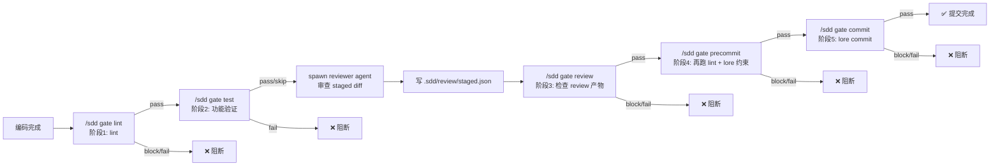
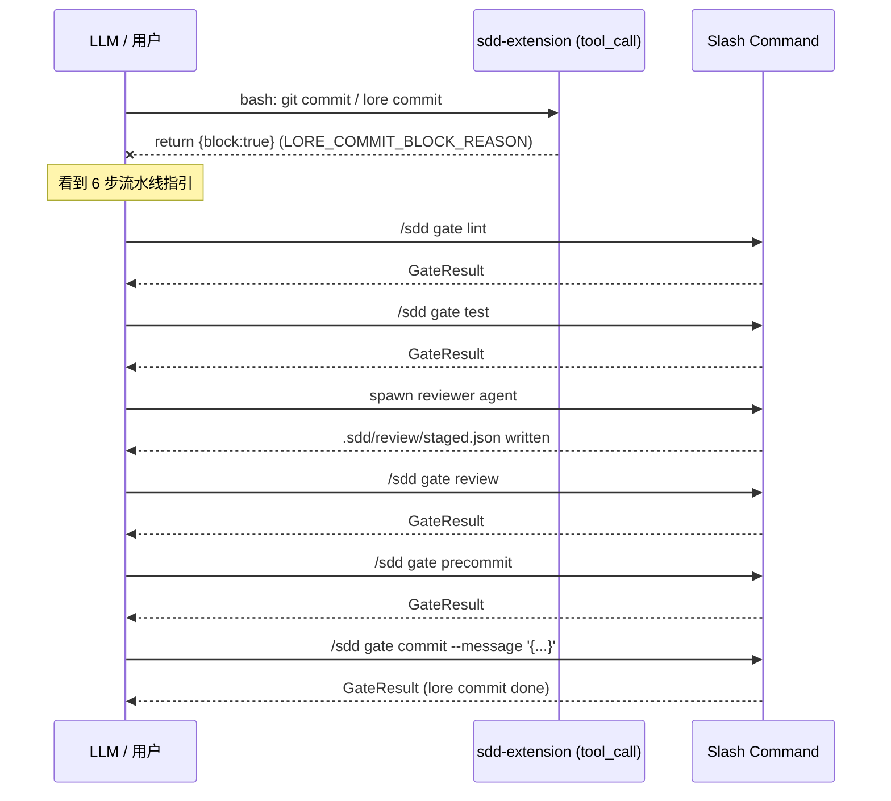

# sdd-gate 门禁流水线架构

> 修改记录：执行 `lore log docs/architecture/sdd-gate.md`

本文档描述 sdd-pack 的**门禁流水线（sdd-gate）**子系统。阻断机制：extension `pi.on('tool_call')` `{block:true}` 硬拦截（v1.6.0 起，ADR-015 落地）+ slash command / tool 执行结果（status=block/fail 告知 LLM 是否继续）+ CI 环境 `api-runner.ts` 的 `process.exit` 进程级阻断。

## 1. 设计动机

### 1.1 问题

sdd-pack 原有的门禁依赖三层防线：

| 防线 | 机制 | 强度 |
|---|---|---|
| `lore-commit-guard.md` rule | LLM 读到文本规则才遵守 | 弱（可跳过） |
| `extensions/sdd-extension/index.ts` `pi.on('tool_call')` | 匹配 `(git\|lore)\s+commit` 时返回 `{block:true, reason}` | 强（程序级硬拦截，ADR-015） |
| `api-runner.ts` CI runner | `bun run` 退出码阻断 | 强（仅 CI 环境） |

历史对照：早期 v1.4.x 依赖独立 `hooks/sdd/index.ts` omp hook 发 `sendMessage` 引导（中等强度，LLM 可无视）；v1.6.0 起 hook 逻辑合并进 extension（ADR-015），`pi.on('tool_call')` 的 `{block:true}` 提供了真正的程序级拦截能力。

### 1.2 目标

用户明确的流程定义：

```
编码 → lint → 流程验证（功能测试）→ reviewer → lint（再跑）→ lore commit
```

要求：
1. lint **全周期触发**（编码后跑一次，precommit 再跑一次）
2. lint 命令**动态注入**——不指定则**阻塞流程**
3. 第三方用户安装插件后**零额外安装**

### 1.3 决策（ADR-012）

| 决策点 | 选择 | 理由 |
|---|---|---|
| 执行入口 | omp slash command（`/sdd gate *`） | omp extension 在进程内直接 import lib 函数，`process.cwd()` 自动解析为用户项目根；独立 CLI 入口（`bun run gate-runner.ts`）的路径在第三方用户项目里不存在 |
| 拦截机制 | extension `tool_call` 硬拦截 + slash command 结果 | `pi.on('tool_call')` 匹配 `git commit`/`lore commit` → `{block:true}` 强制走 `/sdd gate *` 流水线；LLM 按 slash command 返回的 status 决定后续 |
| lint 配置 | `.sdd/gate.json` 显式配置 > 项目类型自动检测 > 阻塞 | 与 SDD 文档体系同源放 `.sdd/` 目录，git 可追踪 |
| review 集成 | CLI 检查 reviewer 产物文件（`.sdd/review/staged.json`） | CLI 不能 spawn omp agent；reviewer agent 执行后写产物，`/sdd gate review` 检查产物存在且 verdict 通过 |

## 2. 系统架构

### 2.1 流水线全景



### 2.2 组件清单

| 组件 | 路径 | 职责 |
|---|---|---|
| gate-config | `src/cli/lib/gate-config.ts` | `.sdd/gate.json` 读取 + 4 类项目自动检测 + lint/test/build 命令解析 |
| gate-runner | `src/cli/lib/gate-runner.ts` | 5 阶段执行器（runLint / runTest / runReview / runPrecommit / runCommit） |
| sdd-extension | `extensions/sdd-extension/index.ts` | 注册 5 个 `/sdd gate *` slash command，在 omp 进程内执行 |
| commit 拦截 | `extensions/sdd-extension/index.ts`（`pi.on('tool_call')`） | 拦截 `git/lore commit`，`{block:true}` 强制走 `/sdd gate *` 流水线（v1.6.0 起替代独立 hooks/sdd） |
| reviewer agent | `agents/reviewer.md` | step 8 写 `.sdd/review/staged.json` 产物 |

### 2.3 依赖方向

```
extensions/sdd-extension/index.ts  (/sdd gate * handlers)
        ↓ process.cwd()
src/cli/lib/gate-runner.ts         (5 阶段执行器)
        ↓
src/cli/lib/gate-config.ts         (命令解析)
        ↓
.sdd/gate.json 或自动检测
```

gate-runner 不依赖 omp / ExtensionAPI，不调 `process.exit` / `console.*`。退出码语义由调用方（slash command handler）决定。

## 3. 5 阶段执行器

### 3.1 阶段定义

| 阶段 | 函数 | slash command | 失败行为 | 关键逻辑 |
|---|---|---|---|---|
| lint | `runLint(repoRoot)` | `/sdd gate lint` | block(exit 2) / fail(exit 1) | 无 lint 命令 → block；命令失败 → fail |
| test | `runTest(repoRoot)` | `/sdd gate test` | fail(exit 1) | 无 test 命令 → skip（不阻塞）；命令失败 → fail |
| review | `runReview(repoRoot, sha?)` | `/sdd gate review` | block(exit 2) / fail(exit 1) | 无产物 → block；产物 verdict ∈ {incorrect, incorrect_with_minor_defects} → fail |
| precommit | `runPrecommit(repoRoot)` | `/sdd gate precommit` | block(exit 2) / fail(exit 1) | 再跑 lint + lore 约束检查 |
| commit | `runCommit(repoRoot, msg?)` / `runCommitWithFile(repoRoot, path)`（ADR-019） | `/sdd gate commit [--message-file <path>]` | block(exit 2) / fail(exit 1) | lore 不可用 → block；commit 失败 → fail；成功后反查 lore log 填充 loreId + commitHash |

### 3.2 GateResult 结构

```typescript
interface GateResult {
  stage: "lint" | "test" | "review" | "precommit" | "commit";
  status: "pass" | "fail" | "skip" | "block";
  command?: string;       // 实际执行的命令
  stdout: string;
  stderr: string;
  exitCode: number;       // 0=pass/skip, 1=fail, 2=block
  message?: string;       // 人类可读的失败原因
  // ADR-019 新增（commit 阶段 pass 路径填充；非 breaking，旧字段不变）
  loreId?: string;        // lore commit 的 8-char hex Lore-id
  commitHash?: string;    // git commit SHA
}
```

slash command handler（`gateNotify`）把 GateResult 映射为 omp UI 操作：
- `setWidget`：树状格式展示 stage / status / command / stdout / stderr
- `notify`：按 status 发 info / warn / error 级通知

## 4. 动态 lint 注入

### 4.1 命令解析优先级

```
.sdd/gate.json 显式配置
    ↓ (lint 字段存在则用)
项目类型自动检测
    ↓ (检测不到则)
阻塞（source=none，exit 2）
```

### 4.2 自动检测规则

对齐 `rule://backend-toolchain` 判别表：

| 检测信号 | 项目类型 | lint 命令 | test 命令 |
|---|---|---|---|
| `package.json` 含 `vite-plus` 依赖 | vite-plus | `vp check` | `vp test` |
| `Cargo.toml` 存在 | rust | `cargo fmt --check && cargo clippy` | `cargo test` |
| `go.mod` 存在 | go | `go vet ./...` | `go test ./...` |
| `bun.lockb` + `package.json` 含 `elysia` | bun | `bunx tsc --noEmit` | `bun test` |
| 以上都不匹配 | unknown | （空）→ block | （空）→ skip |

### 4.3 gate.json 配置格式

```jsonc
// .sdd/gate.json
{
  "lint": "vp check",           // 显式指定则用这个
  "test": "vp test",            // 可选，缺则 test 阶段 skip
  "build": "vp build"           // 可选（当前未使用，预留）
}
```

## 5. review 产物机制

### 5.1 问题

`/sdd gate review` 在 omp 进程内执行，但 reviewer agent（`task(agent="reviewer")`）是独立的 omp agent，CLI 无法直接 spawn。

### 5.2 方案：文件契约

```
reviewer agent 执行完毕
    ↓ (step 8)
写 .sdd/review/staged.json
    ↓
/sdd gate review 读取并检查
```

### 5.3 ReviewArtifact 格式

```json
{
  "commit_sha": "staged",
  "timestamp": "2026-07-13T10:00:00Z",
  "overall_correctness": "correct",
  "reviewer": "reviewer"
}
```

`overall_correctness` 取值：
- `correct` → review 阶段 pass
- `correct-with-debt` → review 阶段 pass（tech debt 记录但不阻断）
- `incorrect` / `incorrect_with_minor_defects` → review 阶段 fail（P0/P1 findings 阻断 commit；ADR-020 起两者等价处理）

### 5.4 reviewer agent 变更

reviewer.md 的 procedure 新增 step 8：yield 前用 bash 写 `.sdd/review/staged.json`。rules 中的"Bash is read-only"增加例外：写 review 产物是允许的（review metadata，非 source code）。

## 6. omp hook 集成

### 6.1 拦截流程



### 6.2 演进说明

v1.6.0 起独立 `hooks/` 目录删除、hook 逻辑合并进 extension（ADR-015）：`pi.on('tool_call')` 支持返回 `{block:true}` 实现程序级硬拦截，tool 调用在发起前即被拒绝。早期版本（v1.4.x）依赖 omp hook API v16.1.16，该版本只能 `sendMessage` 不能 throw/block，hook 角色仅为引导——此段保留作历史对照。当前硬阻断由两层构成：extension `{block:true}`（omp session 内）+ slash command 的 status（block/fail，LLM 决策依据）。

## 7. 数据流

### 7.1 用户态文件

| 文件 | 位置 | 谁写 | 谁读 |
|---|---|---|---|
| `.sdd/gate.json` | 用户项目根（通过 `findProjectRoot()` walk-up 定位） | 用户手动配置 | gate-config.ts（resolveGateCommands） |
| `.sdd/review/staged.reviewer.json` | 用户项目根 | reviewer agent（step 8） | gate-runner.ts（runReview） |
| `.sdd/review/staged.arch-reviewer.json` | 用户项目根 | arch-reviewer agent | gate-runner.ts（runReview） |
| `.sdd/review/staged.sdd-reviewer.json` | 用户项目根 | sdd-reviewer agent | gate-runner.ts（runReview） |

### 7.2 进程内数据流

```
/sdd gate lint
  → findProjectRoot() = 用户项目根（walk-up 找 .sdd/ 或 .git/）
  → resolveGateCommands(cwd)
    → loadGateConfig(cwd)        // 读 .sdd/gate.json
    → detectProjectType(cwd)     // 检测 package.json / Cargo.toml / go.mod / bun.lockb
    → defaultCommandsFor(type)   // 返回默认命令
  → runCommand(lint, cwd)        // spawnSync 执行 lint
  → GateResult
```
## 8. slash command 清单

sdd-extension 注册 1 个 `/sdd` 主命令，内部 SUBCOMMANDS 路由表分发 **18 个子命令**：

| 子命令 | handler | 说明 |
|---|---|---|
| `/sdd init` | handleInit | 创建新 PRD（草稿） |
| `/sdd review` | handleReview | 草稿 → 待评审 |
| `/sdd approve` | handleApprove | 待评审 → 已评审 |
| `/sdd back` | handleBack | 状态回退 |
| `/sdd plan` | handlePlan | 已评审 → 已规划任务（加 phase 占位） |
| `/sdd start` | handleStart | 已规划任务 → 进行中 |
| `/sdd archive` | handleArchive | 归档 PRD |
| `/sdd phase` | handlePhase | 阶段流转 |
| `/sdd phase-archive` | handlePhaseArchive | 归档 Phase |
| `/sdd status` | handleStatus | PRD/Phase 状态总览 |
| `/sdd sync` | handleSync | 同步 meta |
| `/sdd list` | handleList | 带过滤的文档列表 |
| `/sdd why` | handleWhy | 查询 lore 决策上下文 |
| `/sdd apply` | handleApply | 打印 PRD 实施 checklist |
| `/sdd validate` | handleValidate | 校验 docs/ 文档结构 |
| `/sdd propose` | handlePropose | 创建新 PRD（delta/full） |
| `/sdd migrate` | handleMigrateCmd | 状态行堆叠清理 |
| `/sdd gate` | handleGate | 门禁分派（lint/test/review/precommit/commit 5 stage） |

## 9. 验证体系

### 9.1 单元测试

`src/cli/__tests__/gate.test.ts`（25 个测试）覆盖：

| 测试组 | 覆盖点 |
|---|---|
| detectProjectType | vite-plus / rust / go / bun / unknown 五种检测 |
| defaultCommandsFor | 四种项目类型的默认命令 |
| resolveGateCommands | gate.json 覆盖 / 自动检测 / 阻塞（source=none）/ source 判定仅按 lint 字段 |
| runLint | block（无 lint）/ pass / fail |
| runTest | skip（无 test）/ pass / fail |
| runReview | block（无产物）/ pass（correct）/ fail（incorrect）/ fail（incorrect_with_minor_defects）/ pass（correct-with-debt）/ **block（stale hash 不匹配）** |
| writeReviewArtifact | 产物写入 + **staged_hash 自动填充 + 文件名含 reviewer 名称** |

### 9.2 类型检查

- `tsconfig.json`（strict mode）+ `@types/node` + `@types/bun`
- `bunx tsc --noEmit` 0 errors

### 9.3 测试命令

```bash
cd plugins/sdd-pack
bun test                    # 282 pass, 0 fail
bunx tsc --noEmit           # 0 errors
```

## 10. gate.json 配置参考

```jsonc
{
  // lint 命令（必需，缺则 block）
  "lint": "vp check",

  // 功能验证命令（可选，缺则 test 阶段 skip）
  "test": "vp test",

  // 需要哪些 reviewer 的产物（默认 ["reviewer"]）
  // 可追加 "arch-reviewer", "sdd-reviewer"
  "reviewers": ["reviewer", "arch-reviewer"]
}
```

## 11. 已知限制

| 限制 | 原因 | 缓解 |
|---|---|---|
| extension `{block:true}` 依赖 omp 运行时 | 硬拦截只在 omp session 内生效 | CI 环境由 api-runner.ts `process.exit` 提供进程级阻断 |
| `/sdd gate review` 不能 spawn agent | omp agent spawn 需要 omp session 上下文 | 文件契约：reviewer 写产物，CLI 检查产物 |
| `runCommit` 需要 lore CLI | lore 是外部依赖 | runCommit 在 lore 不可用时 block（exit 2） |
| `stagedHash` 在无 git 时返回 "empty" | 非 git 项目无 staged diff | review 产物 hash 校验在非 git 项目中等效为只检查 verdict |

## 12. 关联文档

- [架构总览](overview.md) — sdd-pack 整体架构
- [架构决策记录](decisions.md) — ADR-012（sdd-gate 门禁流水线）
- `rule://backend-toolchain` — 项目类型检测规则来源
- `rule://lore-protocol` — lore commit trailer JSON schema
- `rule://lore-commit-guard` — 提交质量门禁 rule（文本规则；程序级硬拦截由 extension `tool_call` 承接，ADR-015）
