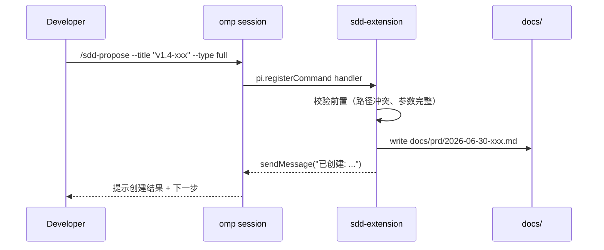

# sdd Extension（Omp Slash Commands）PRD

> 状态：已评审 | 创建日期：2026-06-30 | 评审日期：2026-06-30 | 发布日期：2026-06-30 | 系替代：[sdd CLI PRD](../prd/2026-06-29-sdd-cli.md)
> 修改记录：执行 `lore log docs/prd/2026-06-30-sdd-extension.md`
> 对应阶段：[sdd Extension 阶段文档](../phase/2026-06-30-sdd-extension.md)
> 关键决策：[ADR-009 sdd Extension 替代独立 CLI](../architecture/decisions.md)（Accepted）· [omp Extension API 参考](../reference/omp-extension-api.md)

> [!IMPORTANT] PRD 生命周期状态机（遵循 `rule://prd-change-management`）
> 草稿 → 评审中 → 已评审 → 已发布 → 已归档/已替换；已废弃为任意阶段的终态分支。
> **硬约束**：`已评审` 不可回退 `草稿`；`已发布` 后新需求**只能新开 PRD + supersedes 链**，禁止往已发布 PRD 堆叠新版本功能。变更类型判据（A 实现偏差 / B v1 内微调 / C 跨版本叠加）与决策树见 `rule://prd-change-management`。
> **本文是 supersede 型**：以下 Δ 段列出相对旧 PRD 的差异；未提及的章节沿用旧 PRD。

## Δ 变更摘要（仅 supersedes 型 PRD 填写）

> 本 PRD 替代 [sdd CLI PRD](../prd/2026-06-29-sdd-cli.md)。
> 以下仅列出相对于旧 PRD 的变更点。**未提及的章节/内容沿用旧 PRD 对应内容，无需在本文件重复。**

### ADDED

| # | 目标章节 | 新增内容摘要 | 原因 |
|---|---------|-------------|------|
| A1 | §0 + §1 + §3 | 删去「独立 CLI 二进制」定位，改为「omp slash command 集合 + 程序化 API 双形态」 | marketplace 调研发现 omp 不支持 plugin 分发独立 CLI 二进制，`package.json#bin` 字段对 omp 是 noop |
| A2 | §3.1 | 新增 `sdd-extension` 子模块定位（`extensions/sdd-extension/`） | 区别于「单文件 hooks 聚合」的另一种装载形态，由 `--extension` flag 装载 |
| A3 | §3.2.1 | slash command 注册：7 个 `/sdd-*` 命令 + arg 解析从 `arg-parser.ts` 移植到 `pi.registerCommand` 的 handler 参数 | slash command 由 omp 自己完成 arg 解析，不需要自建 arg-parser |
| A4 | §4 + §3.2 | 程序化 API：`src/cli/api.ts` 导出纯函数（`validateDocs()` / `proposePrd()` / `archivePrd()` / `migratePrd()`），CI / hook / slash command 三个调用方复用同一份代码 | 保留 CI 调用能力，避免「只能人机交互才能跑 sdd validate」的反模式 |
| A5 | §7.1 | 集成表调整：`sdd CLI` bin → 删；新增 `sdd-extension` slash command 入口 | 旧的「spawn subprocess 调 sdd validate --staged --json」改为「in-process 调 api.ts」 |

### MODIFIED

| # | 目标章节 | 原内容 | 新内容 | 原因 |
|---|---------|--------|--------|------|
| M1 | §0 目标声明 | 「构建 `sdd` 命令行工具（TypeScript + bun）」 | 「构建 `sdd-extension`（omp slash command 集合）+ `sdd-api`（程序化入口）」 | 定位从「独立 CLI」改为「omp 原生扩展 + 程序化库」 |
| M2 | §3.2 验收 | `alias sdd='bun .../bin/sdd'` 验收 | 验收改为「装 sdd-pack plugin 后，重启 omp 进程，敲 `/sdd-validate` 可触发校验」 | marketplace 一键安装体验，无须手工 alias |
| M3 | §6.1 命令结构 | `sdd <command> [options] [args]` | `/<sdd-command> [args]` | 入口形式变更 |
| M4 | §6.2 输出 | stdout/--json | `pi.sendMessage()` + `ctx.ui.notify()` | 输出进入 omp 会话而非裸 stdout |
| M5 | §9 上线计划 | v1.3.0 rc.1 计划 | v1.4.0-alpha：先内部 dogfood；v1.4.0 正式发布 | slash command 需等待 omp 装载链路稳定后再升级 severity |

### REMOVED

| # | 目标章节 | 移除内容 | 原因 |
|---|---------|---------|------|
| R1 | §1.3 + §3.2.2 + §4 | `package.json#bin`、`bin/sdd` bash wrapper、用户手工 alias 路径 | omp marketplace 不识别这些；徒增认知负担 |
| R2 | §3.2 命令清单 | `src/cli/index.ts`（CLI 入口 + arg 解析） | slash command 不需要独立入口；arg 解析由 omp 提供 |
| R3 | §3.2 命令清单 | `src/cli/lib/arg-parser.ts` | 同上 |
| R4 | §7 集成 | 「用户配 alias」相关说明 | 别名不再需要 |
| R5 | 验收 | 「`sdd` 在终端独立运行」相关验收 | 不再是验收路径 |

### 不变内容（显式确认）

| # | 章节 | 确认 |
|---|------|------|
| U1 | §1.1 业务背景 | 沿用（PRD 堆叠、状态行手工维护等痛点未变） |
| U2 | §2 目标用户与场景 | 沿用（维护者、贡献者、用户三类身份不变） |
| U3 | §3.2.1 → §3.2.4 核心子命令语义 | 沿用（validate/propose/archive/migrate 行为定义不变，仅入口形式变化） |
| U4 | §4.2 安全要求 | 沿用（不写 git 历史、不联网、输出不泄露敏感信息） |
| U5 | §5 数据模型 | 沿用（CLI 操作的数据结构不变） |
| U6 | §11 附录 | 沿用（设计思想借鉴说明不变） |

---

## 0. 目标声明

为 sdd-pack 构建 **`sdd-extension`**（omp 原生 slash command 集合），同时导出 **`sdd-api`** 程序化入口供 CI / hook / 脚本复用。两者复用同一组核心库（`prd-state-machine` / `doc-parser` / `validator` / `template-engine` / `index-sync`），共同构成 sdd-pack **文档生命周期的权威入口**。

入口形态：
- **人机交互场景**（日常使用）：在 omp 会话内敲 `/sdd-validate` / `/sdd-propose` / `/sdd-archive` / `/sdd-migrate` / `/sdd-status` / `/sdd-list` / `/sdd-why` / `/sdd-apply`
- **自动化场景**（CI / hook）：直接 `import { validateDocs } from 'sdd-pack/api'`，纯函数调用，无 spawn subprocess

两者共享 `src/cli/lib/*` 核心库，但**不再有独立二进制入口**——`bin/sdd`、`src/cli/index.ts`、`src/cli/lib/arg-parser.ts` 全部移除。

## 0. 目标验收开关

### 业务验收

- [ ] 用户在 omp v16.2.4+ 中安装 sdd-pack plugin 后，重启 omp 即可在会话中输入 `/sdd-validate` 触发校验
- [ ] `/sdd-validate` 对 sdd-pack 自身 `docs/` 运行无错误（同旧 PRD 验收：10 项检查全部通过）
- [ ] `/sdd-propose --supersedes <path> --title X` 创建 delta 型 PRD（含 Δ 段 + `> 替代:`）
- [ ] `/sdd-archive <path> --reason completed --merge-delta` 归档 PRD 时正确移动文件、更新状态行、同步 `docs/index.md`、封装 `lore commit`
- [ ] `/sdd-migrate docs/prd/2026-06-24-sdd-pack.md --dry-run` 预览状态行堆叠清理
- [ ] hook `runSddValidate`（commit 拦截）改为 in-process 调用 `api.ts`，不再 spawn subprocess

### 技术验收

- [ ] `sdd-extension` 通过 `pi.registerCommand` 在 extension factory 中注册 8 个 slash command
- [ ] `sdd-api`（`src/cli/api.ts`）导出 8 个纯函数（`validateDocs` / `proposePrd` / `archivePrd` / `migratePrd` / `getStatus` / `listPrds` / `getWhy` / `getApplyChecklist`）
- [ ] 核心库（`prd-state-machine.ts` / `doc-parser.ts` / `validator.ts` / `template-engine.ts` / `index-sync.ts` / `lore-wrapper.ts`）从「CLI 内部模块」提升为「extension + api 共用代码」，零业务修改可直接 import
- [ ] `package.json` 移除 `"bin"` 字段；`files` 移除 `"bin"` 项
- [ ] 删去 `plugins/sdd-pack/bin/sdd`、`src/cli/index.ts`、`src/cli/lib/arg-parser.ts`
- [ ] `plugins/sdd-pack/extensions/sdd-extension/index.ts` 新增，包含所有 slash command 注册逻辑
- [ ] CI 调用样例写入 README：「GitHub Actions: `bun run src/cli/api-runner.ts validate --staged`」或类似 in-process 入口

### 文档验收

- [ ] ADR-009「sdd Extension 替代独立 CLI」状态从 Proposed → Accepted；ADR-008 状态变为 Superseded by ADR-009
- [ ] `plugins/sdd-pack/README.md` 移除「CLI 安装/使用（alias）」章节，新增「Slash Commands」「Programmatic API」两章
- [ ] 本 PRD 通过 sdd-reviewer 一致性评审

### 非目标（明确不做）

- 不实现 `package.json#bin`（npm 路径）—— 保持 omp marketplace plugin 形态
- 不拆出独立 npm 包（违反 marketplace 形态一致性）
- 不实现 CI 调用 omn 的复杂编排 —— CI 直接调 `bun run src/cli/api-runner.ts` 即可
- 不实现 slash command 的 shell tab completion —— omp 自身会从 `registerCommand` 元数据生成 completion

---

## 1. 背景与目标

### 1.1 业务背景

[沿用旧 PRD §1.1](../prd/2026-06-29-sdd-cli.md#11-业务背景) —— v1.2.3 状态行堆叠、PRD 生命周期操作纯手工、docs-check.sh 缺失状态机校验、归档机制半自动化四大痛点未变。

### 1.2 第三方市场安装角度的再设计

2026-06-30 市场调研结论（来源：[omp marketplace 文档](https://github.com/can1357/oh-my-pi/blob/main/docs/marketplace.md) + [extension authoring](https://omp.sh/docs/extension-authoring) + [@oh-my-pi/cli](https://registry.npmjs.org/%40oh-my-pi%2Fcli)）：

| 第三方路径 | 例子 | omp 是否支持 | sdd-pack 是否采用 |
|---|---|---|---|
| omp 内部 slash command | `/handoff`, `/notes`, `/commit` | ✓ 原生 | ✓ 主路径 |
| marketplace plugin `package.json#bin` | npm `bin` 字段 | ✗ 不识别 | ✗ 旧方案失败 |
| 独立 npm 全局 CLI | `@oh-my-pi/cli` | ✓ 但需 npm 路径 | ✗ 违反 PRD §4.1 |
| marketplace plugin `omp.install` | 拷贝到 `~/.pi/agent/commands/` | ✓ 但仅斜杠命令 | ✓ 兼容 |

旧 PRD 选择的「bash wrapper + alias 路径」在用户安装体验上是不一致的：
- 用户敲 `sdd validate` 时，实际跑的是手工 alias 指向的 `bun .../bin/sdd`
- `package.json#bin` 字段对 omp 而言是 noop，会误导用户以为 `npm install -g sdd-pack` 可用
- 与 omp 生态已有扩展（commands / agents / hooks）的工作流不一致

本 PRD 把「独立 CLI」改为「omp 原生 extension」，解决上述一致性问题。

### 1.3 产品目标

| 目标 | 衡量标准 |
|---|---|
| 第三方一键安装体验 | `omp plugin install sdd-pack` 后，重启 omp 即可在会话中用 `/sdd-*` 命令，零额外配置 |
| 保留 CI 能力 | `bun run src/cli/api-runner.ts validate` 在 GitHub Actions / drone CI 中可独立运行 |
| 与现有守门体系正交 | slash command 做结构化检查（程序化、无 LLM），三层守门 agent 做语义检查（需 LLM 推理） |
| 复用核心库 | `prd-state-machine` / `doc-parser` / `validator` 等核心库零修改，从 CLI 私有模块提升为 extension + api 共用代码 |

### 1.4 成功指标

- **指标 1**：`docs/prd/2026-06-24-sdd-pack.md` 状态行被 `/sdd-migrate`（或 API `migratePrd()`）自动清理为单行 + CHANGELOG
- **指标 2**：Phase A 实施后，新增 PRD 时**默认**走 `/sdd-propose` 而非手动 `write` —— 100% 新 PRD 通过 extension 创建
- **指标 3**：状态机违规测试覆盖 `已评审 → 草稿` / `已发布 → 编辑` / 状态行堆叠 三种 case，全部 block
- **指标 4**（新增）：第三方用户安装 plugin 后，**零额外配置**即可触发 slash command，README 中不再出现 alias / PATH 说明

---

## 2. 用户与场景

### 2.1 目标用户

[沿用旧 PRD §2.1](../prd/2026-06-29-sdd-cli.md#21-目标用户) —— 维护者、贡献者、用户三类身份不变。

### 2.2 使用场景

#### 场景 A（人机交互）：v1.4 新功能起新 PRD



#### 场景 B（自动化）：CI 在 PR 流水线中校验文档

```yaml
# .github/workflows/docs-ci.yml
- name: sdd validate
  run: bun run src/cli/api-runner.ts validate --staged --json
```

`api-runner.ts` 是 `src/cli/api.ts` 的薄壳 CLI 调用器：
- 解析 arg（用 `Bun.argv` 或基础 split）
- 调 `validateDocs(options)`
- 输出 JSON 到 stdout

**它不是新 CLI**，是**给 CI 用的逃生通道**：bash 5 行 + bun eval，避免为 CI 维护一个完整的 `bin/sdd` 二进制。

#### 场景 C（人机交互 + 反馈）：sdd-reviewer 评审中发现问题时

```bash
# sdd-reviewer 在 phase 完成时调用
/sdd-validate --severity error
# 收到: { status: "error", errors: [...], warnings: [...] }
# 修复后重试
```

---

## 3. 功能需求

### 3.1 模块拓扑

```
plugins/sdd-pack/
├── src/
│   └── cli/
│       ├── api.ts                  # 程序化入口（8 个纯函数，CI/hook/slash 共用）
│       ├── api-runner.ts           # CI 逃生通道（bash 5 行 + bun eval）
│       └── lib/                    # 核心库（提升为共用代码，零业务修改）
│           ├── prd-state-machine.ts
│           ├── doc-parser.ts
│           ├── validator.ts
│           ├── template-engine.ts
│           ├── index-sync.ts
│           └── lore-wrapper.ts
├── extensions/                     # 新增目录（区别于 hooks/）
│   └── sdd-extension/
│       └── index.ts                # omp extension factory，注册 8 个 slash command
├── hooks/
│   └── index.ts                    # 现有 hook 聚合（略修改：runSddValidate 改为调 api.ts）
├── package.json                    # 移除 bin 字段
└── README.md                       # 重写安装/使用章节
```

**关键变化**：
- ❌ 删除 `bin/sdd`、`src/cli/index.ts`、`src/cli/lib/arg-parser.ts`、`src/cli/commands/*.ts`
- ✅ 新增 `src/cli/api.ts`、`src/cli/api-runner.ts`、`extensions/sdd-extension/index.ts`
- 🔁 `src/cli/lib/*` 提升为共用代码，无业务修改

### 3.2 功能清单

| 功能模块 | 功能点 | 优先级 | 说明 |
|---------|--------|--------|------|
| **扩展装载** | `extensions/sdd-extension/` | P0 | omp extension factory，单文件聚合 8 个 slash command 注册 |
| 扩展装载 | hook in-process 改造 | P0 | `hooks/index.ts` 的 `runSddValidate` 从 spawn subprocess 改为 in-process 调用 `api.validateDocs()` |
| **程序化 API** | `src/cli/api.ts` | P0 | 8 个纯函数导出，无 IO 副作用对外部不可见（文件操作封装在内部） |
| 程序化 API | `src/cli/api-runner.ts` | P1 | CI 逃生通道，薄壳 bash + bun eval |
| **Slash Commands** | `/sdd-validate` | P0 | 核心校验，输出 10 项检查结果到 omp 会话 |
| Slash Commands | `/sdd-propose` | P0 | 创建新 PRD / delta 变更 |
| Slash Commands | `/sdd-archive` | P0 | 归档 PRD，含 merge-delta |
| Slash Commands | `/sdd-migrate` | P0 | 状态行堆叠清理 |
| Slash Commands | `/sdd-status` | P1 | 所有 PRD/Phase 状态总览 |
| Slash Commands | `/sdd-list` | P2 | 带过滤的文档列表 |
| Slash Commands | `/sdd-why` | P2 | 查询 lore 决策上下文 |
| Slash Commands | `/sdd-apply` | P2 | 打印实施 checklist（不操作文件） |

### 3.3 详细功能描述

#### 3.3.1 `extensions/sdd-extension/index.ts`

**职责**：omp extension factory，注册 8 个 slash command。

**输入**：`pi: ExtensionAPI`（omp 注入）

**处理逻辑**：
1. 导入 `src/cli/lib/*` 核心库
2. 导入 `src/cli/api.ts` 程序化入口
3. 对每个 slash command 调用 `pi.registerCommand(name, { description, handler })`
4. handler 内部：解析 `args: string[]`（omp 提供的入参）→ 调 `api.xxxFunction(opts)` → 用 `pi.sendMessage(msg)` 或 `ctx.ui.notify(level, msg)` 输出

**斜杠命令命名规范**（沿用 omp 习惯）：
- 命令以 `/` 前缀触发，用户输入 `/sdd-validate`
- 命令名 kebab-case：`/sdd-validate` 而非 `/sddValidate`
- description 必须人类可读（omp autocomplete 用）

**示例实现**：

```typescript
// extensions/sdd-extension/index.ts
import { validateDocs, proposePrd, archivePrd } from "../../src/cli/api";

export default function (pi: ExtensionAPI): void {
  pi.registerCommand("sdd-validate", {
    description: "校验 docs/ 文档结构 + 状态机 + 交叉引用一致性",
    handler: async (args, ctx) => {
      const opts = parseValidateArgs(args);  // 简单 arg 解析
      const result = await validateDocs(opts);
      ctx.ui.notify(result.status === "pass" ? "info" : "warn",
        formatResult(result));
      if (result.status === "block") {
        return { blocked: true, reason: result.errors.join("\n") };
      }
    },
  });

  pi.registerCommand("sdd-propose", {
    description: "创建新 PRD（full / delta）",
    handler: async (args, ctx) => {
      const opts = parseProposeArgs(args);
      const result = await proposePrd(opts);
      ctx.ui.notify("info", `已创建: ${result.path}\n${result.next}`);
    },
  });

  // ... 其他 6 个 command 注册
}
```

#### 3.3.2 `src/cli/api.ts`

**职责**：程序化入口，导出 8 个纯函数供 slash command / hook / CI 三方调用。

**设计原则**：
- 函数签名返回结构化对象（`{ status, errors, warnings, payload }`），不直接打印
- 不依赖 omp / ExtensionAPI（可在 hook 和 CI 中复用）
- 文件 IO 封装在内部（`Bun.write()` / `Bun.read()`），但**不依赖 bun runtime 的 API 表面**——核心 IO 用 `node:fs`，仅在 `api-runner.ts` 用 bun

**导出函数清单**：

```typescript
// src/cli/api.ts
export interface ValidateOptions {
  path?: string;             // 校验范围
  staged?: boolean;          // 仅 staged 变更
  severity?: "warn" | "error" | "block";
  json?: boolean;            // 仅内部使用
}

export interface ValidateResult {
  status: "pass" | "warn" | "error" | "block";
  errors: Array<{ check: number; file: string; line?: number; message: string }>;
  warnings: Array<{ check: number; file: string; message: string }>;
  checks: Array<{ id: number; name: string; status: "pass" | "fail"; count: number }>;
}

export async function validateDocs(opts: ValidateOptions): Promise<ValidateResult>;
export async function proposePrd(opts: ProposeOptions): Promise<ProposeResult>;
export async function archivePrd(opts: ArchiveOptions): Promise<ArchiveResult>;
export async function migratePrd(opts: MigrateOptions): Promise<MigrateResult>;
export async function getStatus(): Promise<StatusResult>;
export async function listPrds(opts: ListOptions): Promise<ListResult>;
export async function getWhy(target: string): Promise<WhyResult>;
export async function getApplyChecklist(prdPath: string): Promise<ApplyResult>;
```

#### 3.3.3 `src/cli/api-runner.ts`（CI 逃生通道）

**职责**：在不启动 omp 的场景下，让 CI / 脚本也能调用 `api.ts`。

**实现**：

```typescript
// src/cli/api-runner.ts
// CI 专用: bun run src/cli/api-runner.ts <command> [args]
// 不是 sdd CLI 的替代品，是 api.ts 的薄壳入口
import { parseArgs } from "node:util";
import { validateDocs, proposePrd, /* ... */ } from "./api";

const { positionals, values } = parseArgs({
  args: process.argv.slice(2),
  allowPositionals: true,
});

const command = positionals[0];
const opts = values;

switch (command) {
  case "validate":
    const result = await validateDocs(opts);
    if (opts.json) {
      console.log(JSON.stringify(result, null, 2));
    } else {
      console.log(formatHuman(result));
    }
    process.exit(result.status === "block" ? 2 : result.status === "error" ? 1 : 0);
  case "propose":
    await proposePrd(opts);
    break;
  // ... 其他
}
```

**为什么需要 `api-runner.ts`**：
- slash command 是人机交互，不能 CI 化
- hook 是 commit gate，不能 CI 化
- CI 需要 stdout + exit code + JSON 输出，这是 `api-runner.ts` 的职责
- 但这是**逃生通道**，不是产品形态——README 中明确「正常用户用 `/sdd-*` slash command 即可」

#### 3.3.4 hook in-process 改造

**现有** (`hooks/index.ts` 的 `runSddValidate`)：

```typescript
function runSddValidate(pi: HookAPI): void {
  const result = spawnSync(["bun", "run", sddCliPath, "validate", "--staged", "--json"]);
  // 解析 stdout
  // 发送 message / block
}
```

**改为**：

```typescript
import { validateDocs } from "../src/cli/api";

async function runSddValidate(pi: HookAPI, files: string[]): Promise<void> {
  const result = await validateDocs({ staged: true, files, severity: getSeverity() });
  // 解析 result
  // 发送 message / block
}
```

#### 3.3.5 模块边界硬约束（arch-reviewer P1 三条修正）

>**本节是对 arch-reviewer 在 [commit `b0a3f9d`] 评审中提出的 3 个 P1 finding 的硬性回应,所有后续实施必须遵守。**

**F3.1 api.ts 不变成 God 模块**：

`src/cli/api.ts` 的 8 个函数必须满足下列硬约束（不可豁免）：

| 约束 | 限制 |
|---|---|
| 函数单行数 | 每个 export 函数 ≤ 80 行（不含类型声明与 import） |
| 新增逻辑 ≤ 0 | api.ts 仅做 lib/* 调用 + 结果组装；path 解析 / git staged 检测 / option validation / severity gating / 跨函数共享逻辑 **必须先抽到 `src/cli/lib/orchestration/`** |
| orchestration/ 新目录 | v1.4.0 实施时新增 `src/cli/lib/orchestration/{path,git,options,severity,gates}.ts`（可选,按需拆） |
| 文件总行数 | api.ts ≤ 300 行；超过即触发 P1 警报,需 PR 重构 |

**F3.2 extension/index.ts 单文件聚合的工程理由**：

>C7 约束单文件聚合的"与 hooks 保持同构"理由不充分,arch-reviewer 评分有效。本节给出**真正的工程理由**:

- **理由 A（omp loader 单文件最稳）**：v16.2.x 后虽支持目录形式（PR #2714），但 `omp.extensions: ["./path/to/entry.ts"]` 单文件形式对所有 omp 版本都是契约安全的；目录形式依赖 v16.2.x 之后。**单文件 = 最大兼容性**
- **理由 B（统一 arg parser 入口）**：8 个 slash command 共享一个 `parseArgs(args: string): <Options>` 集中入口(避免每个 handler 重复 split)——单文件聚合保证唯一入口,避免分散到多文件后引入两份不同的 split 逻辑
- **理由 C（统一 UI adapter）**：8 个 command 共享一个 `notifyBySeverity(result, ctx)` 统一把 api.ts 返回的 `ValidateResult` 映射到 `ctx.ui.notify` / `setWidget` / `setStatus`——单文件让 adapter 集中可见
- **理由 D（omp factory 原子性）**：单文件保证所有 `pi.registerCommand` 在同一个 factory 同步注册;omp 在装载 extension 时如果遇到 split 文件方案,可能部分 command 已注册但其他未注册,导致中间态 slash command 不可用
- **预算**：根据参考 API doc §11 骨架(每个 handler ~30 行:15 行 arg parse + 10 行 API call + 5 行 UI),8 command × 30 行 + 50 行 import/types/const = ~290 行;**400 行硬上限**,超过即 PR 重新论证拆分

**F3.3 api-runner.ts 存在性的设计权衡**：

>arch-reviewer 指出 api-runner.ts 重蹈"CLI 入口"覆辙。本节给出**有意识的设计选择**而非 path-of-least-resistance:

| 方面 | slash command (extension handler) | api-runner.ts (CI) |
|---|---|---|
| 调用方 | omp 会话 + 用户 | CI runner 进程（无 omp 会话） |
| 输入 | `args: string`（omp 注入） | `process.argv` 数组 |
| 输出 | `ctx.ui.notify` / `setWidget` | stdout JSON + exit code |
| 路由 | 一个 handler 一个 API 函数 | 一个 switch 8 case（仅 process.argv 分发） |
| error 报告 | `ctx.ui.notify(level, msg)` | `process.exit(1 \| 2)` |
| arg 解析 | 内联 `parseArgs(args)` | 借用 `node:util.parseArgs` |

共享边界（避免重复建设）：
- arg 解析: `extensions/` 与 `api-runner.ts` 都调用 `src/cli/lib/orchestration/parseArgs.ts`（**单一实现**）
- 格式化输出: handler 用 `notifyBySeverity`;api-runner 用 `formatHuman(result)` + `console.log(JSON.stringify(result))`;两者都从 `src/cli/lib/orchestration/format.ts` 调用
- 维护成本声明: 接受双轨,即"CI 这条逃生通道保留",用"两个调用方共享 lib/orchestration"换取"不接受完整 CLI 二进制回潮"

替代方案(已拒绝)：仅留 `bun -e "import { validateDocs } from './api'; console.log(JSON.stringify(await validateDocs({staged: true})))"` 一行——可行但破坏 CI 用户体验(无法传 flag,无法多命令分发,无 exit code 聚合)

#### 3.3.6 `package.json` omp.extensions manifest 设计前置

>+arch-reviewer P2 指出 manifest 缺失不应仅作 checklist,应升为设计前置。本节固化:

**v1.4.0 启动条件**（在动 extensions 代码之前必须先动 package.json）：
```json
{
  "name": "sdd-pack",
  "version": "1.4.0-alpha",
  "files": ["skills", "rules", "hooks", "agents", "extensions", "src", "README.md"],
  "omp": {
    "extensions": ["./extensions/sdd-extension/index.ts"]
  }
}
```
不增这一行,marketplace 路径(第三方用户安装)直接失败——这不是 checklist,这是 hard requirement,与 §10.1 R1 直接挂钩


---

## 4. 非功能需求

### 4.1 性能要求

[沿用旧 PRD §4.1](../prd/2026-06-29-sdd-cli.md#41-性能要求)：
- `/sdd-validate` 在 sdd-pack 仓库规模（~30 docs 文件）下 < 100ms
- `/sdd-propose` 创建文件 < 500ms
- `/sdd-archive` 完整归档流程（含 lore commit）< 2s

### 4.2 安全要求

[沿用旧 PRD §4.2](../prd/2026-06-29-sdd-cli.md#42-安全要求)：
- 不修改 git 历史（不执行 `git reset` / `git rebase`）
- 不向网络发送数据（纯本地文件操作）
- 输出不包含敏感信息（lore commit trailer 不含 token / credential）

### 4.3 可用性要求

[沿用旧 PRD §4.3](../prd/2026-06-29-sdd-cli.md#43-可用性要求)：
- 每个 slash command 有 `description`（omp autocomplete 用）
- 错误信息人类可读
- `validateDocs(opts.dryRun)` 模式可预览所有破坏性操作

### 4.4 第三方安装体验要求（新增）

- **安装一致性**：第三方用户装 plugin = 装 sdd-commands，零额外配置
- **可发现性**：slash command 在 omp autocomplete 中可见，用户敲 `/sd` 即可看到 `/sdd-*` 列表
- **可逆性**：用户不需要时，禁用 plugin 即可，不残留 PATH / alias

---

## 5. 数据需求

### 5.1 数据模型

[沿用旧 PRD §5.1](../prd/2026-06-29-sdd-cli.md#51-数据模型) —— `docs/prd/*.md` / `docs/phase/*.md` / `docs/spec/*.md` / `docs/index.md` / `docs/prd/archive/*.md` 数据源不变。

### 5.2 数据迁移

不涉及数据迁移。但涉及**代码迁移**：

| 旧位置 | 新位置 | 操作 |
|---|---|---|
| `bin/sdd` | （删除） | 文件移除 |
| `src/cli/index.ts` | （删除） | 文件移除 |
| `src/cli/lib/arg-parser.ts` | `extensions/sdd-extension/index.ts` 内联 | 文件移除，arg 解析移植到 handler 内 |
| `src/cli/commands/{validate,propose,archive,migrate,status,list,why,apply}.ts` | `src/cli/api.ts` 内的 export 函数 | 文件移除，逻辑迁入 api.ts |
| `src/cli/lib/*`（核心库） | `src/cli/lib/*` | 文件保留，零业务修改 |
| `hooks/index.ts` | `hooks/index.ts` | 增量修改：runSddValidate 改 in-process 调用 |
| `package.json#bin` | （删除） | 字段移除 |
| `package.json#files` | 修改 | 移除 `"bin"`，保留 `"extensions", "hooks", "src", "skills", "rules", "agents"` |

---

## 6. 界面需求

### 6.1 入口形态

**slash command**（人机交互）：

```
/sdd-<command> [args]
```

示例：
```
/sdd-validate
/sdd-validate --staged --severity error
/sdd-propose --title "v1.4-xxx" --type full
/sdd-propose --supersedes docs/prd/2026-06-24-sdd-pack.md --title "v1.3-bugfix"
/sdd-archive docs/prd/2026-06-29-sdd-cli.md --reason completed --merge-delta
/sdd-migrate docs/prd/2026-06-24-sdd-pack.md
/sdd-status
/sdd-list --status 已发布 --since 2026-06-01
/sdd-why docs/prd/2026-06-24-sdd-pack.md:23
/sdd-apply docs/prd/2026-06-30-sdd-extension.md
```

**程序化 API**（自动化）：

```typescript
import { validateDocs } from "sdd-pack/src/cli/api";
const result = await validateDocs({ staged: true });
```

**CI 逃生通道**：

```bash
bun run src/cli/api-runner.ts validate --staged --json
```

### 6.2 输出格式

**slash command 输出**：通过 `pi.sendMessage()` 或 `ctx.ui.notify(level, message)` 进入 omp 会话：
- `info`（蓝色/绿色）：pass / 创建成功
- `warn`（黄色）：有 warning，但建议继续
- `error`（红色）：有 error，必须修复
- `block`（红 + 不返回）：硬阻塞

**API 输出**：结构化对象（见 §3.3.2 类型签名），调用方决定如何呈现。

**CI 输出**（`api-runner.ts`）：stdout + exit code + `--json` 可选 JSON。

### 6.3 帮助系统

- 每个 slash command 的 `description` 字段即帮助文本（omp autocomplete 展示）
- 复杂命令（如 `propose`、`archive`）handler 内部对 `args.length === 0` 情况输出 usage 提示

---

## 7. 集成需求

### 7.1 内部系统集成

| 系统名称 | 集成方式 | 数据流向 | 说明 |
|---------|---------|---------|------|
| `pi.registerCommand` | in-process（extension factory 内） | 双向（hook ↔ handler） | 新增 8 个 slash command 注册 |
| `pi.sendMessage` / `ctx.ui.notify` | in-process | 单向（handler → omp session） | 输出 |
| `lore` CLI | spawn subprocess（保留） | 双向 | `lore-wrapper.ts` 封装 lore commit / lore why |
| omp hook runtime | 子进程 + in-process 混合 | 双向 | hook 拦截中调 `api.validateDocs()`（in-process，不 spawn） |
| `prd-change-management` rule | 程序化（TS 实现） | 单向（rule → api） | 状态机逻辑从 rule §3 翻译为 `prd-state-machine.ts` |
| `docs-check.sh` | 内部调用或保留 shell | 单向 | 4 项检查保留；api.ts 是超集 |
| `lore-protocol` rule | 调用 `lore commit`（封装） | 单向 | 遵守 lore trailer JSON schema |
| **CI（GitHub Actions / drone）** | `bun run src/cli/api-runner.ts` | 单向 | 逃生通道 |

### 7.2 外部系统集成

不涉及外部 API。

### 7.3 omp 生态集成（新增）

| omp 能力 | sdd-extension 使用方式 | 说明 |
|---------|-----------------------|------|
| `pi.registerCommand` | 注册 8 个 slash command | extension 核心 |
| `pi.sendMessage` | 输出校验结果到会话 | 用户看到反馈 |
| `ctx.ui.notify` | 通知层级（info/warn/error/block） | 视觉化 |
| `ctx.exec` | 执行 lore commit 等 shell 命令 | 间接通过 lore-wrapper |
| `ctx.newSession` | 不使用 | 扩展不主动开新 session |
| `pi.appendEntry` | 不使用 | 状态机状态变化通过文件持久化 |

---

## 8. 验收标准

### 8.1 功能验收

[沿用旧 PRD §8.1](../prd/2026-06-29-sdd-cli.md#81-功能验收) 的 10 项校验清单 + 8 个 slash command 行为。

#### 安装验收（新增）

- [ ] 全新 omp v16.2.4+ 安装 sdd-pack plugin 后，重启 omp → 输入 `/sd<Tab>` 自动补全出现 `/sdd-validate` 等 8 个命令
- [ ] 输入 `/sdd-validate`（无 args）→ 30 docs 文件全部校验完成，输出 10 项检查结果，`pi.sendMessage` 在 omp 会话显示
- [ ] 不存在 `package.json#bin` 字段；README 不出现 alias / PATH 说明
- [ ] `bin/sdd`、`src/cli/index.ts`、`src/cli/lib/arg-parser.ts` 在仓库中不存在

#### API 验收（新增）

- [ ] `bun run src/cli/api-runner.ts validate --staged --json` 在 git staged 有变更时输出合法 JSON
- [ ] `import { validateDocs } from '../src/cli/api'` 在 hook 中调用可行，无 spawn subprocess

#### Slash Command 注册验收（新增）

- [ ] 8 个 slash command 全部注册：`/sdd-validate` `/sdd-propose` `/sdd-archive` `/sdd-migrate` `/sdd-status` `/sdd-list` `/sdd-why` `/sdd-apply`
- [ ] 每个 command 有 description 字符串
- [ ] handler 函数签名符合 `(args: string[], ctx: ExtensionContext) => Promise<...>`

### 8.2 非功能验收

[沿用旧 PRD §8.2](../prd/2026-06-29-sdd-cli.md#82-非功能验收)：
- 状态机 100% 与 `prd-change-management` rule §3 一致
- docs-check.sh 不删除
- 通过 sdd-reviewer 一致性评审

---

## 9. 上线计划

### 9.1 上线时间

| 阶段 | 时间 | 内容 |
|---|---|---|
| **v1.4.0-alpha** | T+0 | sdd-extension + api.ts 完成；npm 测试环境跑通；hook 仍走原 spawn 路径（灰度） |
| **v1.4.0-beta** | T+1 周 | hook 切换到 in-process api.validateDocs()；同仓库 dogfood；severity=warn |
| **v1.4.0 正式** | T+2 周 | severity=error；CHANGELOG 标注 ADR-009 + ADR-008 superseded |
| ADR 配套 | 同步 | ADR-009 Accepted + ADR-008 → Superseded by ADR-009 |

### 9.2 上线前准备

- [ ] 旧 PRD (`2026-06-29-sdd-cli.md`) 状态改为 `已替换`，`> 替代:` 反向引用本 PRD
- [ ] 旧设计文档 (`sdd-cli-design.md`) §1.3 `bin/sdd` 部分加删除线 + 指向 ADR-009
- [ ] 旧阶段文档 (`2026-06-29-sdd-cli.md` 阶段) 状态改为 `已归档`
- [ ] `package.json` 删除 `bin` 字段、`files` 删除 `bin` 项
- [ ] `plugins/sdd-pack/bin/sdd`、`src/cli/index.ts`、`src/cli/lib/arg-parser.ts`、`src/cli/commands/*.ts` 全部 git rm
- [ ] `extensions/sdd-extension/index.ts` 新增（含 8 个 slash command 注册）
- [ ] `src/cli/api.ts` 新增（8 个 export 函数）
- [ ] `src/cli/api-runner.ts` 新增（CI 逃生通道）
- [ ] `hooks/index.ts` `runSddValidate` 改为 in-process 调用 `api.validateDocs()`
- [ ] `README.md` 重写安装/使用章节，删除 alias / PATH 说明
- [ ] `docs/architecture/decisions.md` 新增 ADR-009，ADR-008 状态改为 Superseded

---

## 10. 风险与约束

### 10.1 已知风险

| 风险 | 影响 | 概率 | 应对措施 |
|------|------|------|---------|
| **R1** omp extension 在本机实测不工作（参考 ADR-006 状态更新 §"结论"）—— 全新 omp 进程读 `skill://sdd-core` 报 Unknown | 高 | 中 | v1.4.0-alpha 阶段首日验证 extension factory 能否被装载；不行则保留 hook 路径，slash command 注册延后 |

**R1 实测证据（2026-06-30，omp v16.2.6）**：
- `omp --extension ./plugins/sdd-pack/extensions/sdd-extension/index.ts` 装载**成功**——stub factory 被调用,控制台打印 `sdd-extension: stub only`
- marketplace 路径当前不可验证：已安装 cache 为 `sdd-pack___sdd-pack___1.2.3`（不带 `extensions/` 目录,无 `omp.extensions` manifest）,需 v1.4.0 正式发布后才能跑通 marketplace 自动装载
- `package.json#omp.extensions` 是 marketplace 自动装载的**硬条件**,v1.4 实施时**必须新增**: `"omp": { "extensions": ["./extensions/sdd-extension/index.ts"] }`
- 结论：R1 风险等级从「中-高」降为「中」——CLI flag 路径已验证可行,marketplace 路径取决于 manifest 声明正确性

| **R2** slash command 的 arg 解析比 CLI 更受限（omp 可能不支持 `--flag value` 形式，只支持 `--flag=value`） | 中 | 中 | handler 内自己 split `args`，容忍两种形式 |
| **R3** `ctx.ui.notify` 在不同 omp 版本中签名不一致 | 中 | 低 | handler 内 adapter 层封装，按 omp 版本分支 |
| **R4** CI 路径（api-runner.ts）成为攻击面（CI 环境可能无 sandbox） | 低 | 低 | api-runner.ts 与 api.ts 共享同一份核心库，逻辑不开新口子；CI 调用约定 `bun run` 而非 `node run`（避免 Node 用户误用） |
| **R5** 卸载 sdd-pack 后用户 omp 会话残留 slash command 注册 | 低 | 中 | omp 自带 plugin 卸载清理；README 提醒「卸载后重启 omp」 |
| **R6** 用户已习惯 `sdd validate` 旧形式，迁移期认知成本 | 中 | 高 | v1.3 → v1.4 CHANGELOG 明确标注「命令名变更」；README 给迁移表（`sdd validate` → `/sdd-validate`） |
| **R7** slash command 在阻塞性操作（archive 等）期间 omp TUI 可能冻结 | 中 | 中 | archive/migrate 等长操作 handler 用 `await ctx.waitForIdle()`；O(n) 文档规模下 archive < 2s，可接受 |

### 10.2 约束条件

- **C1** 不拆出独立 npm 包（违反 marketplace 形态一致性）
- **C2** 不实现 `package.json#bin`（omp 不识别）
- **C3** 不引入第三方测试框架（仅 `bun:test`）
- **C4** `hooks/index.ts` 仍单文件聚合（不改 4 工厂结构）
- **C5** 不依赖 `@oh-my-pi/pi-coding-agent` 类型（bun runtime 直加载 .ts）
- **C6** `docs-check.sh` 不删除
- **C7** `extensions/sdd-extension/index.ts` 单文件聚合 8 个 slash command 注册（与 hooks 保持同构）

---

## 11. 附录

### 11.1 术语表

| 术语 | 定义 |
|------|------|
| **omp extension** | omp 的 TypeScript 扩展形态，由 `omp.extensions` manifest 字段声明入口；运行时由 omp 注入 ExtensionAPI；可注册 slash command / tool / hook / 快捷键 |
| **slash command** | omp 用户在会话中以 `/` 前缀触发的命令，例 `/sdd-validate` |
| **in-process API** | 程序化入口，同进程调用，无 spawn subprocess，无 PATH 依赖 |
| **CI 逃生通道（api-runner）** | 给 CI 用的薄壳入口，bash 5 行 + bun eval，避免为 CI 维护完整 CLI |
| **supersede** | 替代关系；新 PRD 替代旧 PRD 时建立双向引用，旧 PRD 状态 → 已替换 |

### 11.2 参考资料

**主要参考文档（已整理为 reference 文档，本仓库一手知识库）**：

| 文档 | 位置 | 适用关系 |
|---|---|---|
| **[omp Extension API 参考](../reference/omp-extension-api.md)** | `docs/reference/omp-extension-api.md`（2026-06-30 整理） | 本 PRD 实施期的**一手 omp 官方文档摘要**——extension 形态 / manifest / API / UI / 装载路径 / 已知风险全覆盖 |
| [omp Task Agent 机制参考](../reference/omp-task-agent.md) | `docs/reference/omp-task-agent.md`（2026-06-25 整理） | agent 机制及三层守门 agent 运行时依据 |
| [OpenSpec 官方文档](https://openspec.dev/) | 外部资料 | 文档驱动约束思想的成熟实践（沿用旧 PRD） |
| [sdd CLI 设计文档](../architecture/sdd-cli-design.md) §11 | 本仓库架构文档 | 设计与借鉴对象详细分析 |

**omp Extension API 参考文档 涵盖内容**（详见 `omp-extension-api.md`）：

1. omp 扩展体系总览（Extension / Hook / Command 形态对比）
2. ExtensionAPI / ToolDefinition / ExtensionContext / ExtensionCommandContext 顶层接口定义
3. UI 形态全集（notify / setStatus / setWidget / setTitle / setEditorText）+ RPC 模式特殊行为
4. pi.sendMessage 3 种 delivery 模式
5. Manifest 兼容矩阵（omp.extensions / pi.extensions / 目录形式 / 无 manifest）
6. 4 条安装/装载路径（Marketplace / 本地 link / 单次 / 过渡 hook）+ dogfooding 推荐流程
7. 已知装载风险（v16.2.4 本机实测 + PR #1498 修复进度）
8. sdd-extension 8 个 slash command 的 UI 形态映射
9. sdd-extension vs sdd CLI 设计决策表
10. sdd-extension 实施期 checklist + 最小骨架代码
11. omp 生态参考项目（8 个外部项目 + 借鉴点）

**设计思想参考（沿用旧 PRD）**：

- OpenSpec 官方文档（https://openspec.dev/）— 文档驱动约束思想的成熟实践
- 设计与借鉴对象详细分析（`docs/architecture/sdd-cli-design.md` §11）

### 11.3 市场调研摘要（2026-06-30）

调研背景：sdd CLI v1.3.0-rc.1 commit 后，发现第三方用户安装体验问题（手工 alias 不可持续），启动市场验证。

**调研问题**：omp marketplace 是否有 plugin 分发独立 CLI 二进制的先例？

**调研结论**：

| omp 生态中已有的「命令」形态 | 例子 | 限制 |
|---|---|---|
| slash command（`/xxx`） | `/handoff`、`/notes`、`/commit` | 必须在 omp 会话内 |
| omp 自身子命令（`omp plugin ...`） | `omp plugin install/upgrade` | omp core 提供，非 plugin 可声明 |
| `omp install -g pkg` 全局 CLI | `@oh-my-pi/cli` | npm 路径，不走 marketplace |
| plugin `package.json#bin` 字段 | 无 omp 端装载机制 | omp marketplace 不识别 |

**结论**：**omp marketplace 没有 plugin 分发独立 CLI 二进制的官方机制**。已有路径只有两条：slash command（在 omp 会话内）或 npm 全局包（脱离 marketplace）。

**对 sdd-pack 的影响**：sdd CLI 当前设计（marketplace plugin + 用户手工 alias）属于「自己拼出来的方案」，与 omp 生态不一致。本 PRD 改为 slash command 主路径 + 程序化 API 辅路径，统一在同一 plugin 内解决。

### 11.4 迁移对照表（v1.3 → v1.4）

| v1.3（独立 CLI） | v1.4（slash command + API） | 备注 |
|---|---|---|
| `alias sdd='bun .../bin/sdd'` | （无） | 不再需要 |
| `sdd validate` | `/sdd-validate` | 命令前缀 `/`，命令名 kebab-case |
| `sdd validate --staged --json` | `/sdd-validate --staged --json` | flag 形式不变 |
| `sdd propose --title X` | `/sdd-propose --title X` | 同上 |
| `sdd archive <path> --reason completed` | `/sdd-archive <path> --reason completed` | 同上 |
| 终端 stdout 输出 | omp 会话 `pi.sendMessage` | 输出形式变更 |
| CI 调 `sdd validate --json` | CI 调 `bun run src/cli/api-runner.ts validate --json` | API 路径一致 |
| `package.json#bin` 字段 | （删除） | omp 不识别 |
| `bin/sdd` bash wrapper | （删除） | escape velocity |
| `src/cli/index.ts` | `src/cli/api.ts` + `extensions/sdd-extension/index.ts` | 入口分裂 |
| `src/cli/lib/arg-parser.ts` | （删除；arg 解析移植到 extension handler 内） | slim |
| `src/cli/commands/*.ts` | （逻辑迁入 `api.ts`） | slim |
| hook `runSddValidate` 走 `spawnSync bun ...` | hook `runSddValidate` 走 `in-process api.validateDocs()` | 消除 subprocess |
