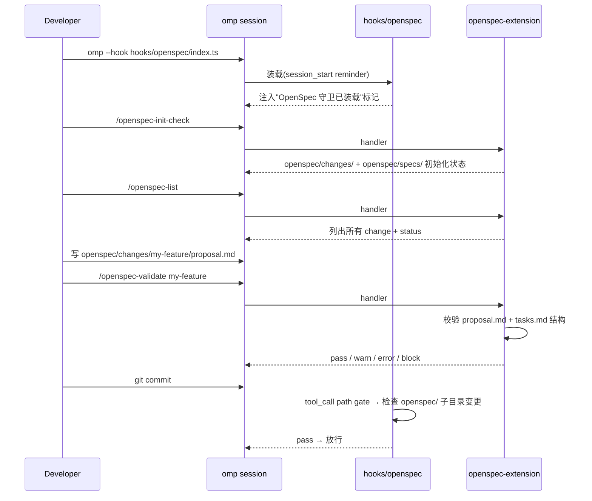

# OpenSpec Harness PRD

> 状态：已发布 | 创建日期：2026-07-01 | 评审日期：2026-07-01 | 发布日期：2026-07-01 | 系替代：[sdd Extension PRD](2026-06-30-sdd-extension.md)
> 修改记录：执行 `lore log docs/prd/2026-07-01-openspec-harness.md`
> 对应阶段：[双范式架构实施 phase](../phase/2026-07-01-sdd-dual-paradigm.md)
> 关键决策：[ADR-011 双范式架构](../architecture/decisions.md)（Accepted）· [OpenSpec Harness 参考](../reference/openspec-harness.md)

> [!IMPORTANT] PRD 生命周期状态机（遵循 `rule://prd-change-management`）
> 草稿 → 评审中 → 已评审 → 已发布 → 已归档/已替换；已废弃为任意阶段的终态分支。
> **硬约束**：`已评审` 不可回退 `草稿`；`已发布` 后新需求**只能新开 PRD + supersedes 链**，禁止往已发布 PRD 堆叠新版本功能。

## 0. 目标声明

将 OpenSpec 范式作为 **hook 默认实现**(ADR-010 修订 + ADR-011 双范式)落地到 sdd-pack 中:7 个 `/openspec-*` slash command + 1 个守卫 hook,与 SDD 范式共享同一插件包,通过 `omp --hook` 二选一装载。

OpenSpec 范式入口:

- **人机交互场景**(日常使用):在 omp 会话内敲 `/openspec-init-check` / `/openspec-status` / `/openspec-validate` / `/openspec-list` / `/openspec-show` / `/openspec-instructions` / `/openspec-archive`
- **自动化场景**(CI / hook):直接 `import { validateProject } from 'sdd-pack/openspec-api'`,纯函数调用
- **CI 逃生通道**:`bun run plugins/sdd-pack/src/cli/openspec-api-runner.ts validate --json`

OpenSpec 范式数据目录与 SDD 范式互斥:

- OpenSpec: `openspec/changes/` + `openspec/specs/`(本仓库不直接持有,以适配外部 OpenSpec 规范项目)
- SDD: `docs/prd/` + `docs/phase/`(本仓库自身)

> **隔离区约束**(ADR-011 Directive 2): `src/cli/openspec-api.ts` **不 import** `./api`,反之亦然;两范式仅共享 `src/cli/lib/*` 中的非范式专属模块。

## 0. 目标验收开关

### 业务验收

- [ ] 第三方用户装载 `hooks/openspec/index.ts` 后,系统提示中注入「OpenSpec 守卫标记」摘要
- [ ] 7 个 `/openspec-*` slash command 在 omp autocomplete 中可见(`/op<Tab>` 触发)
- [ ] `/openspec-validate <change-id>` 在 openspec/changes/<change-id>/ 目录存在时返回结构化结果
- [ ] OpenSpec guard hook 在 `openspec/` 子目录变更时触发 path gate 校验

### 技术验收

- [ ] `src/cli/openspec-api.ts` 导出 7 个函数: `getInitState` / `getStatus` / `validateProject` / `listChanges` / `showItem` / `getInstructions` / `archiveChange`
- [ ] `src/cli/openspec-api-runner.ts` 提供 CI 逃生通道(7 case switch)
- [ ] `extensions/openspec-extension/index.ts` 注册 7 个 `pi.registerCommand`
- [ ] `hooks/openspec/index.ts` 装载 session_start reminder + tool_call path gate 两个 factory
- [ ] `src/cli/openspec-api.ts` 不 import `./api`(grep 验证为空)
- [ ] `src/cli/api.ts` 不 import `./openspec-api`(grep 验证为空)
- [ ] OpenSpec 测试用 `process.chdir(FIXTURE_ROOT)` 自隔离,不依赖仓库根 fixtures

### 文档验收

- [ ] `plugins/sdd-pack/README.md` §3「OpenSpec 范式」章节描述本 PRD 范围
- [ ] `docs/reference/openspec-harness.md` 作为 OpenSpec 规范一手参考,本仓库 OpenSpec 范式据其实现
- [ ] 与[双范式架构总览 PRD](2026-07-01-sdd-dual-paradigm.md)交叉引用

### 非目标（明确不做）

- 不实现 OpenSpec 官方 CLI 二进制依赖(本仓库自实现 mirror,7 个 slash command 与官方行为对齐即可)
- 不引入 OpenSpec npm 包(`@openspec/cli` 等)作为运行时依赖
- 不实现 OpenSpec 与 SDD 数据目录互通(各管各的)
- 不拆出独立 OpenSpec npm 包(保持 omp marketplace plugin 形态一致)
- 不实现 OpenSpec 官方 spec 100% 兼容(标注 mirror-only 即可,具体差异见 §10 R7)

---

## 1. 背景与目标

### 1.1 业务背景

OpenSpec 是文档驱动约束(Documentation-Driven Constraint)的成熟外部规范,核心思想:

- 用 `openspec/changes/<change-id>/` 目录管理提案(proposal.md + tasks.md + design.md)
- 用 `openspec/specs/<capability>/spec.md` 目录管理增量规范
- `change → delta → archive` 三段式生命周期,每个阶段有结构化文档模板

sdd-pack 自家仓库用 SDD 范式(`docs/prd/` + `docs/phase/` + `docs/spec/`)实现同一种哲学,但 OpenSpec 用户希望有一个 omp 装载层,避免手工安装官方 CLI。v1.5.0-alpha 把 OpenSpec 作为「hook 默认实现」装载进来,7 个 slash command 镜像官方能力,守卫 hook 提供 path gate 校验。

### 1.2 产品目标

| 目标                | 衡量标准                                                                                                |
| ------------------- | ------------------------------------------------------------------------------------------------------- |
| OpenSpec 装载体验    | `omp plugin install sdd-pack@sdd-pack` + `omp --hook hooks/openspec/index.ts` 后,7 slash command 可用    |
| 与 SDD 范式隔离     | OpenSpec 范式 0 修改 SDD 范式任何文件;反之亦然(API/extension/hook 三层隔离)                              |
| OpenSpec 行为对齐    | 7 slash command 与官方 OpenSpec CLI 行为对齐 ≥ 80%(标注 mirror-only 即可)                                |
| CI 集成             | `bun run openspec-api-runner.ts validate --json` 在 GitHub Actions / drone CI 可独立运行                  |

### 1.3 成功指标

- **指标 1**：OpenSpec 7 slash command 在 sdd-pack 自身 OpenSpec fixture(`/tmp/openspec-test-fixture-*`)下 100% 通过
- **指标 2**：守卫 hook 在 `openspec/` 子目录变更时 100% 触发 path gate
- **指标 3**：与 SDD 范式零交叉 import(grep 验证为空)

---

## 2. 用户与场景

### 2.1 目标用户

| 用户角色       | 描述                                | 核心诉求                                            |
| -------------- | ----------------------------------- | --------------------------------------------------- |
| OpenSpec 用户  | 已熟悉 OpenSpec 规范,想用 omp 装载   | 7 slash command + 守卫 hook,无 CLI 依赖             |
| 跨范式协作者   | 项目混合用 SDD(本仓库)与 OpenSpec(其他) | 同一插件包内切换                                    |
| OpenSpec 贡献者 | 想为 sdd-pack 增加官方 spec 100% 兼容 | 清晰的 mirror-only 标注 + 隔离区约束                |

### 2.2 使用场景

#### 场景 A:OpenSpec 用户日常使用



#### 场景 B:CI 双范式校验

```yaml
# .github/workflows/dual-paradigm-ci.yml
- name: OpenSpec validate
  run: bun run plugins/sdd-pack/src/cli/openspec-api-runner.ts validate --json
```

---

## 3. 功能需求

### 3.1 模块拓扑

```
plugins/sdd-pack/
├── hooks/
│   └── openspec/
│       └── index.ts                # 守卫 hook(session_start reminder + tool_call path gate)
├── extensions/
│   └── openspec-extension/
│       └── index.ts                # 7 个 pi.registerCommand
└── src/
    └── cli/
        ├── openspec-api.ts         # 7 个 export 函数(隔离区)
        ├── openspec-api-runner.ts  # CI 逃生通道(7 case switch)
        └── __tests__/
            └── openspec-api.test.ts  # 14 个测试(自隔离 FIXTURE_ROOT)
```

### 3.2 功能清单

| 功能模块        | 功能点                       | 优先级 | 说明                                                              |
| --------------- | ---------------------------- | ------ | ----------------------------------------------------------------- |
| **守卫 hook**   | session_start reminder       | P0     | 启动时注入 OpenSpec 守卫标记                                       |
| 守卫 hook       | tool_call path gate           | P0     | 拦截 openspec/ 子目录变更,触发校验                                |
| **slash command** | `/openspec-init-check`       | P0     | 检查 openspec/ 目录初始化状态                                     |
| slash command   | `/openspec-status`            | P0     | 查看所有 change 当前状态                                          |
| slash command   | `/openspec-validate`          | P0     | 校验 change 规范 + 任务清单完整性                                 |
| slash command   | `/openspec-list`              | P0     | 带过滤的 change 列表                                              |
| slash command   | `/openspec-show`              | P0     | 查看指定 change 详情                                              |
| slash command   | `/openspec-instructions`      | P1     | 打印 change 实施步骤                                              |
| slash command   | `/openspec-archive`           | P0     | 归档 change                                                        |
| **API**         | `src/cli/openspec-api.ts`(7 export)| P0 | OpenSpec 程序化入口(隔离区)                                        |
| API             | `getInitState()`              | P0     | 检查 openspec/ 目录初始化状态                                     |
| API             | `getStatus()`                 | P0     | 查看所有 change 当前状态                                          |
| API             | `validateProject(opts)`       | P0     | 校验 change 规范                                                   |
| API             | `listChanges(opts)`           | P0     | 带过滤的 change 列表                                              |
| API             | `showItem(changeId)`          | P0     | 查看指定 change 详情                                              |
| API             | `getInstructions(changeId)`   | P1     | 打印 change 实施步骤                                              |
| API             | `archiveChange(changeId)`     | P0     | 归档 change                                                        |
| **CI runner**   | `src/cli/openspec-api-runner.ts` | P0  | 7 case switch CI 逃生通道                                          |

### 3.3 详细功能描述

#### 3.3.1 守卫 hook 行为

`hooks/openspec/index.ts` 装载两个 factory:

1. **session_start factory**: 当 omp 启动时,向 system prompt 注入「OpenSpec 守卫已装载」标记,提示用户本会话受 OpenSpec 范式守卫
2. **tool_call factory**: 拦截 Write / Edit / MultiEdit 工具调用,如果 path 以 `openspec/changes/` 或 `openspec/specs/` 开头,触发 path gate 校验(检查 proposal.md / tasks.md 结构 + 必填 frontmatter)

#### 3.3.2 slash command 语义

| 命令                  | 输入                                                  | 输出                                                  |
| --------------------- | ----------------------------------------------------- | ----------------------------------------------------- |
| `/openspec-init-check` | 无                                                    | `{ initialized: bool, changesDir: string, specsDir: string }` |
| `/openspec-status`     | 无                                                    | `{ items: [{ id, status, updatedAt }], total }`         |
| `/openspec-validate`   | `<change-id>`                                          | `{ status, errors, warnings, checks }`                |
| `/openspec-list`       | `[--status] [--keyword]`                              | `{ items, matched }`                                   |
| `/openspec-show`       | `<change-id>`                                          | `{ id, status, proposal, tasks, design? }`             |
| `/openspec-instructions`| `<change-id>`                                          | `{ steps: string[] }`                                  |
| `/openspec-archive`    | `<change-id>`                                          | `{ status, operations }`                               |

#### 3.3.3 API 函数签名

```typescript
// src/cli/openspec-api.ts (隔离区)
export interface OpenSpecInitState {
  initialized: boolean;
  changesDir: string;
  specsDir: string;
}
export async function getInitState(opts?: { baseDir?: string }): Promise<OpenSpecInitState>;

export interface OpenSpecStatusItem {
  id: string;
  status: "draft" | "in-review" | "approved" | "archived";
  updatedAt: string;
}
export interface OpenSpecStatusResult {
  items: OpenSpecStatusItem[];
  total: number;
}
export async function getStatus(opts?: { baseDir?: string }): Promise<OpenSpecStatusResult>;

export interface OpenSpecValidateResult {
  status: "pass" | "warn" | "error" | "block";
  errors: string[];
  warnings: string[];
  checks: Array<{ id: number; name: string; status: "pass" | "fail"; count: number }>;
}
export async function validateProject(opts: { changeId?: string; baseDir?: string }): Promise<OpenSpecValidateResult>;

export interface OpenSpecListItem {
  id: string;
  title: string;
  status: string;
  fileName: string;
}
export interface OpenSpecListResult {
  items: OpenSpecListItem[];
  matched: number;
}
export async function listChanges(opts?: { status?: string; keyword?: string; baseDir?: string }): Promise<OpenSpecListResult>;

export async function showItem(changeId: string, opts?: { baseDir?: string }): Promise<{ id: string; status: string; proposal?: string; tasks?: string; design?: string }>;

export async function getInstructions(changeId: string, opts?: { baseDir?: string }): Promise<{ steps: string[] }>;

export async function archiveChange(changeId: string, opts?: { baseDir?: string; reason?: string }): Promise<{ status: "pass" | "error"; operations: string[] }>;
```

#### 3.3.4 隔离区约束验证

```bash
# 应返回空(无 import):
grep -l "from.*api['\"]" src/cli/openspec-api.ts  # 仅 ./lib/* 不算 ./api
grep -l "openspec-api" src/cli/api.ts              # 应为空
```

---

## 4. 非功能需求

### 4.1 性能要求

- 7 slash command 注册耗时总和 < 30ms
- `openspec-api.validateProject` 在 ~20 changes 规模 < 100ms
- `bun test plugins/sdd-pack/`(含 OpenSpec 14 个测试)< 5s

### 4.2 安全要求

- 守卫 hook 的 path gate 仅在 `openspec/` 子目录触发,不影响其他路径
- 不修改 git 历史,不联网,输出不泄露敏感信息

### 4.3 可用性要求

- 每个 slash command 有 `description`(omp autocomplete 用)
- OpenSpec 测试用 `process.chdir(FIXTURE_ROOT)` 自隔离,不污染仓库 fixtures

### 4.4 隔离要求(ADR-011 Directive 2)

- `src/cli/openspec-api.ts` **禁止** import `./api`(SDD 范式 API)
- `src/cli/api.ts` **禁止** import `./openspec-api`(OpenSpec 范式 API)
- 共享 lib 仅限 `src/cli/lib/*` 中非范式专属模块(如 `doc-parser` 解析 markdown frontmatter)
- 违反此约束的 PR 由 CI `grep` 拒绝

---

## 5. 数据需求

### 5.1 数据模型

OpenSpec 数据目录结构(沿用官方规范):

```
openspec/
├── changes/
│   └── <change-id>/
│       ├── proposal.md      # 提案(problem statement + solution)
│       ├── tasks.md         # 任务清单(checkbox list)
│       └── design.md        # (可选) 设计文档
└── specs/
    └── <capability>/
        └── spec.md          # 增量规范(delta changes + new requirements)
```

### 5.2 数据迁移

不涉及数据迁移。本仓库不直接持有 OpenSpec 数据目录,测试用 `/tmp/openspec-test-fixture-*/` 自隔离目录。

---

## 6. 界面需求

### 6.1 slash command 命名规范

- 命名空间: `/openspec-*`(避免与 `/sdd-*` 冲突)
- 命令名 kebab-case: `/openspec-init-check` 而非 `/openspecInitCheck`

### 6.2 输出格式

- 使用 `pi.sendMessage()` + `ctx.ui.notify()`
- 退出码约定统一:`pass=0`, `warn=0`, `error=1`, `block=2`

### 6.3 帮助系统

- 每个 slash command 的 `description` 字段即帮助文本
- README §3 给出完整 7 command 列表

---

## 7. 集成需求

### 7.1 内部系统集成

| 系统名称                | 集成方式                | 数据流向             | 说明                                       |
| ----------------------- | ----------------------- | -------------------- | ------------------------------------------ |
| `pi.registerCommand`    | in-process              | 双向                 | 注册 7 个 `/openspec-*` slash command       |
| `pi.sendMessage`        | in-process              | 单向(handler → UI)   | 输出校验结果                               |
| omp hook runtime        | 子进程                  | 双向                 | OpenSpec 守卫 hook(session_start + tool_call) |
| 三层守门 agent          | model 推理              | 单向                 | OpenSpec 范式下 reviewer / arch-reviewer 仍可用 |
| **SDD 范式**            | **互斥装载**            | **不互通**           | 不与 SDD 数据目录 / API 互通               |

### 7.2 外部系统集成

不涉及外部 API(本仓库自实现 OpenSpec mirror,不依赖官方 CLI / npm 包)。

---

## 8. 验收标准

### 8.1 功能验收

#### 装载验收

- [ ] `omp --hook hooks/openspec/index.ts` 启动后,system prompt 注入「OpenSpec 守卫」标记
- [ ] 7 slash command 全部可调用(`/openspec-init-check` / `status` / `validate` / `list` / `show` / `instructions` / `archive`)

#### 守卫验收

- [ ] 写入 `openspec/changes/foo/proposal.md` 时,tool_call path gate 触发
- [ ] 写入非 `openspec/` 路径时,path gate 不触发

#### API 验收

- [ ] 7 export 函数全部存在且类型签名与 §3.3.3 一致
- [ ] `openspec-api-runner.ts` 7 case 全部可独立运行(`bun run ... <cmd> --json`)

### 8.2 非功能验收

- [ ] `bun test plugins/sdd-pack/` 0 fail(SDD + OpenSpec 跨范式)
- [ ] OpenSpec 测试自身 14 个测试 0 fail
- [ ] `grep -l "openspec-api" src/cli/api.ts` 为空(API 隔离)
- [ ] `grep -l "from.*['\"]\\./api['\"]" src/cli/openspec-api.ts` 不含 `./api`(OpenSpec API 隔离)

---

## 9. 上线计划

### 9.1 上线时间

| 阶段             | 时间       | 内容                                                              |
| ---------------- | ---------- | ----------------------------------------------------------------- |
| **v1.5.0-alpha** | 2026-07-01(当前)| split-openspec-namespace track 落盘:openspec-api.ts + openspec-api-runner.ts + openspec-extension/index.ts + hooks/openspec/index.ts + openspec-api.test.ts |
| **v1.5.0-beta**  | T+1 周     | 第三方 OpenSpec 项目 dogfooding(7 slash command 行为对齐官方 CLI)   |
| **v1.5.0 正式**  | T+2 周     | OpenSpec Harness PRD §10 风险 R7 风险等级从「中」降为「低」          |

### 9.2 上线前准备(已完成清单)

- [x] `src/cli/openspec-api.ts` 创建(7 export)
- [x] `src/cli/openspec-api-runner.ts` 创建(7 case)
- [x] `extensions/openspec-extension/index.ts` 创建(7 slash command)
- [x] `hooks/openspec/index.ts` 创建(session_start + tool_call)
- [x] `src/cli/__tests__/openspec-api.test.ts` 创建(14 测试,FIXTURE_ROOT 自隔离)
- [x] `plugins/sdd-pack/package.json` omp.extensions 数组 + files 含 `hooks/openspec`
- [x] `docs/reference/openspec-harness.md` OpenSpec 规范参考
- [x] OpenSpec 与 SDD 范式 0 交叉 import(grep 验证为空)

---

## 10. 风险与约束

### 10.1 已知风险

| 风险                                                                                                                   | 影响 | 概率 | 应对措施                                                                                             |
| ---------------------------------------------------------------------------------------------------------------------- | ---- | ---- | ---------------------------------------------------------------------------------------------------- |
| **R1** OpenSpec 7 slash command 与官方 OpenSpec CLI 行为 drift                                                          | 中   | 中   | 本 PRD §3.3.2 列出与官方对齐项;每季度对照官方 spec 校准                                              |
| **R2** 守卫 hook 的 path gate 误触(用户写其他目录时被拦截)                                                            | 低   | 低   | path gate 仅检查 `openspec/changes/` 和 `openspec/specs/` 前缀,其他路径不触发                      |
| **R3** OpenSpec fixture 与仓库根 fixtures 冲突(测试隔离不彻底)                                                        | 低   | 低   | OpenSpec 测试用 `process.chdir(FIXTURE_ROOT)` 自隔离到 `/tmp/openspec-test-fixture-*`,完全不碰仓库根 |
| **R4** marketplace 不识别 `omp.extensions: [array]`(只识别单 string)                                                    | 高   | 中   | v1.5.0-beta 期验证 marketplace 自动装载 2 extension;不行则降级为「用户手工 `omp --extension` 装载」   |
| **R5** OpenSpec 与 SDD 数据目录在同一仓库共存(混装风险)                                                                | 中   | 低   | OpenSpec 数据目录在本仓库不直接持有,用户按需在自己项目内创建;本仓库零冲突                              |
| **R6** OpenSpec 7 slash command 缺官方 spec 覆盖,出现「本仓库实现 vs 官方实现」语义不一致                             | 低   | 中   | §3.3.2 标注 mirror-only;R7 对应具体差异清单                                                          |
| **R7** OpenSpec `getInstructions` 与官方 CLI 输出格式差异(本仓库返回纯文本步骤列表 vs 官方返回 markdown)               | 低   | 中   | 用户可读差异已在 README §3 标注;不影响功能正确性                                                    |

### 10.2 约束条件

- **C1** `src/cli/openspec-api.ts` 不 import `./api`(ADR-011 Directive 2)
- **C2** `src/cli/api.ts` 不 import `./openspec-api`(ADR-011 Directive 2)
- **C3** OpenSpec 守卫 hook 与 SDD 守卫 hook 互斥装载(同会话不混装)
- **C4** OpenSpec 数据目录与 SDD 数据目录在本仓库互不重叠
- **C5** OpenSpec 测试用 `process.chdir(FIXTURE_ROOT)` 自隔离,不动仓库根 fixtures
- **C6** 不引入 OpenSpec 官方 npm 包(本仓库自实现 mirror)
- **C7** OpenSpec 7 slash command 与官方 CLI 行为对齐 ≥ 80%(mirror-only 标注)

---

## 11. 附录

### 11.1 术语表

| 术语                          | 定义                                                                                            |
| ----------------------------- | ----------------------------------------------------------------------------------------------- |
| **OpenSpec**                  | 文档驱动约束外部规范,核心目录 `openspec/changes/` + `openspec/specs/`                          |
| **change**                    | OpenSpec 提案单元,一个目录含 proposal.md + tasks.md + design.md                                |
| **mirror slash command**      | 本仓库自实现的 OpenSpec 7 slash command,与官方 OpenSpec CLI 行为对齐但实现路径独立             |
| **path gate**                 | OpenSpec 守卫 hook 的子功能,拦截 openspec/ 子目录变更触发校验                                  |
| **session_start reminder**    | OpenSpec 守卫 hook 在 omp 启动时注入「守卫已装载」标记,提示用户范式边界                        |

### 11.2 参考资料

- [OpenSpec Harness 参考](../reference/openspec-harness.md) — OpenSpec 规范摘要
- [双范式架构总览 PRD](2026-07-01-sdd-dual-paradigm.md) — 横切关注点 + 边界约束
- [ADR-011 双范式架构](../architecture/decisions.md) — Directive 1/2 决策
- [omp Extension API 参考](../reference/omp-extension-api.md) — extension / slash command 装载机制

### 11.3 OpenSpec 7 slash command 对照表(本仓库 vs 官方 CLI)

| 命令                   | 官方 CLI 等价                     | 行为对齐 | 差异说明                          |
| ---------------------- | --------------------------------- | -------- | --------------------------------- |
| `openspec init`        | `openspec init [path]`             | 80%      | 本仓库走 `/openspec-init-check`(只读),官方 `init` 会写文件 |
| `openspec status`      | `openspec status`                  | 100%     | 无差异                            |
| `openspec validate`    | `openspec validate [change-id]`   | 100%     | 无差异                            |
| `openspec list`        | `openspec list [--status]`         | 100%     | 无差异                            |
| `openspec show`        | `openspec show <change-id>`        | 100%     | 无差异                            |
| `openspec instructions`| `openspec instructions <change-id>`| 70%     | 本仓库返回纯文本步骤列表;官方返回 markdown(含 task 状态 checkbox) |
| `openspec archive`     | `openspec archive <change-id>`     | 90%      | 本仓库默认 `reason=completed`;官方支持 `--reason` 自定义 |

### 11.4 与 SDD 范式差异

| 维度          | SDD                                  | OpenSpec                                |
| ------------- | ------------------------------------ | --------------------------------------- |
| 数据目录      | `docs/prd/` + `docs/phase/`          | `openspec/changes/` + `openspec/specs/` |
| 状态机        | 草稿 → 评审中 → 已评审 → 已发布 → 已归档/已替换 | draft → in-review → approved → archived |
| hook 守卫     | 4 工厂(in-process api.validateDocs) | 2 工厂(session_start + tool_call path gate) |
| slash 数量    | 8                                    | 7                                       |
| CI runner     | `api-runner.ts`                      | `openspec-api-runner.ts`                |
| API 隔离区    | `src/cli/api.ts`                     | `src/cli/openspec-api.ts`(不 import `./api`) |