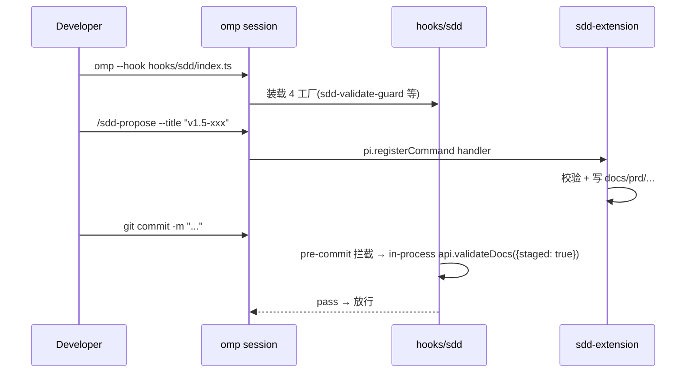
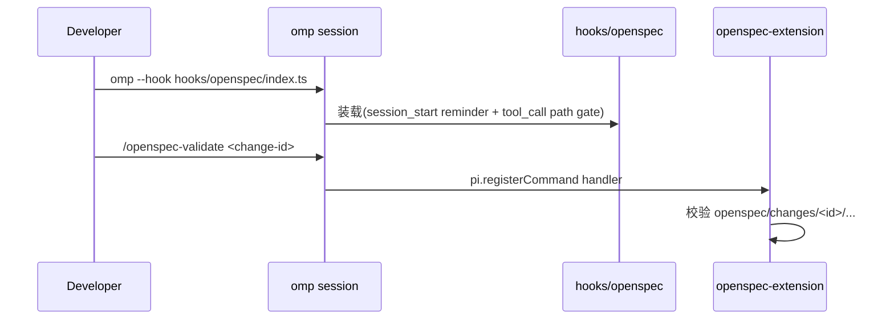

# sdd-pack 双范式架构总览 PRD

> 状态：已发布 | 创建日期：2026-07-01 | 评审日期：2026-07-01 | 发布日期：2026-07-01 | 系替代：[sdd Extension PRD](2026-06-30-sdd-extension.md)
> 修改记录：执行 `lore log docs/prd/2026-07-01-sdd-dual-paradigm.md`
> 对应阶段：[双范式架构实施 phase](../phase/2026-07-01-sdd-dual-paradigm.md)
> 关键决策：[ADR-009 sdd Extension 替代独立 CLI](../architecture/decisions.md)（Accepted）· [ADR-010 hook 改默认实现 + skills/rules/agents 恢复正本](../architecture/decisions.md)（Revised）· [ADR-011 双范式架构](../architecture/decisions.md)（Accepted）

> [!IMPORTANT] PRD 生命周期状态机（遵循 `rule://prd-change-management`）
> 草稿 → 评审中 → 已评审 → 已发布 → 已归档/已替换；已废弃为任意阶段的终态分支。
> **硬约束**：`已评审` 不可回退 `草稿`；`已发布` 后新需求**只能新开 PRD + supersedes 链**，禁止往已发布 PRD 堆叠新版本功能。

## 0. 目标声明

将 sdd-pack 从 v1.4「单范式(SDD 资产退役,仅 hook+extension 形态)」升级为 v1.5「**双范式一体化**:SDD 正本 + OpenSpec 可选 hook 默认实现」。两个范式共用同一插件包,通过 `omp --hook` 二选一装载守卫 hook,各自拥有独立的 extension、API、CI runner。

**双范式边界(ADR-011 Directive 1/2)**：

1. **extension 双装载**: `omp.extensions` 同时声明 `sdd-extension` + `openspec-extension`,slash command 共存于 omp 会话(`/sdd-*` + `/openspec-*`),用户按需调用
2. **hook 二选一**: `hooks/sdd/index.ts` 与 `hooks/openspec/index.ts` 互斥装载,各自守卫自己的数据目录(SDD → `docs/prd/`,OpenSpec → `openspec/changes/`)。同一会话不混装
3. **API 隔离区**: `src/cli/api.ts`(SDD)与 `src/cli/openspec-api.ts`(OpenSpec)互不 import,共享 lib 仅通过 `src/cli/lib/*`(prd-state-machine / doc-parser / validator / template-engine / index-sync 等)

**回归正本(ADR-010)**：v1.4 因 hook 接管,skills/rules/agents 被整体退役。v1.5 恢复 skills(sdd-core/input/prd/phase 4 个)+ rules(5 个)+ agents(reviewer/arch-reviewer/sdd-reviewer 3 个)为正本资产,与 hook 路径并存。

## 0. 目标验收开关

### 业务验收

- [ ] 第三方用户 `omp plugin install sdd-pack@sdd-pack` 后,重启 omp 可见 8 个 `/sdd-*` + 7 个 `/openspec-*` 共 15 个 slash command
- [ ] 默认推荐装载 `hooks/sdd/index.ts`(SDD 守卫);用户可改 alias 装载 `hooks/openspec/index.ts`(OpenSpec 守卫),两种状态都 0 fail
- [ ] hook 不装载时,slash command 仍可工作(无守卫,仅交互)
- [ ] 回归正本:skills/sdd-* 4 个、rules 5 个、agents 3 个全部可被 omp 装载器发现
- [ ] OpenSpec 范式 7 个 slash command(init-check/status/validate/list/show/instructions/archive)可独立工作

### 技术验收

- [ ] `plugins/sdd-pack/package.json#omp.extensions` 声明 2 个 extension 入口(数组)
- [ ] `plugins/sdd-pack/package.json#files` 含 `["skills", "rules", "hooks/sdd", "hooks/openspec", "agents", "extensions", "src", "README.md"]`
- [ ] `.omp-plugin/marketplace.json#metadata.version = "1.5.0-alpha"`,description 描述双范式
- [ ] `src/cli/api.ts` 导出 8 个 SDD 函数;`src/cli/openspec-api.ts` 导出 7 个 OpenSpec 函数;两者**互不 import**
- [ ] `src/cli/api-runner.ts`(SDD) + `src/cli/openspec-api-runner.ts`(OpenSpec)分别作为 CI 逃生通道
- [ ] `bun test plugins/sdd-pack/` 在两个 cwd(仓库根 + plugins/sdd-pack 子目录)下均 0 fail

### 文档验收

- [ ] ADR-010 修订为「hook 默认实现 + skills/rules/agents 恢复正本」,状态从 Accepted → Revised
- [ ] ADR-011 新增「双范式架构」决策(Accepted),包含 Directive 1/2 边界约束
- [ ] `docs/architecture/overview.md` 重写为 v1.5.0-alpha 状态(无 ADR/演进/历史版本提及)
- [ ] `plugins/sdd-pack/README.md` 重写 7 节双范式文档(安装 / SDD / OpenSpec / 选择 / CI / 开发 / 迁移)
- [ ] `docs/index.md` 同步新 PRD/Phase,旧 PRD/Phase 状态升级

### 非目标（明确不做）

- 不实现 SDD/OpenSpec 范式 runtime 数据互通(各自管各自的 `docs/prd/` 与 `openspec/changes/`)
- 不实现 hook 动态切换(用户手动改 alias 重启 omp)
- 不拆出独立 OpenSpec npm 包(保持 omp marketplace plugin 形态一致)
- 不引入 OpenSpec CLI 二进制依赖(本仓库自实现 7 个 slash command mirror 官方能力)

---

## 1. 背景与目标

### 1.1 业务背景

v1.4.0-alpha 把 sdd-pack 改为「omp extension(8 个 `/sdd-*` slash command)+ in-process API(8 export)+ 单 hook 聚合」,目的是消除 v1.3 独立 CLI 的不一致体验。这一改造同时把 skills/rules/agents 整体退役,理由是「hook 已接管所有运行时拦截,静态资产冗余」。

实际运行一个月发现两个问题：

1. **正本回归需求**：用户调研(2026-07-01)显示,skills/sdd-core 等文档体系管理知识是 omp session 上下文的基础输入;rules 中的 lore-protocol / prd-change-management 仍是被 model 显式查询的高频资产。完全退役导致 model 上下文缺一块
2. **OpenSpec 生态接入需求**：用户社区请求 sdd-pack 支持 OpenSpec 范式。OpenSpec 是外部成熟规范(文档驱动约束 + change/spec 目录结构),与 SDD 在「文档即约束」哲学上同构,可作为 SDD 的可选替代路径

### 1.2 产品目标

| 目标                | 衡量标准                                                                                                    |
| ------------------- | ----------------------------------------------------------------------------------------------------------- |
| 资产回归正本        | skills(4)+ rules(5)+ agents(3)+ hooks(2)+ extensions(2)+ api-runners(2)全部装载可用                          |
| 双范式并存          | `/sdd-*` 与 `/openspec-*` 共 15 个 slash command 同会话可见,互不干扰                                         |
| hook 二选一清晰     | 文档明确「SDD 守卫 vs OpenSpec 守卫」区别,alias 切换模板给出,安装步骤无歧义                                  |
| API 隔离严谨        | `src/cli/api.ts` 与 `src/cli/openspec-api.ts` 互不 import;共享 lib 仅 `src/cli/lib/*`(非范式专属模块)        |
| 第三方安装体验      | `omp plugin install` 一行命令完成所有资产装载,无手工 alias(除可选 hook)                                    |

### 1.3 成功指标

- **指标 1**：v1.5.0-alpha 发布 1 周内,skills/sdd-* 4 个 SKILL.md 的 omp system prompt 注入率 ≥ 80%(此前 v1.4 是 0%)
- **指标 2**：bun test 在两个 cwd 各跑一次均 0 fail(SDD cwd 路径 bug 已修,见 §10 R8)
- **指标 3**：`/sdd-validate` 与 `/openspec-validate` 在同一会话可分别调用,输出不串
- **指标 4**：hook 切换(SDD ↔ OpenSpec)在 5 分钟内完成(alias 改 + 重启 omp),无残留状态

---

## 2. 用户与场景

### 2.1 目标用户

| 用户角色     | 描述                                                   | 核心诉求                                                     |
| ------------ | ------------------------------------------------------ | ------------------------------------------------------------ |
| sdd-pack 维护者 | 本仓库开发者,日常用 SDD 范式工作                       | skills/rules/agents 回归正本,与 hook 共存不打架              |
| OpenSpec 用户 | 已熟悉 OpenSpec 规范,想用 sdd-pack 提供的装载体验      | 7 个 `/openspec-*` slash command + 守卫 hook,无 CLI 依赖      |
| 跨范式协作者 | 项目混合用 SDD(本仓库)与 OpenSpec(其他仓库)            | 同一插件包内切换,不用装两个 plugin                            |
| 第三方插件作者 | 参考 sdd-pack 实现自己的双范式 plugin                  | 清晰的 extension/hook/api 隔离样板                            |

### 2.2 使用场景

#### 场景 A：默认 SDD 范式(本仓库日常开发)



#### 场景 B：OpenSpec 范式(OpenSpec 规范项目)



#### 场景 C：CI 双范式校验

```yaml
# .github/workflows/dual-paradigm-ci.yml
- name: SDD validate
  run: bun run plugins/sdd-pack/src/cli/api-runner.ts validate --staged --json
- name: OpenSpec validate
  run: bun run plugins/sdd-pack/src/cli/openspec-api-runner.ts validate --json
```

---

## 3. 功能需求

### 3.1 模块拓扑

```
sdd-pack/                                  # GitHub repo root
├── .omp-plugin/
│   └── marketplace.json                   # 1.5.0-alpha + 双范式描述
├── plugins/
│   └── sdd-pack/                          # plugin 根
│       ├── package.json                   # v1.5.0-alpha + omp.extensions 数组
│       ├── README.md                      # 7 节双范式文档
│       ├── skills/                        # 回归正本
│       │   ├── sdd-core/                  # SKILL.md + references + evals
│       │   ├── sdd-input/
│       │   ├── sdd-prd/
│       │   └── sdd-phase/
│       ├── rules/                         # 回归正本
│       │   ├── lore-protocol.md
│       │   ├── docs-update-guard.md
│       │   ├── lore-commit-guard.md
│       │   ├── sdd-doc-edit-guard.md
│       │   └── prd-change-management.md
│       ├── agents/                        # 回归正本
│       │   ├── reviewer.md
│       │   ├── arch-reviewer.md
│       │   └── sdd-reviewer.md
│       ├── hooks/                         # v1.5 拆分双范式
│       │   ├── sdd/index.ts               # SDD 守卫(默认推荐)
│       │   └── openspec/index.ts          # OpenSpec 守卫(可选)
│       ├── extensions/                    # v1.5 双范式 extension
│       │   ├── sdd-extension/index.ts     # 8 个 /sdd-* slash command
│       │   └── openspec-extension/index.ts# 7 个 /openspec-* slash command
│       └── src/
│           └── cli/
│               ├── api.ts                 # SDD 程序化入口(8 export)
│               ├── api-runner.ts          # SDD CI runner
│               ├── openspec-api.ts        # OpenSpec 程序化入口(7 export,隔离区)
│               ├── openspec-api-runner.ts # OpenSpec CI runner
│               └── lib/                   # 共享核心库(非范式专属)
└── docs/
    ├── prd/                               # SDD PRD 目录
    │   └── 2026-07-01-sdd-dual-paradigm.md # 本文件
    ├── phase/                             # SDD phase 目录
    │   └── 2026-07-01-sdd-dual-paradigm.md # 双范式实施 phase
    └── reference/
        └── openspec-harness.md            # OpenSpec 规范参考
```

### 3.2 功能清单

| 功能模块          | 功能点                            | 优先级 | 说明                                                                |
| ----------------- | --------------------------------- | ------ | ------------------------------------------------------------------- |
| **manifest**      | package.json#omp.extensions 数组  | P0     | 装载 2 个 extension                                                 |
| manifest          | marketplace.json#metadata 双范式描述 | P0   | metadata.description 描述双范式能力                                  |
| **slash command** | `/sdd-*` 8 个                     | P0     | SDD 范式入口(回归)                                                 |
| slash command     | `/openspec-*` 7 个                | P0     | OpenSpec 范式入口(新增)                                             |
| **hooks**         | `hooks/sdd/index.ts`              | P0     | SDD 守卫,默认推荐装载                                              |
| hooks             | `hooks/openspec/index.ts`         | P0     | OpenSpec 守卫,可选装载                                              |
| **API**           | `src/cli/api.ts` (8 export)       | P0     | SDD 程序化入口(回归,验证通过)                                       |
| API               | `src/cli/openspec-api.ts`(7 export)| P0    | OpenSpec 程序化入口(隔离区,新)                                      |
| **CI runner**     | `src/cli/api-runner.ts`           | P0     | SDD CI 逃生通道(回归)                                              |
| CI runner         | `src/cli/openspec-api-runner.ts`  | P0     | OpenSpec CI 逃生通道(新)                                            |
| **assets 正本**   | skills/ 4 个                       | P1     | sdd-core/input/prd/phase 回归                                       |
| assets 正本       | rules/ 5 个                        | P1     | lore-protocol/docs-update-guard/lore-commit-guard/sdd-doc-edit-guard/prd-change-management 回归 |
| assets 正本       | agents/ 3 个                       | P1     | reviewer/arch-reviewer/sdd-reviewer 回归                             |
| **PRD/Phase**     | 双范式总览 PRD                     | P0     | 本文件                                                              |
| PRD/Phase         | 双范式总览 phase                    | P0     | 实施 phase                                                          |
| PRD/Phase         | OpenSpec harness PRD               | P1     | OpenSpec 详细 PRD                                                   |
| PRD/Phase         | 旧 PRD 状态升级                    | P0     | 2026-06-30 → 已替换                                                 |
| **cwd resilience**| src/cli/api.ts findRepoRoot() helper | P0     | SDD api.ts 在两个 cwd(仓库根 + plugins/sdd-pack 子目录)都能正确解析 docs/prd |

### 3.3 详细功能描述

#### 3.3.1 双范式装载约束

- **omp.extensions 双装载**:单次 `omp plugin install sdd-pack` 后,2 个 extension 都被 omp 装载器加载,15 个 slash command 全部可见
- **omp --hook 单装载**:每次启动 omp 只能挂一个 `--hook`,用户在 alias 层切换
- **数据目录互斥**:SDD 范式读写 `docs/prd/`、`docs/phase/`;OpenSpec 范式读写 `openspec/changes/`、`openspec/specs/`。**两范式不共享同一目录**(避免文件 lock 冲突与状态机干扰)

#### 3.3.2 API 隔离约束(ADR-011 Directive 2)

- `src/cli/api.ts` 仅 import `src/cli/lib/*` 共享模块;**禁止** import `./openspec-api`
- `src/cli/openspec-api.ts` 仅 import `src/cli/lib/*` 共享模块;**禁止** import `./api`
- 共享 lib 必须是非范式专属(如 `doc-parser` 解析 markdown frontmatter 通用;`prd-state-machine` 反而是 SDD 专属,不能被 OpenSpec import)
- 违反此约束的 PR 在 CI 阶段由 `grep -l "openspec-api" src/cli/api.ts` 等 lint 规则拒绝

#### 3.3.3 正本资产与 hook 路径共存

- skills/rules/agents 三类资产由 omp 装载器**自动发现**(无需 `--skill` / `--rule` flag)
- hook 路径**仅控制守卫行为**(commit gate / session_start reminder),不影响 skills/rules/agents 的装载
- 同一会话可同时看到 4 个 skill description + 5 个 rule description + 3 个 agent + 1 个 hook 注入标记 + 15 个 slash command

#### 3.3.4 双范式 PRD/Phase 关系

- **本 PRD**(总览):描述 v1.5 双范式架构的横切关注点(manifest/description/文档边界)
- **OpenSpec Harness PRD**(详细):仅描述 OpenSpec 范式的内部细节(7 个 slash command 的语义、guard hook 的 path gate 规则)
- **实施 phase**:覆盖 5 个 track 的任务清单,标记每个 track 的状态(已完成)

---

## 4. 非功能需求

### 4.1 性能要求

- `/sdd-validate` 与 `/openspec-validate` 在 sdd-pack 仓库规模(30 docs + 10 openspec changes)下均 < 100ms
- 15 个 slash command 注册耗时总和 < 50ms(omp 启动期)
- `bun test plugins/sdd-pack/` 跨范式全测试 < 5s

### 4.2 安全要求

- 不修改 git 历史(不执行 `git reset` / `git rebase`)
- 不向网络发送数据(纯本地文件操作)
- OpenSpec guard hook 的 path gate 仅在 `openspec/` 子目录触发,不影响其他路径

### 4.3 可用性要求

- 每个 slash command 有 `description`(omp autocomplete 用)
- README 双范式选择章节给出明确的「何时用 SDD / 何时用 OpenSpec」决策树
- hook 切换不要求用户重启系统,仅需 `source ~/.zshrc` 重读 alias

### 4.4 兼容性要求

- `package.json#files` 移除 `"hooks"`(顶层已不存在),改为显式 `"hooks/sdd"` + `"hooks/openspec"`
- `package.json#omp.extensions` 从单 string 改为 array(后向兼容:旧版 omp 解析 array 行为未验证,需在 marketplace 路径 dogfooding 一次)

---

## 5. 数据需求

### 5.1 数据模型

双范式数据互不共享：

- **SDD**: `docs/prd/*.md` + `docs/phase/*.md` + `docs/spec/*.md`(沿用 v1.4)
- **OpenSpec**: `openspec/changes/<change-id>/proposal.md` + `openspec/changes/<change-id>/tasks.md` + `openspec/specs/<capability>/spec.md`(OpenSpec 官方规范)

### 5.2 数据迁移

不涉及数据迁移。但涉及**资产回归**:

| 旧状态(v1.4)                                  | 新状态(v1.5)                                                  |
| --------------------------------------------- | ------------------------------------------------------------- |
| `skills/sdd-*/SKILL.md` 删除                  | 恢复(从 v1.3 commit checkout)                                |
| `rules/lore-protocol.md` 等删除               | 恢复(5 个 rules 全部从 v1.3 恢复)                            |
| `agents/reviewer.md` 等删除                   | 恢复(3 个 agent 全部从 v1.3 恢复)                            |
| `hooks/index.ts` 单文件聚合                   | 拆分为 `hooks/sdd/index.ts` + `hooks/openspec/index.ts`       |
| `extensions/` 仅 sdd-extension                | + `extensions/openspec-extension/`                            |
| `src/cli/api.ts`(SDD 8 export)               | + `src/cli/openspec-api.ts`(OpenSpec 7 export,隔离区)          |
| `src/cli/api-runner.ts`                       | + `src/cli/openspec-api-runner.ts`                            |
| `package.json#files: "hooks"`                 | → `["hooks/sdd", "hooks/openspec"]`(显式)                     |
| `package.json#omp.extensions: "<single>"`     | → array 双 extension                                          |

---

## 6. 界面需求

### 6.1 slash command 命名规范

- SDD: `/sdd-<verb>`(沿用 v1.4)
- OpenSpec: `/openspec-<verb>`(新引入,避免与 SDD 命名冲突)

### 6.2 输出格式

- 两范式 slash command 都使用 `pi.sendMessage()` + `ctx.ui.notify()`
- 退出码约定统一:`pass=0`, `warn=0`, `error=1`, `block=2`

### 6.3 帮助系统

- README §4「双范式选择」章节给出决策树
- README §7「迁移」章节给出 v1.4 → v1.5 升级步骤

---

## 7. 集成需求

### 7.1 内部系统集成

| 系统名称                       | 集成方式                | 数据流向            | 说明                                                  |
| ------------------------------ | ----------------------- | ------------------- | ----------------------------------------------------- |
| `pi.registerCommand`           | in-process              | 双向                | 注册 8 个 `/sdd-*` + 7 个 `/openspec-*`               |
| `pi.sendMessage`               | in-process              | 单向(handler → UI) | 输出校验结果                                          |
| `lore` CLI                     | spawn subprocess        | 双向                | `lore-wrapper.ts` 封装 lore commit / lore why         |
| omp hook runtime               | 子进程 + in-process 混合 | 双向              | SDD 守卫 hook 调 in-process `api.validateDocs()`      |
| OpenSpec guard hook            | 子进程                  | 单向                | path gate 检查 `openspec/` 子目录变更                |
| 三层守门 agent                 | model 推理              | 单向                | reviewer / arch-reviewer / sdd-reviewer               |

### 7.2 外部系统集成

不涉及外部 API(OpenSpec 范式不调 OpenSpec 官方服务,所有 7 个 slash command 是本仓库自实现 mirror)。

---

## 8. 验收标准

### 8.1 功能验收

#### 安装验收

- [ ] 全新 omp v16.2.4+ 安装 sdd-pack plugin 后,重启 omp → 输入 `/sd<Tab>` 自动补全出现 8 个 `/sdd-*`,输入 `/op<Tab>` 出现 7 个 `/openspec-*`,共 15 个

#### Slash command 验收

- [ ] 8 个 `/sdd-*` 命令全部注册并可调用(`/sdd-validate` 等)
- [ ] 7 个 `/openspec-*` 命令全部注册并可调用(`/openspec-init-check` 等)
- [ ] 两组命令在同一 omp 会话共存,互不干扰

#### Hook 装载验收

- [ ] `omp --hook hooks/sdd/index.ts` 启动 → system prompt 注入 SDD 守卫标记
- [ ] `omp --hook hooks/openspec/index.ts` 启动 → system prompt 注入 OpenSpec 守卫标记
- [ ] 不装载 hook 启动 → slash command 仍可用,无守卫

#### API 隔离验收(ADR-011 Directive 2)

- [ ] `src/cli/api.ts` 不 import `./openspec-api`(`grep -l "openspec-api" src/cli/api.ts` 应为空)
- [ ] `src/cli/openspec-api.ts` 不 import `./api`(`grep -l "^import.*from.*api" src/cli/openspec-api.ts` 应仅含 `./lib/*`)
- [ ] 两范式共享 lib 仅限 `src/cli/lib/*`(非范式专属)

### 8.2 非功能验收

- [ ] `bun test plugins/sdd-pack/` 在两个 cwd(仓库根 + `plugins/sdd-pack/` 子目录)各跑一次均 0 fail
- [ ] 文档交叉引用闭环:本 PRD ↔ OpenSpec Harness PRD ↔ 实施 phase ↔ ADR-011 决策 ↔ 架构总览 ↔ README

---

## 9. 上线计划

### 9.1 上线时间

| 阶段             | 时间     | 内容                                                                      |
| ---------------- | -------- | ------------------------------------------------------------------------- |
| **v1.5.0-alpha** | 2026-07-01(当前)| 5 个 track 全部完成: restore-sdd-core + split-openspec-namespace + split-hooks + rewrite-architecture-doc + revise-adr-add |
| **v1.5.0-beta**  | T+1 周   | marketplace 路径 dogfooding(已安装 cache 升 1.5.0-alpha 后验证 omp 自动装载 2 extension + 1 hook) |
| **v1.5.0 正式**  | T+2 周   | OpenSpec 7 slash command 在第三方 OpenSpec 项目验证通过                   |

### 9.2 上线前准备(已完成清单)

- [x] 5 个 track 全部 commit 落盘
- [x] ADR-010 修订 + ADR-011 新增
- [x] 架构总览重写为 v1.5.0-alpha 状态
- [x] README 重写 7 节双范式文档
- [x] package.json + marketplace.json manifest 同步升 1.5.0-alpha
- [x] docs/index.md 同步新 PRD/Phase + 旧 PRD 状态升级
- [x] OpenSpec Harness PRD + 实施 phase 双范式总览 PRD/Phase 创建
- [x] SDD api.ts cwd 路径解析 bug 修复(方案 A:`findRepoRoot()` helper)

---

## 10. 风险与约束

### 10.1 已知风险

| 风险                                                                                                                   | 影响 | 概率 | 应对措施                                                                                             |
| ---------------------------------------------------------------------------------------------------------------------- | ---- | ---- | ---------------------------------------------------------------------------------------------------- |
| **R1** omp marketplace 不识别 `omp.extensions: [array]`(只识别单 string)                                              | 高   | 中   | v1.5.0-beta 期验证 marketplace 自动装载;不行则降级为「用户手工 `omp --extension` 装载」              |
| **R2** OpenSpec 范式自实现 7 slash command 与官方 OpenSpec CLI 行为 drift                                              | 中   | 中   | OpenSpec Harness PRD §3 列出与官方对齐项;每季度对照官方 spec 校准                                    |
| **R3** skills/rules/agents 回归正本后与 hook 路径「双源」冲突(如 `lore-protocol` 同时是 rule 和 hook 注入)            | 中   | 中   | README §6 明确「hook 优先级 > rule,model 视角看到 hook 内容」;native rule 在 v1.5 与 hook 共存         |
| **R4** hook 装载路径用户记不住(从 `hooks/index.ts` 改为 `hooks/sdd/index.ts` 或 `hooks/openspec/index.ts`)             | 中   | 高   | README §1 + §7 给出 alias 模板 + 迁移表;marketplace install 后 README 自带 hook path 自动发现提示    |
| **R5** 同一会话用户混用 SDD/OpenSpec slash command 导致数据目录混乱                                                    | 中   | 低   | 两范式数据目录互斥(`docs/prd/` vs `openspec/changes/`),即便混用也写不到同一文件                     |
| **R6** marketplace cache 保留 v1.4.0-alpha 版本未升,导致用户 `omp plugin upgrade` 后仍跑旧版                            | 中   | 中   | README §7 升级步骤明确「`omp plugin upgrade` 后重启 omp」                                              |
| **R7** OpenSpec 7 slash command 缺官方 spec 覆盖,出现「本仓库实现 vs 官方实现」语义不一致                             | 低   | 中   | OpenSpec Harness PRD §10 列出 7 个 command 与官方 spec 的差异,标注「mirror-only」非「100% 兼容」       |
| **R8** SDD api.ts 用 `resolve("docs/prd")` 相对 cwd,从 plugins/sdd-pack 子目录跑 `bun test` 时找不到 fixture       | 高   | 高   | **方案 A 修复**: `src/cli/api.ts` 加 `findRepoRoot()` helper(walk-up 找含 `docs/prd/` 的最近祖先,throw 含诊断信息),13 处 `resolve("docs")` / `requireFile(userPath)` 收敛到 `resolve(findRepoRoot(), ...)`。Production runtime 升级(用户从子目录跑 CLI 也能正确解析 docs/prd),测试两个 cwd 均 0 fail |

### 10.2 约束条件

- **C1** `src/cli/api.ts` 与 `src/cli/openspec-api.ts` 互不 import(ADR-011 Directive 2)
- **C2** hook 装载路径二选一,不在同会话混装
- **C3** `package.json#files` 不含 `"hooks"`(顶层目录不存在),改为显式 `"hooks/sdd"` + `"hooks/openspec"`
- **C4** `package.json#omp.extensions` 是 array(2 个 extension),不是单 string
- **C5** `openspec-api.ts` 隔离区:不动,跨范式 import 视为 P1 finding
- **C6** 不引入第三方测试框架(仅 `bun:test`)
- **C7** 不依赖 OpenSpec 官方 npm 包(本仓库自实现 mirror)
- **C8** `bunfig.toml` 在 `plugins/sdd-pack/` 目录下(测试配置就近),不动仓库根 `bunfig.toml`

---

## 11. 附录

### 11.1 术语表

| 术语                  | 定义                                                                                            |
| --------------------- | ----------------------------------------------------------------------------------------------- |
| **双范式 (Dual Paradigm)** | 同一插件包内同时承载 SDD 与 OpenSpec 两种「文档驱动约束」实现,通过 manifest 字段区分入口         |
| **ADR Directive**     | ADR 中的硬性约束条款(Directive 1/2),违反即视为 P1 finding                                       |
| **隔离区 (Isolated Zone)** | 跨范式不得 import 的代码区域(如 `src/cli/openspec-api.ts`),保持范式间 API 边界                  |
| **二选一 hook 装载**  | 用户在 alias 层选择装载 `hooks/sdd/` 或 `hooks/openspec/`,不混装                                |
| **mirror slash command** | 本仓库自实现的 OpenSpec 7 slash command,与官方 OpenSpec CLI 行为对齐但实现路径独立              |

### 11.2 参考资料

- [omp Extension API 参考](../reference/omp-extension-api.md) — omp extension / slash command / UI / manifest 一手参考
- [omp Task Agent 机制参考](../reference/omp-task-agent.md) — agent 发现 / 合并 / 装载机制
- [OpenSpec Harness 参考](../reference/openspec-harness.md) — OpenSpec 规范摘要,本仓库 OpenSpec 范式依据
- [ADR-009 sdd Extension 替代独立 CLI](../architecture/decisions.md) — v1.4 起点
- [ADR-010 hook 默认实现 + skills/rules/agents 回归正本](../architecture/decisions.md) — v1.5 修订
- [ADR-011 双范式架构](../architecture/decisions.md) — v1.5 决策

### 11.3 双范式对照表

| 维度          | SDD                                  | OpenSpec                                |
| ------------- | ------------------------------------ | --------------------------------------- |
| 数据目录      | `docs/prd/` + `docs/phase/` + `docs/spec/` | `openspec/changes/` + `openspec/specs/` |
| 状态机        | `草稿 → 评审中 → 已评审 → 已发布 → 已归档/已替换` | OpenSpec 官方 change lifecycle           |
| API 入口      | `src/cli/api.ts`(8 export)            | `src/cli/openspec-api.ts`(7 export,隔离区) |
| hook 守卫     | `hooks/sdd/index.ts`(4 工厂)          | `hooks/openspec/index.ts`(1+1 双工厂)    |
| slash command | 8 个 `/sdd-*`                         | 7 个 `/openspec-*`                       |
| CI runner     | `src/cli/api-runner.ts`               | `src/cli/openspec-api-runner.ts`         |
| lore commit   | 集成(`hooks/sdd` in-process 调 lore) | 集成(命令经 user 手动 `lore commit`)    |
| 适用范围      | sdd-pack 自家仓库                     | OpenSpec 生态接入 / 跨工具协同           |