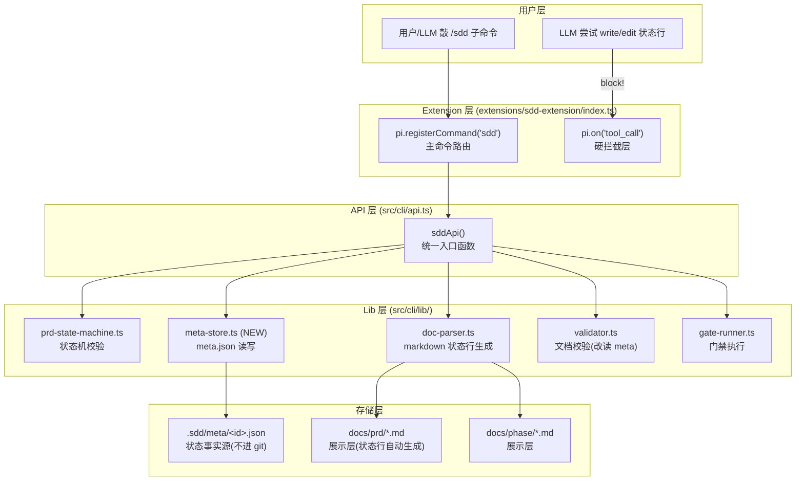
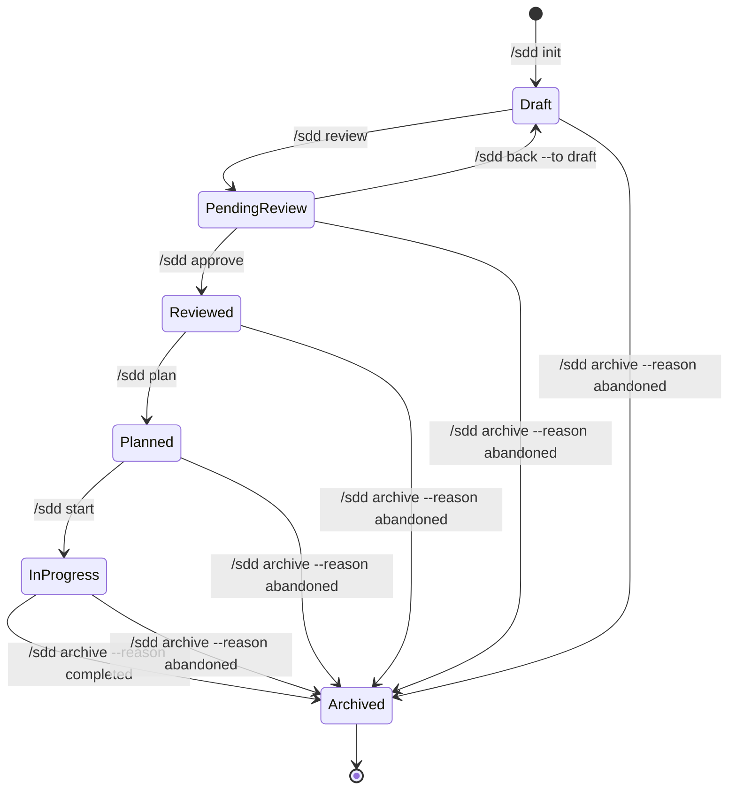
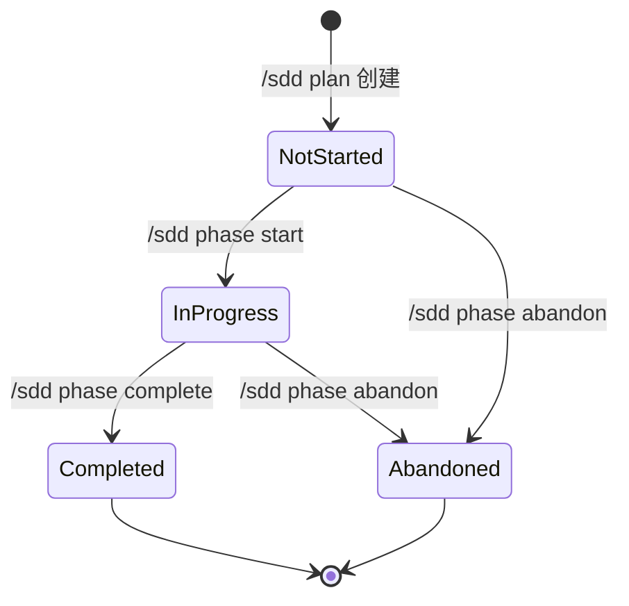

# sdd-pack PRD (v1.8 强状态流转 + meta.json 事实源)

> 状态：已归档 | 发布日期：2026-07-16 | 版本：1.0.0 | 归档原因：已中止
> 修改记录:执行 `lore log docs/prd/2026-07-16-sdd-pack-v18.md`
> 对应阶段:[Phase 001 基础设施](../phase/prd-20260716-001/001-foundation.md) · [Phase 002 命令体系](../phase/prd-20260716-001/002-commands.md) · [Phase 003 门禁集成](../phase/prd-20260716-001/003-gate-integration.md)
> 关键决策:[ADR-009 sdd Extension 替代独立 CLI](../architecture/decisions.md) · [ADR-013 omp 5 类资产分工契约](../architecture/decisions.md) · [ADR-015 hook 合并进 extension](../architecture/decisions.md) · [ADR-016 PRD 状态机重构](../architecture/decisions.md) · [ADR-017 Phase 状态机](../architecture/decisions.md) (Accepted) · **ADR-018 强状态流转 + meta.json 事实源 (Accepted, [v1.8](../architecture/decisions.md#adr-018-强状态流转--metajson-事实源))** · [ADR-010 OpenSpec 作为 hook 默认实现](../architecture/decisions.md) + [ADR-011 双范式架构](../architecture/decisions.md) (Superseded by ADR-018)

> [!IMPORTANT] 本 PRD 的核心架构变更
>
> 1. **meta.json 成为文档状态唯一事实源** — markdown 状态行降级为展示层,由 meta.json 单向生成
> 2. **全局单例 PRD** — 同一时间只允许 1 份活跃 PRD,新建前必须归档当前的
> 3. **`/sdd <subcommand>` 主命令体系** — 替代现有 14 个分散的 `/sdd-*` 命令
> 4. **全链路不可跳过** — PRD 5 个状态流转 + Phase 3 个状态流转全部强制走命令
> 5. **tool_call 硬拦截** — write/edit 指向 `docs/prd/` 或 `docs/phase/` 状态行的操作被 block,必须走命令

---

## 0. 目标声明

将 sdd-pack 的文档生命周期管理从"LLM 自觉遵守 + 软提示"升级为"命令强制流转 + 硬拦截门禁",确保每一步状态变更都不可绕过。引入 meta.json 作为状态唯一事实源,解决当前 markdown 状态行解析脆弱、多格式混排、状态可被随意篡改的根本问题。

### 0.1 设计哲学

**lore CLI 的文档管理体验,在 omp session 内通过 slash command 实现。**

lore CLI 的成功在于:
- 每个操作有明确命令(commit / log / why / constraints)
- 命令内部执行校验,不接受非法输入
- 用户不需要记住格式,命令自动生成正确格式
- 提交记录结构化(trailer schema)

本 PRD 把同样的体验应用到 SDD 文档状态管理:
- 每个状态流转有明确命令(`/sdd review` / `/sdd approve` / `/sdd plan`)
- 命令内部执行状态机校验,拒绝非法迁移
- 用户不需要手写状态行,命令从 meta.json 自动同步到 markdown
- 状态记录结构化(meta.json + transition history)

---

## 1. 背景与目标

### 1.1 现状问题

#### 问题 1:状态行解析脆弱,多格式混排

当前状态完全靠解析 markdown 里的 `> 状态：` 行,存在两种格式:

```
格式 A（单行）: > 状态：进行中 | 创建日期：2026-07-16
格式 B（堆叠）: > 状态:1.2.3 已发布(2026-06-25);v1.2.0 新增功能;v1.2.1 修正bug
```

`doc-parser.ts` 需要同时处理两种格式,`parseStatusLine` 和 `parseStackedStatusLine` 两套逻辑。`/sdd-migrate` 命令的存在就是为了把堆叠格式拆成 CHANGELOG——这本身就是格式混乱的补救措施。

#### 问题 2:状态可被随意篡改

LLM 或人可以直接 edit markdown 文件的状态行,把"已归档"改回"草稿",validator 不会拦截(只校验状态字符串是否合法,不校验迁移合法性)。`checkStateMachine`(validator.ts:298)的注释明确写了"堆叠行跳过状态检查"。

#### 问题 3:没有状态流转命令

当前 14 个 slash command 只做:
- CRUD: `/sdd-propose`(创建,写死"进行中") / `/sdd-archive`(归档)
- 格式迁移: `/sdd-migrate`(堆叠→CHANGELOG)
- 查询: `/sdd-status` / `/sdd-list` / `/sdd-why` / `/sdd-validate` / `/sdd-apply`
- 门禁: `/sdd-gate-lint` / `/sdd-gate-test` / `/sdd-gate-review` / `/sdd-gate-precommit` / `/sdd-gate-commit`

**草稿→待评审→已评审→已规划任务→进行中 这条链完全没有命令覆盖。** `/sdd-propose` 创建时直接写死"进行中",跳过了前 4 个状态。

#### 问题 4:PRD↔Phase 关系松散

当前 Phase 命名规范要求"日期与对应 PRD 一致",但实际上:
- 没有程序级关联验证(只检查日期前缀匹配)
- 一份 PRD 拆多份 Phase 是常见需求,但命名规范说"Phase 与 PRD 必须一一对应"(conventions.md §2.2)
- supersedes/引用链靠 markdown 链接,容易断裂

#### 问题 5:门禁分散,无强制编排

`/sdd-gate-*` 是 5 个独立命令,LLM 可以跳过任意一步。tool_call 拦截只在 commit 时触发(lore-commit-guard),状态流转时无任何门禁。

### 1.2 目标

| # | 目标 | 衡量标准 |
|---|------|----------|
| G1 | meta.json 成为状态唯一事实源 | markdown 状态行由命令从 meta.json 单向生成;validator 从 meta.json 读状态 |
| G2 | 全局单例 PRD | docs/prd/ 同时只有 1 份非归档 PRD;新建前强制归档当前的 |
| G3 | `/sdd <subcommand>` 统一命令体系 | 现有 14 个 `/sdd-*` 命令合并为 `/sdd` 主命令 + 子命令路由 |
| G4 | 全链路强制流转 | PRD 5 状态 + Phase 3 状态的每次迁移都通过命令执行,非法迁移被拒绝 |
| G5 | tool_call 硬拦截状态篡改 | write/edit 指向 docs/prd\|phase 状态行被 block;必须走命令 |
| G6 | PRD 1:N Phase ID 关联 | meta.json 内 parentId/phaseIds 数组维护关联;validator 校验 |
| G7 | 门禁嵌入流转流程 | 状态流转命令内部自动触发对应门禁,不需要用户手动跑 /sdd-gate-* |

### 1.3 非目标

- 不重写 lore CLI(lore 是独立工具,本 PRD 只复用 lore-wrapper)
- 不改 omp extension API(pi.registerCommand / pi.on("tool_call") 接口不变)
- 不改 sdd-gate 门禁核心逻辑(gate-runner.ts / gate-config.ts 复用)
- 不实现 Phase 文档自动从 PRD todo 拆解(仍然是 /sdd plan 手动创建,但建立 ID 关联)

### 1.4 移除 OpenSpec 双范式（吸收精华）

OpenSpec 范式自 v1.5.0 引入双范式架构（ADR-010/011），但 `openspec/` 目录在本仓库不存在（未初始化），从未真正并行使用。经分析，OpenSpec 的 3 个设计精华可以吸收到 SDD：

| 精华 | OpenSpec 实现 | SDD 吸收方式 |
|------|-------------|-------------|
| 目录即状态 | `changes/` vs `changes/archive/` | SDD 已有（`prd/` vs `prd/archive/`），meta.json 记录中间态，终态靠目录位置 |
| change 目录内聚 | `changes/<id>/` 内聚 proposal+tasks+design | Phase 按 PRD ID 分组目录：`docs/phase/<prd-id>/<seq>-<name>.md` |
| SHALL/MUST 规范校验 | validate 检查 SHALL/MUST/Requirement:/Scenario: | `/sdd review` 门禁新增规范语言校验 |

**移除清单**（~1500 行死代码）:
- `extensions/openspec-extension/index.ts` + test
- `src/cli/openspec-api.ts` + test
- `src/cli/openspec-api-runner.ts`
- `src/cli/lib/orchestration/openspec-cli.ts`
- `src/cli/lib/orchestration/openspec-project.ts`
- ADR-010/011 标记 Superseded
- session_start 不再注入 OpenSpec reminder
- tool_call 不再有 OpenSpec 路径提示
- `.omp-plugin/marketplace.json` 的 assets 字段清理 OpenSpec 命令声明 + metadata.description 和 plugins[0].description 的双范式文本更新为 SDD 单范式
- `plugins/sdd-pack/README.md` 同步更新: 移除双范式描述,改为 SDD 单范式

---

## 2. 架构设计

### 2.1 分层架构（ADR-013 遵守）



**关键分层原则（advisory 锚定）**:
- slash command **无状态**,只做意图入口和参数收集
- 状态校验与流转逻辑落在 **lib 层**（api.ts → state-machine → meta-store）
- **tool_call 拦截**是唯一的程序级阻断点（ADR-009/013/015 确立的硬门禁来源）

### 2.2 meta.json 数据模型

#### 2.2.1 文件位置

```
.sdd/
├── meta/                          # NEW: 状态事实源目录
│   ├── prd/                       # PRD meta 文件
│   │   └── <prd-id>.json          # 一个 PRD 一个 meta 文件
│   └── phase/                     # Phase meta 文件
│       └── <phase-id>.json        # 一个 Phase 一个 meta 文件
├── gate.json                      # 现有: 门禁配置
└── review/                        # 现有: 审查产物(gitignore)
```

**git 策略**: `.sdd/meta/` **不进 git**（和 `.sdd/review/` 一样本地）。原因:
- meta.json 是本地工作状态,不同开发者/环境可能处于不同状态
- 状态变更通过 lore commit 记录在 git 历史中(intent + trailer)
- markdown 状态行进 git,作为团队可见的展示层

**⚠️ 设计权衡**: meta.json 不进 git 意味着 clone 后没有 meta.json。解决方案:
- `/sdd sync` 命令从 markdown 状态行重建 meta.json(反向同步)
- `/sdd status` 检测到 meta.json 缺失时自动触发重建
- validator 优先读 meta.json,缺失时 fallback 读 markdown 状态行(并 warn)

**不变量（invariants，validator 强制校验）**:
- **全局单例**: `docs/prd/` 下最多 1 份非归档 `.md` 文件（`archive/` 子目录除外）
- clone 后重建逻辑安全假设: `docs/prd/` 下唯一的非归档 `.md` = active PRD
- 如重建时发现 0 份非归档文件: `activePrdId = null`,提示 `/sdd init`
- 如重建时发现 >1 份非归档文件: **block**,提示"全局单例违反,请先归档多余的"

**双写崩溃恢复（C1 风险缓解）**:
- 流转命令内部用 try-catch 包裹双写（meta.json + markdown）
- 写入顺序: **先写 markdown（进 git），成功后写 meta.json（本地缓存）**
- 如 meta.json 写入失败: markdown 已更新,下次 `/sdd sync` 自动重建 meta.json（markdown 此时是临时事实源）
- 如 markdown 写入失败: 整个操作回滚,meta.json 不写,报错给用户
- 这个顺序确保: git 仓库中的 markdown 永远是最新的可信状态;meta.json 是命令操作的首选事实源（命令读写 meta.json 判断状态），markdown 是崩溃恢复的备份事实源


#### 2.2.2 Phase 目录结构（吸收 OpenSpec 目录内聚）

当前 Phase 文件平铺在 `docs/phase/` 下，靠日期前缀 + markdown 链接关联 PRD。吸收 OpenSpec 的"change 目录内聚"思想，Phase 文件按 PRD ID 分组：

```
docs/phase/
├── prd-20260716-001/              # PRD ID 分组目录
│   ├── 001-foundation.md          # Phase 序号（per-PRD 递增）
│   ├── 002-commands.md
│   └── 003-gate-integration.md
├── archive/
│   └── prd-20260701-xxx/          # 归档时整个分组目录移入
└── README.md                      # Phase 索引
```

**设计理由**:
- 文件系统结构本身表达 PRD->Phase 归属关系，meta.json 的 `parentId`/`phaseIds` 变为冗余校验（目录关系即关联）
- 归档 PRD 时整个 `prd-<id>/` 子目录移入 `archive/`，原子操作
- 吸收自 OpenSpec 的 `changes/<id>/` 目录内聚模式，但保持 SDD 的 6 态状态机（非 OpenSpec 的 2 态）

**对 meta.json 的影响**:
- Phase meta.json 的 `parentId` 仍保留（从目录路径推断 vs 显式声明，后者更健壮）
- Phase meta.json 的 `filePath` 改为 `docs/phase/<prd-id>/<seq>-<name>.md`

#### 2.2.3 PRD meta.json 结构

```typescript
interface PrdMeta {
  /** PRD 唯一 ID（格式: prd-YYYYMMDD-NNN, 如 prd-20260716-001） */
  id: string;

  /** PRD 文件相对路径（相对项目根,如 docs/prd/2026-07-16-sdd-pack-v18.md） */
  filePath: string;

  /** PRD 标题（从 markdown H1 提取） */
  title: string;

  /** 当前状态（6 PrdStatus 之一） */
  status: PrdStatus;

  /** 归档原因（仅 status === Archived 时有值） */
  archiveReason?: ArchiveReason;

  /** 关联的 Phase ID 列表（1:N, Phase 的 parentId 指回此处） */
  phaseIds: string[];

  /** 本 PRD 的 Phase 序号计数器（per-PRD 递增，每个 PRD 的 Phase 从 001 开始） */
  nextPhaseSeq: number;

  /** 状态迁移历史（审计日志） */
  transitions: TransitionRecord[];

  /** 创建时间（ISO 8601） */
  createdAt: string;

  /** 最后更新时间（ISO 8601） */
  updatedAt: string;

  // active 字段已删除: 全局单例由 MetaIndex.activePrdId 唯一管理，PrdMeta 不冗余存储
}

interface TransitionRecord {
  /** 迁移前状态 */
  from: PrdStatus;
  /** 迁移后状态 */
  to: PrdStatus;
  /** 迁移时间（ISO 8601） */
  at: string;
  /** 触发命令（如 /sdd review） */
  command: string;
  /** lore commit hash（如有） */
  commitHash?: string;
}
```

#### 2.2.4 Phase meta.json 结构

```typescript
interface PhaseMeta {
  /** Phase 唯一 ID（格式: phs-<prd-seq>-NNN, 如 phs-001-002 = PRD 001 的第 2 个 Phase。嵌入 PRD seq 防止全局碰撞） */
  id: string;

  /** Phase 文件相对路径 */
  filePath: string;

  /** Phase 标题 */
  title: string;

  /** 当前状态（4 PhaseStatus 之一: NotStarted/InProgress/Completed/Abandoned） */
  status: PhaseStatus;

  /** 关联的 PRD ID（parent 关系, 每个 Phase 必须有 parentId） */
  parentId: string;

  /** 状态迁移历史 */
  transitions: TransitionRecord[];

  /** 创建时间 */
  createdAt: string;

  /** 最后更新时间 */
  updatedAt: string;
}
```

#### 2.2.5 全局索引（.sdd/meta/index.json）

```typescript
interface MetaIndex {
  /** 当前活跃 PRD ID（全局单例保证: 只有一个 activePrdId 或 null） */
  activePrdId: string | null;

  /** 所有 PRD meta 的摘要（快速查找,不含 transitions 等大字段） */
  prds: Array<{
    id: string;
    title: string;
    status: PrdStatus;
    filePath: string;
    phaseCount: number;
  }>;

  /** 所有 Phase meta 的摘要 */
  phases: Array<{
    id: string;
    title: string;
    status: PhaseStatus;
    parentId: string;
    filePath: string;
  }>;

  /** 下一个 PRD 序号（ID 生成用。Phase 序号 per-PRD，存在 PrdMeta.nextPhaseSeq） */
  nextPrdSeq: number;
}
```

#### 2.3.1 命令总览

```
/sdd <subcommand> [options]

主命令:
  /sdd init <title>                    初始化新 PRD（归档当前活跃 PRD 如有 → 创建新 PRD → 草稿状态）
  /sdd review                          草稿 → 待评审（校验 PRD 格式完整性）
  /sdd approve                         待评审 → 已评审（需 reviewer 产物或人工确认）
  /sdd plan                            已评审 → 已规划任务（拆解 Phase 文档,建立 ID 关联）
  /sdd start                           已规划任务 → 进行中（激活 Phase 执行）
  /sdd archive --reason <completed|abandoned>  进行中 → 已归档（终态,带门禁校验）
  /sdd back --to <draft|pending>       状态回退（仅草稿↔待评审双向）
  /sdd status                          状态面板（当前 PRD/Phase 状态 + 可执行操作 + meta 摘要）
  /sdd validate [--path <file>]        文档校验（现有功能,保留）
  /sdd sync [--fix]                    meta.json ↔ markdown 同步（检测不一致;--fix 从 meta 重新生成 markdown）
  /sdd phase <action> [--id <id>]      Phase 状态流转命令族

Phase 子命令:
  /sdd phase start [--id <id>]         未开始 → 进行中
  /sdd phase complete [--id <id>]      进行中 → 已完成
  /sdd phase abandon [--id <id>]       → 已废弃

辅助子命令（保留现有功能,归入 /sdd 体系）:
  /sdd list [--status <filter>]        文档列表（合并 /sdd-list）
  /sdd why <target>                    决策溯源（合并 /sdd-why）
  /sdd apply                           PRD 实施 checklist（合并 /sdd-apply）
  /sdd gate <stage>                    门禁流水线（合并 /sdd-gate-*,嵌入流转流程后通常不需要手动调用）

废弃命令（删除或别名兼容）:
  /sdd-propose    → /sdd init
  /sdd-migrate    → 废弃（堆叠格式不再支持,存量由 /sdd sync --fix 清理）
  /sdd-archive    → /sdd archive
  /sdd-archive-phase → /sdd phase complete/abandon
  /sdd-status     → /sdd status
  /sdd-list       → /sdd list
  /sdd-why        → /sdd why
  /sdd-apply      → /sdd apply
  /sdd-validate   → /sdd validate
  /sdd-gate-lint  → /sdd gate lint
  /sdd-gate-test  → /sdd gate test
  /sdd-gate-review → /sdd gate review
  /sdd-gate-precommit → /sdd gate precommit
  /sdd-gate-commit → /sdd gate commit
```

#### 2.3.2 命令路由实现

extension/index.ts 只注册一个 `/sdd` 命令,handler 内部按 args[0] 路由:

```typescript
pi.registerCommand("sdd", {
  description: "SDD 文档生命周期管理（/sdd <subcommand>）",
  handler: async (args: string, ctx: unknown) => {
    const [subcommand, ...rest] = splitArgs(args);
    const route: Record<string, (args: string, ctx: unknown) => Promise<unknown>> = {
      init: handleInit,
      review: handleReview,
      approve: handleApprove,
      plan: handlePlan,
      start: handleStart,
      archive: handleArchive,
      back: handleBack,
      status: handleStatus,
      validate: handleValidate,
      sync: handleSync,
      phase: handlePhase,
      list: handleList,
      why: handleWhy,
      apply: handleApply,
      gate: handleGate,
    };
    const handler = route[subcommand];
    if (!handler) {
      return { error: `未知子命令: ${subcommand}。可用: ${Object.keys(route).join(", ")}` };
    }
    return handler(rest.join(" "), ctx);
  },
});
```

### 2.4 状态流转全链路

#### 2.4.1 PRD 状态流转图



**Draft -> Reviewed 不允许跳过**: 遵守 ADR-016 迁移矩阵,`/sdd approve` 只接受从 `PendingReview` 流转。`Draft` 必须先 `/sdd review` 再 `/sdd approve`。

#### 2.4.2 Phase 状态流转图



#### 2.4.3 流转命令的内部流程

每个流转命令(`/sdd review` / `/sdd approve` / `/sdd plan` / `/sdd start` / `/sdd archive`)的统一执行流程:

```
1. 读取当前 meta.json（获取 from 状态）
2. 校验迁移合法性（isTransitionAllowed(from, to)）→ 非法则拒绝
3. 执行流转前置校验（PRD 格式/Phase 引用/必需章节等）
4. 执行流转（更新 meta.json status + transitions[]）
5. 从 meta.json 单向生成 markdown 状态行（覆盖写入 PRD/Phase 文件）
6. 更新 .sdd/meta/index.json（全局索引）
7. 门禁检查（按流转类型触发对应 gate）
8. UI 反馈（setWidget + notify）
9. 引导下一步（提示可用命令）
```

### 2.5 门禁嵌入流转

门禁不再独立暴露为 `/sdd-gate-*`,而是嵌入状态流转命令内部:

| 流转命令 | 嵌入的门禁 | 说明 |
|----------|-----------|------|
| `/sdd review` | validate（文档格式校验） | PRD 必须格式完整才能提交评审 |
| `/sdd approve` | reviewer agent（可选） | 评审通过前触发 reviewer 审查 PRD 内容 |
| `/sdd plan` | validate（Phase 引用校验） | Phase 文档必须创建且 ID 关联正确 |
| `/sdd start` | 无 | 开始执行不需要门禁 |
| `/sdd archive --reason completed` | gate lint + gate test + reviewer | 归档前跑完整门禁流水线 |
| `/sdd archive --reason abandoned` | 无 | 中止归档不需要门禁 |
| `/sdd phase complete` | gate lint + gate test | Phase 完成前跑门禁 |

**逃生通道**: `/sdd gate <stage>` 子命令保留,供用户在流转过程中手动补跑某一步门禁（如 reviewer 失败后修复重跑）。

### 2.6 tool_call 硬拦截设计

#### 2.6.1 拦截规则

```typescript
pi.on("tool_call", async (e) => {
  const ev = e as ToolCallEvent;
  const { toolName, input } = ev;

  // 现有: commit 拦截（保持不变）
  if (toolName === "bash" && (isGitCommit(input) || isLoreCommit(input))) {
    // ... 现有 commit 拦截逻辑
  }

  // 新增: docs/prd/ 和 docs/phase/ 状态行写入拦截
  if (toolName === "write" || toolName === "edit") {
    const path = typeof input["path"] === "string" ? input["path"] : "";

    // 检测状态行修改
    if (isPrdOrPhaseFile(path) && touchesStatusLine(input, toolName)) {
      return {
        block: true,
        reason: [
          "🚫 sdd-state-guard [hook]: 禁止直接修改 PRD/Phase 状态行。",
          "   状态变更必须通过 /sdd 命令:",
          "   - PRD 流转: /sdd review | /sdd approve | /sdd plan | /sdd start | /sdd archive",
          "   - 回退: /sdd back --to <draft|pending>",
          "   - Phase 流转: /sdd phase <start|complete|abandon>",
          "   - 同步: /sdd sync --fix（meta.json → markdown）",
        ].join("\n"),
      };
    }

    // 现有: docs/ 写入提示（保持,但降级为非状态行修改的提示）
    if (isDocWritePath(input)) {
      // ... 现有写入提示逻辑
    }
  }
});
```

#### 2.6.2 状态行检测函数

```typescript
/** 判断路径是否为 PRD 或 Phase 文档 */
function isPrdOrPhaseFile(path: string): boolean {
  return path.includes("/prd/") || path.includes("/phase/");
}

/** 判断 write/edit 操作是否触及状态行 — 分层检测 */
function touchesStatusLine(input: Record<string, unknown>, toolName: string): boolean {
  // write 工具: 检查 content 是否包含 "> 状态" 行（write 是整体覆盖,必检）
  if (toolName === "write" && typeof input["content"] === "string") {
    return /^>\s*状态[：:]/m.test(input["content"]);
  }
  // edit 工具: 精确检测（方案 C）
  // edit 的 body 行如果包含 "> 状态" 前缀模式（状态行本身），则 block
  // edit 的 body 行如果只是正文中的"状态"一词（如"检查设备状态"），不 block
  if (toolName === "edit" && Array.isArray(input["body"])) {
    return input["body"].some(
      (line) => typeof line === "string" && /^>\s*状态[：:]/.test(line),
    );
  }
  return false;
}
```

**⚠️ 设计权衡**: edit 工具的 body 行以 `+` 前缀标记（如 `+> 状态：草稿`）。检测逻辑匹配 `> 状态` 前缀模式而非裸"状态"关键字,避免正文误报:
- **write 工具**: 整体覆盖,content 含 `> 状态` 行 → block（write 必然触及状态行）
- **edit 工具**: body 行匹配 `> 状态` 前缀 → block;body 行只含正文"状态"一词（如 `+检查设备状态`）→ 放行
- **事后兜底**: `/sdd validate` 检测到 markdown 状态行与 meta.json 不一致时 warn,提示 `/sdd sync --fix`

**为何不用方案 A（body 含"状态"关键字就 block）**: PRD/Phase 正文高频出现"状态"一词（"检查设备状态""返回订单状态""状态码"等）,方案 A 误报率不可接受。

**为何不用方案 B（只 block write）**: edit 工具同样可以修改状态行（SWAP 首行范围含 `> 状态` 行）,不拦截 edit 等于门户大开。

**docs/index.md 不受拦截保护**: `isPrdOrPhaseFile` 只匹配 `/prd/` 和 `/phase/` 路径,不匹配 `docs/index.md`。index.md 是 derived view（由 `/sdd sync` 自动同步 PRD/Phase 状态到表格），不是状态事实源。如 LLM 直接 edit index.md 的 PRD 表格状态列,不会被 block--但下次 `/sdd sync` 会从 meta.json 覆盖回正确值。这是设计选择: index.md 是展示层,不是控制层。

---

## 3. 功能需求

### 3.1 P0（必须）

#### F1: meta-store.ts — meta.json 读写模块

**新增文件**: `plugins/sdd-pack/src/cli/lib/meta-store.ts`

| 函数 | 功能 |
|------|------|
| `readPrdMeta(id): PrdMeta \| null` | 读取单个 PRD meta |
| `readPhaseMeta(id): PhaseMeta \| null` | 读取单个 Phase meta |
| `writePrdMeta(meta: PrdMeta): void` | 写入 PRD meta（含 updatedAt 更新） |
| `writePhaseMeta(meta: PhaseMeta): void` | 写入 Phase meta |
| `readMetaIndex(): MetaIndex` | 读取全局索引 |
| `writeMetaIndex(index: MetaIndex): void` | 写入全局索引 |
| `getActivePrdMeta(): PrdMeta \| null` | 获取当前活跃 PRD meta |
| `generatePrdId(): string` | 生成 PRD ID（prd-YYYYMMDD-NNN） |
| `generatePhaseId(prdSeq: number): string` | 生成 Phase ID（phs-<prdSeq>-NNN，嵌入 PRD seq 防碰撞） |
| `rebuildMetaFromMarkdown(): void` | 从 markdown 状态行重建 meta.json（sync 反向） |

**约束**:
- 文件 IO 走 node:fs,不依赖 bun
- meta.json 目录: `.sdd/meta/prd/` 和 `.sdd/meta/phase/`
- 不调 process.exit / console.*
- 每个函数 ≤ 80 行

#### F2: /sdd init — 初始化新 PRD

**流转**: 无 → Draft（新建）

**流程**:
1. 检查 MetaIndex.activePrdId !== null（是否有活跃 PRD）
2. 如有: block,提示先归档当前的（`/sdd archive --reason <completed|abandoned>`）
3. `--force` 仅允许覆盖**空的草稿 PRD**（status === Draft 且 transitions 为空,说明没做任何工作）;非空草稿或已流转的 PRD 不可 --force
4. 生成 PRD ID（`prd-YYYYMMDD-NNN`,序号从 index.nextPrdSeq 取）
5. **先写 markdown**（template-engine 生成,状态行 = 草稿）- 进 git 的事实源
6. markdown 写入成功后,**再写 meta.json**（status = Draft, transitions = [], nextPhaseSeq = 1）
7. 更新 index.json（activePrdId = 新 PRD ID, nextPrdSeq++, prds 列表）
8. 更新 docs/index.md
9. UI: setWidget 显示创建结果 + notify 成功

**参数**: `--title <title>`（必填）/ `--force`（仅允许覆盖空草稿 PRD,不可覆盖已流转的 PRD）

**门禁**: 无（草稿无门槛）

#### F3: /sdd review — 草稿 → 待评审

**流转**: Draft → PendingReview

**流程**:
1. 读取活跃 PRD meta,校验 status === Draft
2. `isTransitionAllowed(Draft, PendingReview)` 校验
3. 运行 validate（severity = error）: 检查必需章节、命名、引用
4. 运行规范语言校验（吸收自 OpenSpec，降级为 warn）: 检查 PRD 需求章节是否含规范性语言（中文"必须"/"应当"或英文"SHALL"/"MUST"）;缺则 warn（不 block，提醒但不阻止流转）
5. 如 validate 不通过: block,列出缺失项
6. 更新 meta.json: status = PendingReview, transitions 追加
7. 从 meta.json 生成 markdown 状态行
8. 更新 index.json
9. UI: setWidget 显示校验结果 + notify 成功 + 提示下一步 `/sdd approve`

#### F4: /sdd approve — 待评审 → 已评审

**流转**: PendingReview → Reviewed

**流程**:
1. 读取活跃 PRD meta,校验 status === PendingReview
2. `isTransitionAllowed(PendingReview, Reviewed)` 校验
3. **可选**触发 reviewer agent 审查 PRD 内容（如 `.sdd/gate.json` 配置 `reviewOnApprove: true`）
4. 如 reviewer 产物 verdict !== pass: block
5. 更新 meta.json: status = Reviewed
6. 从 meta.json 生成 markdown 状态行
7. UI: notify 成功 + 提示下一步 `/sdd plan`

**门禁**: reviewer agent（可选,配置驱动）

#### F5: /sdd plan — 已评审 → 已规划任务

**职责边界**: Phase 的需求拆解（PRD 拆成哪些 Phase、每个 Phase 包含什么任务）是 LLM 的认知行为。`/sdd plan` 命令只做文件创建 + ID 关联（落盘），不做自动拆解。LLM 调 `/sdd plan --phase <title>` 时自行决定拆解方案。

**流转**: Reviewed → Planned

**流程**:
1. 读取活跃 PRD meta,校验 status === Reviewed
2. `isTransitionAllowed(Reviewed, Planned)` 校验
3. 检查至少 1 份 Phase 文档已创建（通过 `--phase <title>` 参数或检测 docs/phase/ 下有对应文件）
4. 如创建新 Phase:
   - 生成 Phase ID（`phs-<prdSeq>-NNN`，prdSeq 从 PRD ID 提取，NNN 从 PrdMeta.nextPhaseSeq 取）
   - 创建 Phase markdown 文件
   - 创建 Phase meta.json（parentId = PRD ID, status = NotStarted）
   - 更新 PRD meta.json: phaseIds 追加
5. 更新 PRD meta.json: status = Planned
6. 从 meta.json 生成 markdown 状态行（PRD + Phase）
7. 更新 index.json
8. UI: setWidget 显示 Phase 关联图 + notify 成功 + 提示下一步 `/sdd start`

**参数**: `--phase <title>`（创建新 Phase）/ `--link <phase-id>`（关联已有 Phase）

**门禁**: validate（Phase 引用校验 + ID 关联校验）

#### F6: /sdd start — 已规划任务 → 进行中

**流转**: Planned → InProgress

**流程**:
1. 读取活跃 PRD meta,校验 status === Planned
2. `isTransitionAllowed(Planned, InProgress)` 校验
3. 检查至少 1 份 Phase 的 status === InProgress（Phase 必须先 start）
4. 如全部 Phase 仍为 NotStarted: warn（建议先 `/sdd phase start`）
5. 更新 meta.json: status = InProgress
6. 从 meta.json 生成 markdown 状态行
7. UI: notify 成功

**门禁**: 无

#### F7: /sdd archive — 归档 PRD

**流转**: Any → Archived（终态）

**流程**:
1. 读取活跃 PRD meta
2. `isTransitionAllowed(from, Archived)` 校验（代码 TRANSITION_MATRIX 允许任意非终态 -> Archived;ADR-016 文本需补列 Draft->Archived 作为状态更新）
3. 如 reason === completed:
   - 检查所有 Phase status === Completed（或 Abandoned）
   - 运行 gate lint + gate test + reviewer
   - 任何一步失败: block
4. 如 reason === abandoned: 无门禁
5. 更新 meta.json: status = Archived, archiveReason = reason
6. 从 meta.json 生成 markdown 状态行
7. 移动文件到 archive/（reason === completed 时）
8. 更新 index.json: activePrdId = null
9. UI: setWidget 显示归档摘要 + notify

**参数**: `--reason <completed|abandoned>`（必填）

**门禁**: completed 走完整流水线;abandoned 无门禁

#### F8: /sdd back — 状态回退

**流转**: PendingReview → Draft 或 Draft → PendingReview

**流程**:
1. 读取活跃 PRD meta
2. `isTransitionAllowed(from, to)` 校验（ADR-016: 仅草稿↔待评审双向）
3. 如非法: block,提示"仅草稿↔待评审可回退"
4. 更新 meta.json: status = to, transitions 追加
5. 从 meta.json 生成 markdown 状态行
6. UI: notify

**参数**: `--to <draft|pending>`（必填）

**门禁**: `--to pending` 时跑 validate（与 /sdd review 一致，防止绕过格式校验）;`--to draft` 时无门禁（回退草稿不需要校验）

#### F9: /sdd phase — Phase 状态流转

**子命令**: `/sdd phase <start|complete|abandon> [--id <phase-id>]`

| 子命令 | 流转 | 门禁 |
|--------|------|------|
| start | NotStarted → InProgress | 无 |
| complete | InProgress → Completed | gate lint + gate test |
| abandon | NotStarted or InProgress -> Abandoned | 无 |

**流程**（以 complete 为例）:
1. 读取 Phase meta（--id 指定或从 active PRD 的 phaseIds 取第一个 InProgress 的）
2. `isPhaseTransitionAllowed(from, Completed)` 校验
3. 运行 gate lint + gate test
4. 更新 Phase meta.json: status = Completed
5. 从 meta.json 生成 Phase markdown 状态行
6. 检查是否所有 Phase 都已 Completed → 如是,提示可以 `/sdd archive --reason completed`
7. UI: notify

#### F10: /sdd sync — meta.json ↔ markdown 同步

**功能**: 检测 meta.json 和 markdown 状态行不一致;`--fix` 从 meta.json 重新生成 markdown 状态行

**流程**:
1. 遍历所有 PRD/Phase 的 meta.json 和 markdown 文件
2. 对比 meta.json.status 和 markdown 状态行解析出的 status
3. 如不一致: report
4. `--fix`: 从 meta.json 生成 markdown 状态行,覆盖写入
5. 如 meta.json 缺失: 从 markdown 状态行重建 meta.json（rebuildMetaFromMarkdown）
6. UI: setWidget 显示一致性报告

**参数**: `--fix`（修复不一致）

#### F11: /sdd status — 状态面板

**功能**: 显示当前 PRD/Phase 状态全景

**输出**:
```
╔══════════════════════════════════════════════╗
║  SDD 状态面板                                 ║
╠══════════════════════════════════════════════╣
║  活跃 PRD: prd-20260716-001                  ║
║  标题: sdd-pack v1.8 强状态流转              ║
║  状态: 进行中                                 ║
║  Phases: 3 (2 完成, 1 进行中)                ║
║                                              ║
║  Phase 列表:                                  ║
║  ├─ phs-001: 基础设施 (已完成)               ║
║  ├─ phs-002: 命令实现 (已完成)               ║
║  └─ phs-003: 门禁集成 (进行中)               ║
║                                              ║
║  可执行操作:                                  ║
║  • /sdd phase complete --id phs-003          ║
║  • /sdd archive --reason completed           ║
╚══════════════════════════════════════════════╝
```

#### F14: LLM 命令提示词注入（P0 必须的--否则 LLM 不知道 /sdd 命令体系）

LLM 不会自动发现 `/sdd` 子命令体系。需要三层覆盖确保 LLM 知道何时调用哪个命令：

**层 1: session_start 注入命令清单（extension 层）**

每次 session 开始时,除了现有 lore protocol reminder,额外注入 `/sdd` 命令清单:

```typescript
const SDD_COMMAND_REMINDER = [
  "📜 SDD 文档状态流转协议(始终生效,sdd-pack extension 注入):",
  "",
  "文档状态变更必须通过 /sdd 命令,禁止直接 edit 状态行:",
  "  /sdd init <title>                        # 创建新 PRD(草稿),归档当前活跃 PRD 如有",
  "  /sdd review                              # 草稿 -> 待评审(校验格式 + 规范语言 warn)",
  "  /sdd approve                             # 待评审 -> 已评审(可选 reviewer)",
  "  /sdd plan --phase <title>                # 已评审 -> 已规划任务(创建 Phase + ID 关联)",
  "  /sdd start                               # 已规划任务 -> 进行中",
  "  /sdd archive --reason <completed|abandoned>  # 归档(completed 走完整门禁)",
  "  /sdd back --to <draft|pending>           # 回退(仅草稿↔待评审)",
  "  /sdd phase <start|complete|abandon>      # Phase 状态流转",
  "  /sdd status                               # 查看当前状态 + 可执行操作",
  "  /sdd sync [--fix]                         # meta.json ↔ markdown 同步",
  "  /sdd validate                             # 文档校验",
  "  /sdd gate <lint|test|review|commit>       # 门禁流水线(通常嵌入流转,手动补跑用)",
  "",
  "提交前走门禁: 编码 -> /sdd gate lint -> /sdd gate test -> reviewer -> /sdd gate commit",
  "状态行篡改会被 tool_call 硬拦截(block)。",
  "详细流程: skill://sdd-core",
].join("\\n");
```

注入方式: `pi.on("session_start", ...)` 发送 system 消息,与 lore protocol reminder 并列。

**层 2: sdd-core SKILL.md 更新（skill 层）**

现有 sdd-core SKILL.md 描述的是文档编写流程知识。v1.8 需要更新:
- description 新增触发词: "状态流转"、"PRD 评审"、"归档 PRD"、"phase 流转"、"/sdd"
- 正文新增"状态流转命令体系"章节: 引用 session_start 注入的命令清单 + 每个命令的详细流程
- 保留现有"文档编写流程"内容(不变)

**层 3: 拦截消息内联引导（已在设计中）**

现有 tool_call 拦截消息已包含引导(如 commit 拦截消息列出 /sdd gate 流水线步骤)。状态行拦截消息也列出 /sdd 命令清单。这是第三层覆盖: LLM 被拦截时即时获得引导。

**三层覆盖的关系**:

| 层 | 触发时机 | 覆盖内容 | 持久性 |
|----|---------|---------|--------|
| session_start 注入 | 每次 session 开始 | 完整命令清单 + 关键约束 | session 级(system 消息) |
| sdd-core SKILL.md | LLM 按 description 自主加载 | 详细流程 + 模板 + 规范 | 按需加载 |
| 拦截消息内联引导 | 被拦截时 | 具体操作引导 | 即时(当前操作) |


#### F12: 旧命令别名兼容

为减少 breaking change 影响,旧命令保留为别名（deprecated warning）:

| 旧命令 | 新命令 | 兼容期 |
|--------|--------|--------|
| `/sdd-propose --title X` | `/sdd init X` | v1.8.0 引入,v1.10.0 删除 |
| `/sdd-archive --reason X` | `/sdd archive --reason X` | v1.8.0 引入,v1.10.0 删除 |
| `/sdd-status` | `/sdd status` | v1.8.0 引入,v1.10.0 删除 |
| `/sdd-list` | `/sdd list` | v1.8.0 引入,v1.10.0 删除 |
| `/sdd-validate` | `/sdd validate` | v1.8.0 引入,v1.10.0 删除 |
| `/sdd-gate-lint` | `/sdd gate lint` | v1.8.0 引入,v1.10.0 删除 |
| ... | ... | ... |

**实现**: extension 注册旧命令名为 alias,handler 内部转发到 `/sdd <subcommand>`,并发送 deprecation warning。

#### F13: validator 事实源切换

validator.ts 的 `checkStateMachine`(Check #5)从解析 markdown 状态行改为读 meta.json:

```typescript
// 之前: 从 markdown 解析状态
const statusLine = extractStatusLine(content);
const parsed = parseStatusLine(statusLine);

// 之后: 从 meta.json 读取状态
const meta = readPrdMeta(metaId);
const status = meta?.status ?? parseFromMarkdownFallback(content);
```

**fallback 策略**: meta.json 不存在时(如 clone 后未 sync),fallback 到 markdown 状态行解析,并发 warn。

**新增 Check #11: 全局单例校验**: 扫描 `docs/prd/` 下非归档 `.md` 文件（排除 `archive/` 子目录）,如 >1 份则 block,提示"全局单例违反,请先归档多余的"。severity = block。

### 3.3 P2（后续）

- ~~`/sdd plan` 自动从 PRD todo 拆解 Phase 文档~~（不做：拆解是 LLM 的认知行为，不是命令功能）
- `/sdd approve` 支持多 reviewer 串联（arch-reviewer + sdd-reviewer）
- `/sdd status` 支持 JSON 输出（供 CI / 其他工具消费）
- meta.json 加密（如包含敏感信息）

---

## 4. 存量迁移

### 4.1 迁移策略: 半自动

| 存量 | 处理方式 |
|------|----------|
| 活跃 PRD（v1.7 `2026-07-16-sdd-pack.md`） | **已归档**（评审时完成） |
| 归档 PRD（5 份在 `archive/`） | **不动**（归档是终态,不需要 meta.json） |
| 归档 Phase（在 `archive/`） | **不动** |
| 堆叠状态行格式（如有残留） | `/sdd sync --fix` 统一清理为 meta.json 事实源 |

### 4.2 迁移命令

新增 `/sdd sync` 子命令负责迁移:

```
/sdd sync
  → 扫描 docs/prd/ 和 docs/phase/ 下所有非归档文件
  → 对每个文件:
    → 检查 .sdd/meta/ 下是否有对应 meta.json
    → 如无: 从 markdown 状态行重建 meta.json
    → 如有: 校验一致性
  → 输出迁移报告
```

### 4.3 迁移验证

迁移完成后,验证:
1. `/sdd status` 能正确显示活跃 PRD 状态
2. `/sdd validate` 通过
3. `.sdd/meta/index.json` 的 activePrdId 指向正确
4. 所有 Phase 的 parentId 正确关联到 PRD

---

## 5. 技术决策(ADR-018 已 Accepted,2026-07-16)

| 决策 | ADR | 状态 | 说明 |
|------|-----|------|------|
| meta.json 为状态唯一事实源 | ADR-018 | Accepted | markdown 状态行降级为展示层 |
| 全局单例 PRD | ADR-018 | Accepted | 同时只 1 份活跃 PRD |
| /sdd 主命令+子命令体系 | ADR-018 | Accepted | 替代 14 个分散命令 |
| tool_call 硬拦截状态行 | ADR-018 | Accepted | write/edit 指向状态行被 block |
| PRD 1:N Phase ID 关联 | ADR-018 | Accepted | meta.json parentId/phaseIds |
| 门禁嵌入流转流程 | ADR-018 | Accepted | 不独立暴露 /sdd-gate-* |
| meta.json 不进 git | ADR-018 | Accepted | 本地状态,markdown 进 git |
| 移除 OpenSpec 双范式 | ADR-018 | Accepted(ADR-010/011 Superseded) | 吸收 3 个精华到 SDD,删除 ~1500 行死代码 |
| Phase 按 PRD ID 分组目录 | ADR-018 | Accepted | 吸收 OpenSpec 目录内聚,文件系统结构表达归属 |

### 5.1 拒绝的方案

| 方案 | 拒绝原因 |
|------|----------|
| 全局单文件 `.sdd-state.json`（非每文档一文件） | 单文件并发写风险大;大项目 meta 膨胀后读写性能差;文件粒度与文档粒度不对齐 |
| meta.json 进 git | 不同开发者/环境状态不同步会造成冲突;meta 是本地工作状态 |
| 删除 markdown 状态行,仅 meta.json | 人无法在 markdown 中直接看到状态;可读性差 |
| 双向同步（meta ↔ markdown 互写） | 一致性校验复杂;谁是事实源不清;冲突处理困难 |
| Phase 状态自动推断（从 checkbox 完成度） | 推断逻辑脆弱;Phase 完成需要显式确认（跑门禁） |
| 独立 CLI 做 state machine（非 slash command） | ADR-009 已否决:第三方用户无 CLI 路径 |
| 保留 14 个独立 slash command 不合并 | 命令分散难以发现;门禁编排无法内聚 |
| 保留 OpenSpec 双范式不删除 | openspec/ 目录为空从未使用;~1500 行死代码维护负担;双 extension 重复逻辑（isGitCommit/isLoreCommit 各写一遍） |
| 吸收 OpenSpec spec delta 机制 | PRD 是完整文档非增量;delta merge 对 SDD 过度工程 |
| 吸收 OpenSpec 2 态生命周期（active/archived） | 太简单;SDD 6 态状态机更适合软件项目管理 |
| Phase 保持平铺不分组 | 靠 meta.json parentId 关联不如目录结构直观;归档时要逐个移动 Phase 文件 |
| `/sdd` 和 omp `/goal` 命名冲突 | 不冲突: `/goal` 是 omp session 级预算/续跑模式;`/sdd` 是 plugin 文档状态机命令;领域和机制完全不同 |

---

## 6. 影响范围

### 6.1 新增文件

| 文件 | 说明 |
|------|------|
| `plugins/sdd-pack/src/cli/lib/meta-store.ts` | meta.json 读写模块 |
| `plugins/sdd-pack/src/cli/lib/__tests__/meta-store.test.ts` | meta-store 测试 |
| `.sdd/meta/prd/<id>.json` | PRD meta 文件（运行时生成） |
| `.sdd/meta/phase/<id>.json` | Phase meta 文件（运行时生成） |
| `.sdd/meta/index.json` | 全局索引（运行时生成） |

### 6.2 修改文件

| 文件 | 修改 |
|------|------|
| `extensions/sdd-extension/index.ts` | 重构: 14 个 registerCommand -> 1 个 /sdd + 子命令路由;tool_call 拦截新增状态行 block;session_start 新增 SDD_COMMAND_REMINDER 注入（F14） |
| `skills/sdd-core/SKILL.md` | description 新增触发词(状态流转/PRD 评审/归档/phase 流转);正文新增"状态流转命令体系"章节引用 session_start 注入的命令清单（F14） |
| `src/cli/api.ts` | 新增流转函数: transitionPrd() / transitionPhase() / syncMeta() / rebuildMeta() |
| `src/cli/lib/validator.ts` | checkStateMachine 改读 meta.json |
| `src/cli/lib/doc-parser.ts` | 新增 generateStatusLine()（从 meta 生成 markdown 状态行） |
| `src/cli/lib/gate-runner.ts` | 无修改（门禁核心复用） |
| `.gitignore` | 新增 `.sdd/meta/` |
| `.omp-plugin/marketplace.json` | assets 字段清理 OpenSpec 命令声明;metadata.description / plugins[0].description / keywords / paradigm 字段更新为 SDD 单范式 |
| `plugins/sdd-pack/README.md` | 移除双范式描述,改为 SDD 单范式 |

### 6.3 删除/废弃

| 文件/命令 | 处理 |
|-----------|------|
| `/sdd-migrate` | 废弃（堆叠格式不再支持） |
| `parseStackedStatusLine()` | 标记 deprecated（sync --fix 清理后不再使用） |
| `extensions/openspec-extension/` | **删除**（OpenSpec 双范式移除,~1500 行死代码） |
| `src/cli/openspec-api.ts` | **删除** |
| `src/cli/openspec-api-runner.ts` | **删除** |
| `src/cli/lib/orchestration/openspec-cli.ts` | **删除** |
| `src/cli/lib/orchestration/openspec-project.ts` | **删除** |
| ADR-010 / ADR-011 | 标记 Superseded |
| `docs/prd/archive/2026-07-01-openspec-harness.md` | 不动（已归档历史） |
| `docs/prd/archive/2026-07-01-sdd-dual-paradigm.md` | 不动（已归档历史） |

## 7. 风险与缓解

| 风险 | 影响 | 缓解 |
|------|------|------|
| meta.json 不进 git,clone 后缺失 | 中 | `/sdd sync` 从 markdown 重建;`/sdd status` 自动检测并触发重建;全局单例不变量保证重建确定性（§2.2.1） |
| 双写竞态（meta.json 写成功但 markdown 写失败） | 高 | 写入顺序: 先 markdown 后 meta.json;markdown 失败则整体回滚;meta.json 失败则 `/sdd sync` 自动重建（§2.2.1 双写崩溃恢复） |
| 全局单例违反（docs/prd/ 出现多份非归档文件） | 中 | validator 强制校验: docs/prd/ 最多 1 份非归档;违反时 block 并提示归档多余的 |
| tool_call edit 误报（正文含"状态"一词） | ~~中~~ 低 | 已从方案 A（关键字匹配）改为分层精确检测: edit body 匹配 `> 状态` 前缀才 block（§2.6.2） |
| /sdd init --force 误归档活跃 PRD | 高 | --force 仅覆盖空草稿（Draft + transitions 为空）;非空或已流转的 PRD 不可 --force（§3.1 F2） |
| 全局单例限制灵活性（不能同时做 2 个 PRD） | 低 | 设计哲学:专注一件事;如需并行,归档当前的再 init 新的 |
| 旧命令别名兼容期维护成本 | 低 | 2 个版本后删除;deprecation warning 引导迁移 |
| meta.json 损坏/误删 | 中 | `/sdd sync` 从 markdown 重建;markdown 状态行作为 fallback |
| Phase ID 碰撞（不同 PRD 同一天创建 Phase） | ~~低~~ 已解决 | Phase ID 嵌入 PRD seq: phs-<prdSeq>-NNN（如 phs-001-002），全局唯一无需碰撞检测（§2.2.4） |
| Goal Mode 续跑中 commit 被 SDD 拦截导致卡住 | 中 | 设计意图非 bug: agent 被 block 后读到拦截引导消息走 /sdd gate; session_start reminder 同 session 可见（§10.3） |

---

## 8. 验收标准

### 8.1 功能验收

- [ ] `/sdd init` 创建新 PRD,状态=草稿,meta.json 生成正确
- [ ] `/sdd review` 草稿→待评审,validate 通过后才流转
- [ ] `/sdd approve` 待评审→已评审
- [ ] `/sdd plan` 已评审→已规划任务,Phase ID 关联正确
- [ ] `/sdd start` 已规划任务→进行中
- [ ] `/sdd archive --reason completed` 归档,门禁全通过
- [ ] `/sdd archive --reason abandoned` 归档,无门禁
- [ ] `/sdd back --to draft` 待评审→草稿（唯一合法回退路径）
- [ ] `/sdd back --to reviewed` 已评审→待评审 被 block（非法回退）
- [ ] `/sdd phase start/complete/abandon` Phase 流转正确
- [ ] `/sdd sync` 检测 meta↔markdown 不一致
- [ ] `/sdd sync --fix` 从 meta 修复 markdown
- [ ] `/sdd status` 显示完整状态面板
- [ ] `/sdd init` 在有活跃 PRD 时 block（全局单例）
- [ ] `/sdd init --force` 仅覆盖空草稿 PRD（Draft + transitions 为空）;非空草稿被 block
- [ ] `/sdd review` 对无规范性语言的 PRD 发 warn（不 block）（吸收自 OpenSpec，降级为 warn）
- [ ] Phase 文件按 PRD ID 分组目录（docs/phase/<prd-id>/<seq>-<name>.md）
- [ ] OpenSpec extension 代码全部删除,session_start 不再注入 OpenSpec reminder
- [ ] session_start 注入 SDD_COMMAND_REMINDER,LLM 可见完整 /sdd 命令清单（F14）
- [ ] sdd-core SKILL.md description 含状态流转触发词,正文含命令体系章节（F14）
- [ ] ADR-010/011 标记 Superseded

### 8.2 门禁验收

- [ ] write/edit 指向 docs/prd/ 状态行被 block
- [ ] write/edit 指向 docs/phase/ 状态行被 block
- [ ] write/edit 修改 PRD/Phase 正文（非状态行）不被 block
- [ ] 非法状态迁移被 isTransitionAllowed 拒绝
- [ ] `/sdd archive --reason completed` 触发完整门禁流水线
- [ ] 门禁失败时流转被 block

### 8.3 技术验收

- [ ] `bun test` 全部通过（含新增 meta-store 测试）
- [ ] `bunx tsc --noEmit` 0 errors
- [ ] `/sdd sync` 迁移当前活跃 PRD 成功
- [ ] `.sdd/meta/` 在 .gitignore 中
- [ ] 旧命令别名兼容（deprecated warning 正确）

### 8.4 回归验收

- [ ] lore commit 流程不受影响
- [ ] OpenSpec extension 代码已删除,session_start 无 OpenSpec reminder 注入
- [ ] Goal Mode 续跑中 tool_call 拦截正常生效（不因 Goal Mode 绕过 SDD 门禁）（§10.5）
- [ ] (手动验收) Goal Mode 续跑中 agent 被 commit 拦截后能读到引导消息并走 /sdd gate（§10.3）

---

## 9. 关键里程碑

| 版本 | 日期 | 里程碑 |
|------|------|--------|
| v1.7.0 | 2026-07-16 | 6 PrdStatus 状态机重构 + 5 PRD 整合归档（已完成） |
| v1.8.0-alpha | 2026-07-16 | meta-store.ts + /sdd init/review/approve 基础流转（已完成） |
| v1.8.0-beta | 2026-07-16 | /sdd plan/start/archive + Phase 流转 + tool_call 硬拦截（已完成） |
| v1.8.0 | 2026-07-16 | /sdd sync 迁移 + 旧命令别名 + validator 事实源切换 + 全链路测试（已完成） |

---

## 10. 与 omp Goal Mode 的组合关系

### 10.1 维度对照：不冲突

| 维度 | omp Goal Mode | sdd-pack `/sdd` |
|------|-------------|-----------------|
| 管什么 | "怎么把活干完"（objective + budget + 自动续跑） | "文档状态和门禁"（状态机 + 校验 + 事实源） |
| 触发 | omp 内置 `/goal set <objective>` | plugin extension `/sdd <subcommand>` |
| 状态 | goal/goal_paused/none（session 级，不跨 session） | Draft/PendingReview/.../Archived（文档级，跨 session） |
| 持久化 | session JSONL mode_change | .sdd/meta/*.json + markdown 状态行 |
| 自动续跑 | 有（~800ms 空闲后注入 continuation prompt） | 无（用户手动调命令） |
| 完成判定 | agent 调 `goal({op:"complete"})` + completion audit | 用户手动 `/sdd archive` |
| 命名冲突 | **无**（不同命名空间） | **无** |

**参考点**: 用户访谈中提到的"参考 omp 的 /goal 命令"指主命令+子命令的交互结构，不是功能层面。`/sdd` 采用同样的 `/sdd <subcommand>` 结构。

### 10.2 组合工作流：用 Goal 完成 Phase 任务

PRD 评审通过、Phase 拆解完成（`/sdd plan` + `/sdd start`）后，用户可以用 Goal Mode 让 agent 自动完成 Phase 任务：

```
/sdd init -> /sdd review -> /sdd approve -> /sdd plan -> /sdd start
                                                               |
                                                               v
/goal set "完成 Phase 001 的所有任务: <deliverable 清单>" budget 500k
   |
   v  agent 自动续跑（Goal Mode continuation prompt 注入）:
   ├── 写代码 / 改代码 / 跑测试         (SDD tool_call 不拦正文编辑)
   ├── commit 时走 /sdd gate commit      (SDD 拦裸 lore commit, 引导走门禁)
   ├── /sdd phase complete --id <id>     (Phase 完成时更新状态 + 跑门禁)
   └── goal({op:"complete"})             (completion audit 验证 deliverable)
   |
   v  用户确认后:
/sdd archive --reason completed
```

### 10.3 唯一交互点：Goal 续跑中 commit 被 SDD 拦截

Goal Mode 的 continuation prompt（MW3）不知道 SDD 门禁流程。agent 续跑中完成工作后可能直接尝试 `lore commit`，被 SDD 的 `tool_call` 拦截 block。

**这不是 bug，是设计意图**：
- SDD 的 commit 拦截要求走 `/sdd gate` 门禁流水线
- agent 被 block 后读到拦截消息里的引导（"请走 /sdd-gate-lint -> ... -> /sdd-gate-commit"）
- agent 在同一 session 内，`session_start` 注入的 lore protocol reminder 持续可见
- agent 调对应 slash command 走门禁，commit 成功后继续续跑

### 10.4 互补关系

- Goal 的 completion audit 要求"验证每个 deliverable 有直接证据"
- SDD 的门禁（gate lint + test + reviewer）提供这个证据
- 两者叠加更严格，不冗余
- **一句话：Goal 是引擎，SDD 是轨道。引擎管跑不跑、跑多远；轨道管往哪跑、到没到站。**

### 10.5 实施约束（防止冲突）

| 约束 | 说明 |
|------|------|
| `/sdd` 不可调 `goal` tool | `/sdd` 命令内部不触发 Goal Mode（状态流转和 Goal 是两个维度，不耦合） |
| Goal 完成不等于 Phase 完成 | agent 调 `goal({op:"complete"})` 只声明 objective 达成；Phase 状态仍需 `/sdd phase complete` 显式更新 |
| Goal 预算耗尽不等于归档 | budget exhaustion 是 budget-limited，不是 completed；PRD 归档仍需 `/sdd archive` |
| tool_call 拦截对 Goal Mode 同样生效 | Goal 续跑中 agent 的 write/edit/commit 都经过 SDD tool_call 拦截器，不因 Goal Mode 而绕过 |

---

## 11. 待确认问题（PRD 评审时讨论）

### Q1: ~~Draft -> Reviewed 是否允许跳过 PendingReview?~~（已确认）

**已确认**: 不允许跳过,必须 `/sdd review` 再 `/sdd approve`。用户接受这个严格度。

### Q2: ~~`/sdd plan` 是否自动创建 Phase 文档?~~（已确认）

**已确认**: `/sdd plan` 命令只做文件创建 + ID 关联（创建 Phase markdown + Phase meta.json + parentId）。Phase 的需求拆解（PRD 拆成哪些 Phase、每个 Phase 包含什么任务）是 LLM 的认知行为,不是命令功能。LLM 调 `/sdd plan --phase <title>` 时自行决定 Phase 拆解方案,命令负责落盘。不做自动拆解（P2 也不做,因为拆解本身就是 LLM 的职责）。

### Q3: ~~Phase 全部 Completed 后是否自动提示归档 PRD?~~（已确认）

**已确认**: 手动归档,不自动触发。`/sdd phase complete` 检查全部完成后提示可 `/sdd archive`。归档时 gate 拦截要求 LLM 走 `/sdd archive` 命令,裸 commit 会被 block。

### Q7: ~~Phase abandon 是否允许从任意状态迁移?~~（已解决-评审修正）

**已解决**: 评审发现 PRD 原写 "abandon: Any -> Abandoned" 违反 ADR-017（已完成是终态,不可 abandon）。已修正为 "abandon: NotStarted or InProgress -> Abandoned"。

### Q8: ~~PrdMeta.active 与 MetaIndex.activePrdId 冗余~~（已解决-评审修正）

**已解决**: 评审发现 PrdMeta.active 字段与 MetaIndex.activePrdId 语义重复,两者可能不一致。已删除 PrdMeta.active,全局单例由 MetaIndex.activePrdId 唯一管理。

### Q9: docs/index.md 是否需要 tool_call 拦截保护?

**评审结论**: 不需要。index.md 是 derived view（由 /sdd sync 自动同步）,不是状态事实源。LLM 篡改 index.md 的 PRD 表格状态列不影响实际状态（meta.json 是事实源）,下次 /sdd sync 会覆盖回正确值。已在 §2.6.2 明确。

### Q10: OpenSpec 移除清单是否遗漏非代码文件?

**已解决**: 评审发现移除清单遗漏 `.omp-plugin/marketplace.json`（assets 字段的 OpenSpec 命令声明）和 `README.md`（双范式描述）。已补充到 §1.4 移除清单。

### Q4: ~~tool_call 硬拦截的 edit body "状态"关键字检测,误报率可接受吗?~~（已解决）

**已解决**: 自检发现方案 A（body 含"状态"关键字就 block）在中文项目里误报率不可接受（正文高频出现"状态"一词）。改为分层精确检测:
- write 工具: content 含 `> 状态` 行 → block
- edit 工具: body 行匹配 `> 状态` 前缀模式 → block;body 行只含正文"状态"一词 → 放行
- 事后兜底: `/sdd validate` 检测不一致时 warn

### Q5: ~~meta.json 不进 git,团队协作时如何同步状态?~~（已确认）

**已确认**: 用户接受 clone 后跑 `/sdd sync` 重建 meta.json。markdown 状态行（进 git）+ lore commit 记录作为团队协作的同步通道。

### Q6: 写入顺序"先 markdown 后 meta.json"与"meta.json 为事实源"是否矛盾?

**已解决**: 不矛盾。meta.json 是**命令操作的首选事实源**（命令读 meta.json 判断当前状态）,markdown 是**崩溃恢复的备份事实源**（meta.json 丢失时从 markdown 重建）。写入顺序确保 git 中的 markdown 永远可信。语义:
- 命令读 meta.json -> "当前状态是什么" -> 决定是否允许迁移
- 命令写 markdown -> "迁移后的新状态是什么" -> 进 git 供团队和恢复使用
- 命令写 meta.json -> 同步更新本地首选事实源
