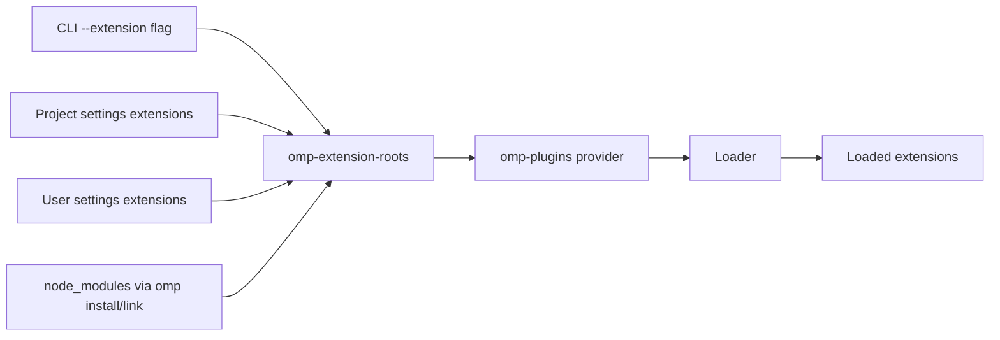
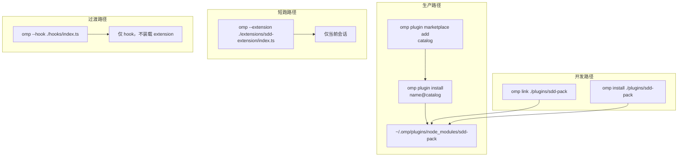

# omp Extension API 参考

> 修改记录：执行 `lore log docs/reference/omp-extension-api.md`
> 整理日期：2026-06-30 | 适用 omp 版本：v16.2.4+

本文档是 sdd-pack 项目实施「**Omp Slash Commands**」(方案 A，详见 PRD [`2026-06-30-sdd-extension.md`](../prd/2026-06-30-sdd-extension.md)) 时的**一手 omp 官方文档摘要**。所有结论均带可点击的官方/源码锚点；当 omp 上游文档演进时，以官方文档为准，本文件仅作本仓库实施期的快速参考。

---

## 1. Omp 扩展体系总览

### 1.1 三种扩展形态

omp 存在三种主要扩展形态：

| 形态                  | 入口字段                                       | 装载方式                                                       | 适用场景                           |
| --------------------- | ---------------------------------------------- | -------------------------------------------------------------- | ---------------------------------- |
| **Extension**（推荐） | `omp.extensions` 或 `pi.extensions`（兼容）    | `omp --extension <path>` 或 marketplace                        | 工具/命令/事件/UI 全场景           |
| **Hook**（过渡形态）  | 无（`--hook` flag）                            | `omp --hook <path>`                                            | 事件拦截（L1 守门旧方案，ADR-006） |
| **Slash Command**     | 子目录 `commands/*.md` 或 `pi.registerCommand` | 随 extension 装载或 marketplace 拷贝到 `~/.pi/agent/commands/` | 人工触发命令                       |

**权威源**：

- [Extension Authoring 官方指南](https://omp.sh/docs/extension-authoring)
- [Extension API Reference（最新）](https://github.com/can1357/oh-my-pi/blob/refs/heads/main/docs/extensions.md)
- [Extension System DeepWiki 解读](https://deepwiki.com/can1357/oh-my-pi/11-extension-system)
- [Custom Tools DeepWiki 解读](https://deepwiki.com/can1357/oh-my-pi/11.3-custom-tools-and-commands)
- [Hooks API 文档](https://github.com/can1357/oh-my-pi/blob/main/docs/hooks.md)（过渡形态，背熟后不再追）

### 1.2 Extension Manifest 声明

sdd-extension **必须**在 `package.json` 声明 manifest 才能被 omp loader 识别，**否则运行时无任何效果**（plugin 被 loader 静默跳过）：

| Manifest 字段                            | 推荐度   | 说明                                                                                                                                                      |
| ---------------------------------------- | -------- | --------------------------------------------------------------------------------------------------------------------------------------------------------- |
| `omp.extensions: ["./path/to/entry.ts"]` | ✓ 推荐   | omp 官方推荐；单 entry 文件                                                                                                                               |
| `pi.extensions: ["./path/to/entry.ts"]`  | ✓ 兼容   | 旧版字段 omp 仍接受                                                                                                                                       |
| `omp.extensions: ["./extensions"]`       | ✓        | 目录形式（v16.2.x 后支持，PR [issue #2713](https://github.com/can1357/oh-my-pi/issues/2713) / [PR #2714](https://github.com/can1357/oh-my-pi/pull/2714)） |
| 无 manifest                              | ✗ 不可用 | loader 静默跳过，运行时空效果                                                                                                                             |
| `omp.hooks` 而非 `omp.extensions`        | ✗        | sdd-pack ADR-006 已实测不识别                                                                                                                             |

**loader 实测代码**：[`packages/coding-agent/src/extensibility/plugins/loader.ts`](https://github.com/can1357/oh-my-pi/blob/main/packages/coding-agent/src/extensibility/plugins/loader.ts)

> **sdd-pack 现状**：当前 `package.json` 没有 `omp.extensions` manifest。v1.4 实施时**必须新增** `omp.extensions: ["./extensions/sdd-extension/index.ts"]` 到 `package.json`。

### 1.3 Extension 装载源

omp extension 的发现/装载遵循以下优先级（[PR #1498](https://github.com/can1357/oh-my-pi/pull/1498)）：



**装载源**：

| 源                 | 路径                                 | 是否 symlink               |
| ------------------ | ------------------------------------ | -------------------------- |
| Marketplace 装     | `~/.omp/plugins/node_modules/<pkg>/` | 否（拷贝）                 |
| 本地 link          | `~/.omp/plugins/node_modules/<pkg>/` | 是 symlink（实时反映源码） |
| 单次（dogfooding） | CLI `--extension` 注入               | 否                         |

**权威源**：

- [Discovery wiring (PR #1498)](https://github.com/can1357/oh-my-pi/pull/1498)
- [loader.ts 源码](https://github.com/can1357/oh-my-pi/blob/main/packages/coding-agent/src/extensibility/plugins/loader.ts)
- [install 命令实现](https://github.com/can1357/oh-my-pi/blob/main/packages/coding-agent/src/commands/install.ts) + [install.d.ts](https://app.unpkg.com/@oh-my-pi/pi-coding-agent@16.1.11/files/dist/types/commands/install.d.ts)

### 1.4 Manifest 兼容性矩阵

| omp 版本               | `omp.extensions` | `pi.extensions` | 目录形式 | 备注                                    |
| ---------------------- | ---------------- | --------------- | -------- | --------------------------------------- |
| v16.1.x                | ✓                | ✓               | ✗        | 仅单文件                                |
| v16.2.x                | ✓                | ✓               | ✓        | PR #2714 修复子目录解析                 |
| v16.1.16 (sdd-pack 旧) | ✓                | ✓               | ✗        | sdd-pack 的 `--hook` 是经实测得出的方案 |

---

## 2. Extension API 核心接口

### 2.1 ExtensionAPI 顶层能力

```typescript
// 来自 official extensions.md + DeepWiki
interface ExtensionAPI {
  // 命令注册
  registerCommand(
    name: string,
    options: {
      description?: string;
      handler?: (args: string, ctx: ExtensionCommandContext) => any | Promise<any>;
      getArgumentCompletions?: (prefix: string) => AutocompleteItem[] | null;
    },
  ): void;

  // 工具注册
  registerTool(definition: ToolDefinition<TParams, TDetails>): void;

  // 事件订阅
  on(event: EventName, handler: (...args: any[]) => any): void;

  // 持久消息
  sendMessage(
    message: string | CustomMessage,
    options?: {
      deliverAs?: "steer" | "followUp" | "nextTurn"; // 默认 "steer"
      triggerTurn?: boolean; // nextTurn 时是否触发
    },
  ): void;

  // LLM 上下文消息
  sendUserMessage(message: string): void;

  // 注册自定义 UI renderer
  registerMessageRenderer(customType: string, renderer: (msg: CustomMessage) => ReactNode): void;

  // 注册快捷键
  registerShortcut(key: string, options: ShortcutOptions): void;

  // 注册 CLI flag
  registerFlag(name: string, options: FlagOptions): void;

  // 注册 model provider
  registerProvider(name: string, config: ProviderConfig): void;
  unregisterProvider(name: string): void;

  // 状态查询/操作
  getActiveTools(): string[];
  getAllTools(): string[];
  setActiveTools(names: string[]): void;
  getCommands(): Command[];
  setLabel(label: string): void;
  appendEntry(entry: SessionEntry): void; // 持久状态

  // Session/Model 控制
  getSessionName(): string | undefined;
  setSessionName(name: string): void;
  setModel(modelId: string): void;
  getThinkingLevel(): ThinkingLevel;
  setThinkingLevel(level: ThinkingLevel): void;

  // 安装/卸载生命周期
  registerBeforeInstall(handler: () => void): void;
  registerAfterInstall(handler: () => void): void;
  registerBeforeRemove(handler: () => void): void;
  registerAfterRemove(handler: () => void): void;

  // Shells out
  exec(cmd: string, args: string[], opts?: ExecOptions): Promise<{ stdout; stderr; exitCode }>;
  cwd: string; // 当前工作目录
  ui: ExtensionUIContext;
  hasUI: boolean;
  zod: typeof import("zod").z; // 注入 zod
  typebox: any; // 注入 typebox
  pi: any; // re-export pi
}
```

**权威源**：[Extension API Reference](https://github.com/can1357/oh-my-pi/blob/refs/heads/main/docs/extensions.md)

### 2.2 ToolDefinition 接口

```typescript
interface ToolDefinition<TParams, TDetails> {
  name: string;
  label: string;
  description: string;
  promptSnippet?: string; // 提示中简短说明
  promptGuidelines?: string; // 提示中详细指引
  parameters: ZodSchema | TypeBoxSchema; // 严格类型校验
  execute: (
    toolCallId: string,
    params: TParams,
    signal: AbortSignal,
    onUpdate: (partial: any) => void,
    ctx: ExtensionContext,
  ) => Promise<{ content: any; details?: TDetails }>;
  // 可选 UI 渲染
  renderCall?: (params, ctx) => ReactNode;
  renderResult?: (result, ctx) => ReactNode;
  // 运行时控制
  hidden?: boolean;
  defaultInactive?: boolean;
  deferrable?: boolean;
  approval?: "always" | "never" | { predicate: (params) => boolean };
  // Session 生命周期
  onSession?: (session, ctx) => void;
}
```

**说明**：

- Tool 是 **LLM 触发**（agent 在 turn 中自动调用）
- Command 是 **用户触发**（`/name` 由用户输入）
- sdd-pack 选用 Command（不暴露 Tool）—— 避免 LLM 在无人工确认时调用破坏性操作

### 2.3 ExtensionContext 接口（Command/Event 共用）

```typescript
interface ExtensionContext {
  ui: ExtensionUIContext; // notify / confirm / select / input
  hasUI: boolean; // RPC 模式下为 true
  cwd: string;
  sessionManager: SessionManager;
  modelRegistry: ModelRegistry;
  memory: MemoryStore;
  hasPendingMessages(): boolean;
  abort(): void;
  shutdown(): Promise<void>;
  getSystemPrompt(): string;
  compact(): Promise<void>;
  isIdle(): boolean;
  getContextUsage(): { tokens: number; budget: number };
}
```

### 2.4 ExtensionCommandContext（Command 专属）

```typescript
interface ExtensionCommandContext extends ExtensionContext {
  waitForIdle(): Promise<void>;          // 长操作前等 omp 空闲
  newSession(opts?: { setup?: (...) => any }): Promise<Session>;  // 开新会话
  fork(entryId: string): Promise<Session>;  // 从某 entry fork
  navigateTree(targetId: string, opts?: { summarize?: boolean }): Promise<void>;
  switchSession(sessionPath: string): Promise<void>;
  reload(): Promise<void>;              // 重载 extensions / skills / prompts
  branch(entryId: string): Promise<void>;
}
```

---

## 3. UI 形态（sdd-extension 输出形式）

### 3.1 通知/状态/Widget

| API                                       | 调用方式        | 用途           | 示例                                                    |
| ----------------------------------------- | --------------- | -------------- | ------------------------------------------------------- |
| `ctx.ui.notify(message, level)`           | fire-and-forget | 单行通知       | `ctx.ui.notify("validate 通过", "info")`                |
| `ctx.ui.setStatus(key, text)`             | fire-and-forget | 状态栏持久文本 | `ctx.ui.setStatus("sdd-validate", "校验中...")`         |
| `ctx.ui.setWidget(key, lines, placement)` | fire-and-forget | 多行 widget    | `ctx.ui.setWidget("sdd-checks", checks, "aboveEditor")` |
| `ctx.ui.setTitle(title, emit?)`           | 同步            | 编辑器标题     | —                                                       |
| `ctx.ui.setEditorText(text)`              | 同步            | 编辑器正文替换 | —                                                       |
| `ctx.ui.getEditorText(): string`          | 同步            | 编辑器当前正文 | —                                                       |
| `ctx.ui.pasteToEditor(text)`              | 同步            | 追加到编辑器   | —                                                       |

**Notify level 取值**：`"info" | "warn" | "error"`（某些版本支持 `"warning"` 别名）

### 3.2 阻塞对话框（dialog methods）

这些方法会向宿主发起 round-trip RPC 请求，返回前 handler 阻塞：

| API                                 | 签名                                                                | 用途       |
| ----------------------------------- | ------------------------------------------------------------------- | ---------- |
| `ctx.ui.select(options[])`          | `(opts: {value, label, description?}[]) => Promise<string>`         | 单选选择器 |
| `ctx.ui.confirm(title, msg)`        | `(title, msg) => Promise<boolean>`                                  | 是/否确认  |
| `ctx.ui.input(title, placeholder?)` | `(title, placeholder?) => Promise<string \| undefined>`             | 输入字符串 |
| `ctx.ui.editor(title, opts?)`       | `(title, {prefill?, promptStyle?}) => Promise<string \| undefined>` | 长文本编辑 |

**sdd-extension 应用映射**：

| sdd 命令                      | UI 用法                                        |
| ----------------------------- | ---------------------------------------------- |
| `/sdd-validate`               | `setWidget` 输出 10 项检查结果（多行）         |
| `/sdd-archive`                | `confirm` 二次确认，破坏性                     |
| `/sdd-archive --reason X`     | `select` 让用户选 completed/replaced/abandoned |
| `/sdd-propose --title X` 缺省 | `input` 让用户输入 title                       |
| 校验进度                      | `setStatus("sdd-validate", "校验中: 30/30")`   |
| 校验结果                      | `notify(level, summary)` 一行提示              |

**权威源**：[docs/rpc.md](https://github.com/can1357/oh-my-pi/blob/main/docs/rpc.md) + [rpc-types.ts](https://github.com/can1357/oh-my-pi/blob/main/packages/coding-agent/src/modes/rpc/rpc-types.ts)

### 3.3 RPC 模式特殊行为

在 RPC 模式（omp 由进程 stdin/stdout 驱动，而非 TUI）下：

| 方法                                                                                          | 行为                                 |
| --------------------------------------------------------------------------------------------- | ------------------------------------ |
| `select` / `confirm` / `input` / `editor`                                                     | round-trip（对话框）                 |
| `notify` / `setStatus` / `setWidget` / `setEditorText`                                        | fire-and-forget                      |
| `setTitle`                                                                                    | 默认抑制；`PI_RPC_EMIT_TITLE=1` 启用 |
| `custom()` / `onTerminalInput` / `setFooter` / `setHeader` / `setWorkingMessage` / `setTheme` | 部分或全部无操作                     |
| 自动 session title 生成                                                                       | 禁用                                 |

**权威源**：[rpc-types.ts 完整类型定义](https://github.com/can1357/oh-my-pi/blob/main/packages/coding-agent/src/modes/rpc/rpc-types.ts)

### 3.4 pi.sendMessage delivery 模式

```typescript
pi.sendMessage("...", {
  deliverAs:
    "steer" | // (默认) 打断当前 run
    "followUp" | // 排队到当前 run 后
    "nextTurn", // 存到下次 user prompt
});
```

**sdd-extension 用法**：

- hook 中 commit 校验：`deliverAs: "nextTurn"`（不打扰 agent）+ `setStatus/setWidget`（人类可见）
- 用户显式 `/sdd-archive`：`deliverAs: "followUp"` 把结果告诉 agent，准备走下一步

---

## 4. 安装/装载路径（端到端）

### 4.1 四条装载路径



| 路径            | 命令                                                                             | 副作用                                                                     | 适用场景                           |
| --------------- | -------------------------------------------------------------------------------- | -------------------------------------------------------------------------- | ---------------------------------- |
| **Marketplace** | `omp plugin marketplace add <catalog>` → `omp plugin install sdd-pack@<catalog>` | 拷贝到 `~/.omp/plugins/node_modules/sdd-pack/`，写 `omp-plugins.lock.json` | 生产环境第三方用户                 |
| **本地 link**   | `omp link ./plugins/sdd-pack` 或 `omp install ./plugins/sdd-pack`                | symlink 到 `~/.omp/plugins/node_modules/`，实时反映源码                    | 开发 dogfooding                    |
| **单次装载**    | `omp --extension ./plugins/sdd-pack/extensions/sdd-extension/index.ts`           | 仅当前 omp 会话有效，关闭失效                                              | 临时验证                           |
| **过渡 hook**   | `omp --hook ./plugins/sdd-pack/hooks/index.ts`                                   | 仅装载 hooks，不挂 extension                                               | v1.4 仍需 hook 路径（commit gate） |

**权威源**：[omp marketplace docs](https://github.com/can1357/oh-my-pi/blob/main/docs/marketplace.md) + [install.ts 实现](https://github.com/can1357/oh-my-pi/blob/main/packages/coding-agent/src/commands/install.ts) + [@oh-my-pi/cli](https://registry.npmjs.org/%40oh-my-pi%2Fcli)

### 4.2 推荐的 v1.4 实施装载策略

| 阶段         | 验证方式                                                           |
| ------------ | ------------------------------------------------------------------ |
| v1.4.0-alpha | `omp --extension ./extensions/sdd-extension/index.ts` 单次装载验证 |
| v1.4.0-beta  | `omp install ./plugins/sdd-pack` 本地 link dogfooding              |
| v1.4.0 正式  | marketplace 路径，第三方用户安装                                   |

### 4.3 卸载清理

- `omp plugin uninstall sdd-pack` 删除 node_modules 条目 + lockfile 条目
- 用户 omp 会话**重启后**才能感知卸载（hook 命令冲突需手动重启）

---

## 5. 已知装载风险（本仓库 v16.2.4 实测）

### 5.1 omp-plugins provider 不工作

**事实**（来源：sdd-pack ADR-006 状态更新 / v16.2.4 本机实测）：

- omp 官方文档（[`docs/skills.md` §"Built-in skill providers and precedence"`](https://github.com/can1357/oh-my-pi/blob/main/docs/skills.md)）说明 `omp-plugins` provider（priority 90）设计上即扫描 plugin 的 `rules/*.{md,mdc}` 与 `skills/<name>/SKILL.md`，与 `native` provider 共存去重
- **本机实测（2026-06-29）**：`omp -p ... --no-session` 进程读 `rule://docs-update-guard`、`skill://sdd-core` 均报 `Unknown`，available 列表中 plugin 提供的所有规则/技能均为 0 个

**修复进度**：

- [PR #1498](https://github.com/can1357/oh-my-pi/pull/1498)（2026-05-29，已合入）—— 修复 `omp plugin install`/`omp plugin link` 的 sub-dirs 发现（Fixes #1496）
- 本机实测仍不生效——根因待查（provider 加载时序 / 缓存 / 配置开关均可能）

### 5.2 v1.4 实施期应对

| 验证点                 | 操作                                                                | 通过标准                         |
| ---------------------- | ------------------------------------------------------------------- | -------------------------------- |
| Extension factory 装载 | `omp --extension ./extensions/sdd-extension/index.ts` 后 `/sd<Tab>` | autocomplete 出现 `/sdd-*` 8 个  |
| Slash command 触发     | 输入 `/sdd-validate`（无 args）                                     | 10 项校验结果出现于会话          |
| Hook 联动（commit 时） | `git commit -m "test"` 后看 hook 是否自动跑 validate                | `runSddValidate` 日志出现        |
| 卸载清理               | `omp plugin uninstall sdd-pack` 重启 omp                            | `/sdd-*` 不再出现在 autocomplete |

**任一失败 → 降级路径**：保留 hook 路径（hook 仅做 commit gate），slash command 注册延后。

---

## 6. sdd-extension 设计决策参考

### 6.1 8 个 slash command 设计

| Command         | UI 形态                                           | 关键 API                 |
| --------------- | ------------------------------------------------- | ------------------------ |
| `/sdd-validate` | `setWidget` 多行 + `notify` 摘要                  | `validateDocs(opts)`     |
| `/sdd-propose`  | `confirm` + `input`（缺省 title 时）+ `notify`    | `proposePrd(opts)`       |
| `/sdd-archive`  | `select`（reason）+ `confirm`（破坏性）+ `notify` | `archivePrd(opts)`       |
| `/sdd-migrate`  | `confirm`（破坏性）+ `notify`                     | `migratePrd(opts)`       |
| `/sdd-status`   | `setWidget`（所有 PRD 状态表）                    | `getStatus()`            |
| `/sdd-list`     | `setWidget`（过滤后列表）                         | `listPrds(opts)`         |
| `/sdd-why`      | `notify`（lore 决策摘要）                         | `getWhy(target)`         |
| `/sdd-apply`    | `setWidget`（实施 checklist）                     | `getApplyChecklist(prd)` |

### 6.2 命令冲突处理

参考 omp 文档：多个 extension 注册**同名 command** 时，omp 给数字后缀并存（`:1` `:2`），**不会覆盖**。

sdd-pack 命令前缀统一为 `/sdd-*`，命令名全部 kebab-case，避免冲突。

### 6.3 arg 解析

omp `handler(args, ctx)` 接收的是**字符串**而非 `argv`，需自解析：

```typescript
// 适配 omp: args 是 "单字符串"
pi.registerCommand("sdd-validate", {
  handler: async (args, ctx) => {
    // 简单 split
    const tokens = args.split(/\s+/).filter(Boolean);
    const opts = { staged: tokens.includes("--staged"), ... };
    const result = await validateDocs(opts);
    ctx.ui.notify(result.status, "info");
  },
});
```

如果需要更复杂 arg，可利用 `getArgumentCompletions(prefix)` 做 tab completion 提示，但实际解析仍是字符串 split。

### 6.4 与 Tool 的对照决策

| 维度           | Command              | Tool                         |
| -------------- | -------------------- | ---------------------------- |
| 触发者         | 用户手动（`/name`）  | LLM（agent turn 内自动调）   |
| 上下文         | omp 会话级           | agent turn 内                |
| 参数校验       | 字符串 split 自解析  | ZodSchema 强校验             |
| 危险操作可见性 | 显式（`confirm` 框） | 隐式（依赖 `approval` 字段） |
| CI/脚本调用    | ✗                    | ✗（需要 omp 会话）           |

**sdd-pack 决策**：仅用 Command，不暴露 Tool（`sdd-archive` 等破坏性操作应有人工确认）。

---

## 7. omp 生态参考项目

| 项目                                           | 路径                                                                                                                                                                                                                                                                                                                                                             | 关键借鉴点                                                                              |
| ---------------------------------------------- | ---------------------------------------------------------------------------------------------------------------------------------------------------------------------------------------------------------------------------------------------------------------------------------------------------------------------------------------------------------------- | --------------------------------------------------------------------------------------- |
| `Dwsy/pi-extensions-skill`                     | [ARCHITECTURE.md](https://github.com/Dwsy/pi-extensions-skill/blob/main/ARCHITECTURE.md) + [quickstart](https://github.com/Dwsy/pi-extensions-skill/blob/main/guides/01-quickstart.md)                                                                                                                                                                           | 最小完整 extension 示例（greet command + handler）                                      |
| `salesforce/sf-pi`                             | [safe-command-handler.ts](https://github.com/salesforce/sf-pi/blob/main/lib/common/safe-command-handler.ts)                                                                                                                                                                                                                                                      | command handler **异常安全包装模式**——sdd-archive 防崩溃                                |
| `screenfluent/omp-semantic-grep`               | [repo](https://github.com/screenfluent/omp-semantic-grep)                                                                                                                                                                                                                                                                                                        | hybrid tool + `ui.notify` 输出                                                          |
| `maximhar/omp-typescript-complexity-evaluator` | [repo](https://github.com/maximhar/omp-typescript-complexity-evaluator)                                                                                                                                                                                                                                                                                          | 本地开发 + `bun link` 工作流                                                            |
| `usr-bin-roygbiv/omp-cmux-browser-tools`       | [repo](https://github.com/usr-bin-roygbiv/omp-cmux-browser-tools)                                                                                                                                                                                                                                                                                                | extension + marketplace 双重发布路径                                                    |
| `pi-mono` examples                             | [reload-runtime.ts](https://app.unpkg.com/@oh-my-pi/pi-coding-agent@16.1.11/files/examples/extensions/reload-runtime.ts) + [06-extensions.ts](https://cdn.jsdelivr.net/npm/@oh-my-pi/pi-coding-agent@13.17.0/examples/sdk/06-extensions.ts) + [commands.ts](https://github.com/badlogic/pi-mono/blob/main/packages/coding-agent/examples/extensions/commands.ts) | `registerCommand + ctx.reload()`、注册综合性 API、列表 + arg completion + source filter |
| `@aliou/pi-dev-kit`                            | [messages.md](https://cdn.jsdelivr.net/npm/@aliou/pi-dev-kit@0.8.0/src/skills/pi-extension/references/messages.md)                                                                                                                                                                                                                                               | persistent vs ephemeral 消息区分                                                        |
| `fiokjr/oh-pi`                                 | [04-extensions.md](https://github.com/ifiokjr/oh-pi/blob/main/docs/04-extensions.md)                                                                                                                                                                                                                                                                             | 实战 registerTool + registerCommand + intercept 模式                                    |

---

## 8. omp Hook 与 Extension 关系（v1.4 内部架构）

### 8.1 当前状态（v1.3）

sdd-pack 通过 `omp --hook ./plugins/sdd-pack/hooks/index.ts` 装载单个聚合 hook，包含：

- `lore-protocol`（session_start 注入）
- `docs-update-guard`（tool_call 提示，非阻塞）
- `lore-commit-guard`（tool_call 硬拦截）
- `sdd-doc-edit-guard`（tool_call 提示，非阻塞）
- `runSddValidate`（commit 时 spawn `bun .../bin/sdd validate --staged --json`）

来源：[ADR-006](../architecture/decisions.md)（CLI flag 路径）。

### 8.2 v1.4 目标架构

```mermaid
graph TB
  User[用户输入 / 触发 commit] --> OMP[omp process]
  OMP --extension--> Ext[extensions/sdd-extension]
  OMP --hook--> Hook[hooks/index.ts]
  Ext --> SddCmd[/sdd-* slash commands]
  SddCmd --> API[src/cli/api.ts]
  Hook --> LCG[lore-commit-guard]
  LCG --> InProc[in-process api.validateDocs]
  API --> Lib[src/cli/lib/* 核心库]
  API --> LorW[lore-wrapper.ts]
  LorW --> Lore[Bin: lore commit / lore why]
```

**关键变化**：

- `bin/sdd`、`src/cli/index.ts`、`src/cli/lib/arg-parser.ts` 全部移除
- 新增 `src/cli/api.ts`（8 个纯函数）、`extensions/sdd-extension/index.ts`（8 个 slash command 注册）
- hook 改为 in-process 调用 `api.ts`，消除 spawn subprocess

详见 [PRD 2026-06-30-sdd-extension.md](../prd/2026-06-30-sdd-extension.md) §3 模块拓扑。

---

## 9. 总结：sdd-extension 设计决策表

| 决策点         | 选择                                 | 拒绝的方案                     | 理由                                                |
| -------------- | ------------------------------------ | ------------------------------ | --------------------------------------------------- |
| 扩展形态       | omp extension（slash command）       | 独立 `bin/sdd` CLI             | omp marketplace 不识别 plugin bin 字段              |
| command 注册数 | 8 个                                 | 7 个 / 3 个 MVP + 4 个完整集   | PRD-002 用户场景要求完整集                          |
| 入口 manifest  | `omp.extensions`                     | `omp.hooks`（v16.1.16 不识别） | omp loader 现状                                     |
| hook 是否保留  | 保留（v1.4 hook 改 in-process）      | 删除 hook                      | hook 提供 `block: true` 硬拦截能力，rule 体系做不到 |
| Tool 是否暴露  | 不暴露（仅 Command）                 | 同时暴露 Tool                  | LLM 调用 `sdd-archive` 不可控                       |
| 输出 UI 主体   | `setWidget` 多行 + `notify` 单行摘要 | 仅 notify（限一行）            | 校验结果 >10 行需 widget 呈现                       |
| CI 路径        | `bun run src/cli/api-runner.ts` 薄壳 | 维护第二个 CLI                 | slash command 不能 CI 化，薄壳即可                  |

---

## 10. 相关文档索引

| 文档                                  | 路径                                                                         | 关系                             |
| ------------------------------------- | ---------------------------------------------------------------------------- | -------------------------------- |
| sdd-extension PRD                     | [`docs/prd/2026-06-30-sdd-extension.md`](../prd/2026-06-30-sdd-extension.md) | 本参考文档是其下游（实施依据）   |
| sdd CLI 旧 PRD                        | [`docs/prd/2026-06-29-sdd-cli.md`](../prd/2026-06-29-sdd-cli.md)             | supersedes 目标                  |
| ADR-006（hook 装载方案）              | [`docs/architecture/decisions.md`](../architecture/decisions.md)             | v1.3 hook 装载决策依据           |
| ADR-009（sdd Extension 替代独立 CLI） | [`docs/architecture/decisions.md`](../architecture/decisions.md)             | v1.4 决策（Accepted 2026-06-30） |
| sdd-core skills                       | `plugins/sdd-pack/skills/sdd-core/`                                          | 本参考文档下游消费者             |
| 三层守门 agent                        | [`docs/reference/omp-task-agent.md`](./omp-task-agent.md)                    | 同级参考文档（agent 机制）       |

---

## 11. 快速参考卡（sdd-extension 实施时）

```typescript
// extensions/sdd-extension/index.ts — 最小骨架
import type { ExtensionAPI, ExtensionCommandContext } from "@oh-my-pi/pi-coding-agent";
// 不依赖 @oh-my-pi/pi-coding-agent 类型（sdd-pack bun runtime 直加载 .ts）
// type ExtensionAPI = { ... 自定义类型 ... };

import {
  validateDocs,
  proposePrd,
  archivePrd,
  migratePrd,
  getStatus,
  listPrds,
  getWhy,
  getApplyChecklist,
} from "../../src/cli/api";

export default function (pi: any): void {
  // 8 个 slash command 一一对应 8 个 api 函数

  pi.registerCommand("sdd-validate", {
    description: "校验 docs/ 文档结构 + 状态机 + 交叉引用一致性",
    handler: async (args: string, ctx: any) => {
      const opts = parseValidateArgs(args);
      const r = await validateDocs(opts);
      ctx.ui.setWidget("sdd-validate", formatChecks(r), "belowEditor");
      ctx.ui.notify(
        `validate: ${r.status} (${r.errors.length} errors, ${r.warnings.length} warnings)`,
        r.status === "block" ? "error" : r.status === "error" ? "warn" : "info",
      );
    },
  });

  pi.registerCommand("sdd-propose", {
    description: "创建新 PRD（full / delta）",
    handler: async (args: string, ctx: any) => {
      const opts = parseProposeArgs(args);
      const r = await proposePrd(opts);
      ctx.ui.notify(`已创建: ${r.path}`, "info");
    },
  });

  // ... 其他 6 个
}

function parseValidateArgs(args: string): { staged?: boolean; severity?: string } {
  return {
    staged: args.includes("--staged"),
    severity: args.match(/--severity\s+(\w+)/)?.[1] as any,
  };
}

function formatChecks(r: any): string[] {
  return r.checks.map(
    (c: any) => `[${c.status === "pass" ? "✓" : "✗"}] #${c.id} ${c.name}: ${c.count}`,
  );
}
```

**实施期 checklist**：

- [ ] 新增 `extensions/sdd-extension/index.ts`（按上述骨架）
- [ ] 新增 `src/cli/api.ts`（8 个 export 函数）
- [ ] 新增 `src/cli/api-runner.ts`（CI 薄壳）
- [ ] 删除 `bin/sdd`、`src/cli/index.ts`、`src/cli/lib/arg-parser.ts`、`src/cli/commands/*.ts`
- [ ] 修改 `hooks/index.ts`（`runSddValidate` 改 in-process）
- [ ] 修改 `package.json`：新增 `omp.extensions`、删除 `bin` 字段、`files` 删 `bin`
- [ ] v1.4.0-alpha 用 `omp --extension` 验证 8 个 autocomplete 出现
- [ ] v1.4.0-beta 用 `omp install ./plugins/sdd-pack` 验证 symlink 路径
- [ ] v1.4.0 正式 marketplace 发布
- [ ] ADR-009 Accepted；ADR-008 → Superseded
