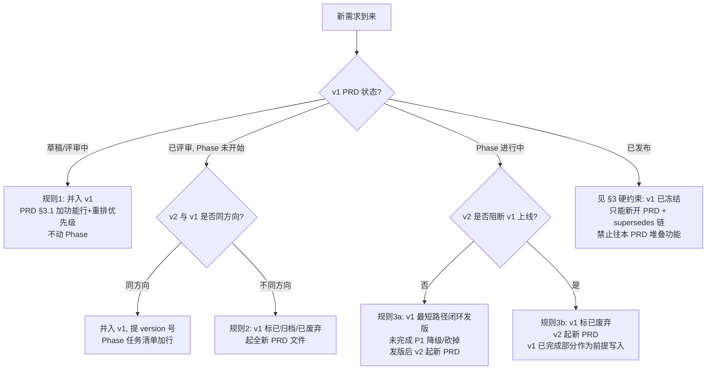

当一个新的产品需求到来、而仓库里已有一个 PRD 时，先判读它是哪一类变更，再决定动作。本 rule 防"PRD 状态行堆叠多版本功能"失控——即 `sdd-pack-version-alignment-guard` skill 所警告的根因。

## 0. 先做变更类型判别

任一新需求先归入三类之一（判定后动作完全不同）：

| 类型                  | 特征                                                              | 典型场景                   | 风险 |
| --------------------- | ----------------------------------------------------------------- | -------------------------- | ---- |
| **A. 实现期偏差**     | PRD 没变，实现时发现做法要调整                                    | 技术选型变更、某功能做不到 | 中   |
| **B. v1 内范围微调**  | PRD 未发布，增删一两个 P1/P2 功能                                 | 草稿/评审中阶段砍功能      | 低   |
| **C. 跨版本需求叠加** | **本 rule 重点**：v1 未闭环（未发版/Phase 进行中），v2 新需求到来 | v1 还没做完，新需求又来    | 高   |

- A 类 → 走 ADR（`docs/architecture/decisions.md` 新增一条），PRD 本身不动；sdd-reviewer 的 adr/docs-sync 检查会兜底。
- B 类 → 直接改 PRD（状态仍是草稿/评审中，范围可塑），重排优先级即可。
- **C 类 → 进入下面的 §1 决策树**。

## 1. C 类决策树（按 v1 所处阶段）

判据核心：**PRD §0 目标声明是否还成立**。还成立→并；不成立→新 PRD。

## 2. 三条强制规则

### 规则 1 — v1 尚未评审定稿（草稿/评审中）→ 直接并入

PRD 范围可塑，是最便宜的窗口期。动作：

- PRD §3.1 功能清单加行；
- 重排 P0/P1/P2 优先级；
- **不动 Phase**（Phase 还没真正开始）。

### 规则 2 — v1 已评审、Phase 未开始 → 评估"是否值得拆版本"

- **同方向**（如 v1 做"插件安装"、v2 加"插件禁用"）→ 并入 v1 PRD，提 version 号（遵循 `version-alignment-guard` 9 字段对齐），Phase 任务清单加任务行。
- **不同方向**（如 v1 做"插件管理"、v2 变成"在线 marketplace 平台"）→ v1 PRD 标 `已归档` 或 `已废弃`，起全新 PRD 文件，新 PRD 头部声明 `> 替代: [v1 PRD](path)`。

### 规则 3 — v1 Phase 进行中（部分任务已完成）→ 禁止并入，必须收尾

这是最易出错的情况。原则：**一个 PRD 对应一次完整的"评审→Phase→验收→发版"闭环**。Phase 一旦开始，PRD 走向冻结；新需求走新 PRD，不往进行中的 PRD 堆功能。

- **3a — v2 不阻断 v1 上线**：v1 用最短路径闭环（未完成的 P1 降级为 P2 或砍掉），完成发版（PRD→已发布、Phase→已完成）；v2 起新 PRD 正常走流程。
- **3b — v2 阻断 v1 上线**：v1 PRD 标 `已废弃`（写明阻塞原因）；起 v2 PRD；v1 已完成部分作为 v2 的"既有实现前提"写入新 PRD。

## 3. PRD 生命周期状态机（不可逆迁移）

| 当前状态 | 可迁移到                                   | 禁止迁移到                     |
| -------- | ------------------------------------------ | ------------------------------ |
| 草稿     | 评审中、已废弃                             | （其余）                       |
| 评审中   | 已评审、草稿（回退仅限评审未通过）、已废弃 | 已发布                         |
| 已评审   | 已发布（走完 Phase）、已归档、已废弃       | 草稿                           |
| 已发布   | 已归档、已替换                             | 任何"再编辑"——新需求只能新 PRD |
| 已替换   | （终态）                                   | —                              |
| 已归档   | （终态）                                   | —                              |
| 已废弃   | （终态）                                   | —                              |

**硬约束**：

- `已评审` 不可回退到 `草稿`（评审已通过即冻结方向）。
- `已发布` 后的新需求 → **只能新开 PRD + supersedes 链**，禁止往已发布 PRD 堆叠新版本功能。
- `已替换` / `已废弃` 为终态，不再修改内容。

## 4. supersedes 链（替代关系）

当走规则 2 / 3b 起新 PRD 时：

- 新 PRD 头部加：`> 替代: [旧 PRD 名称](../prd/YYYY-MM-DD-<old>.md)`
- 旧 PRD 状态改为 `已替换`，并在头部加：`> 已被: [新 PRD 名称](../prd/YYYY-MM-DD-<new>.md) 替代`
- `docs/index.md` 的 PRD 表格体现替代链（旧行状态列标 `已替换`，新行加 `替代: <旧>`）。

## 5. 对失控 PRD 状态行的止损取向

当一个 PRD 的状态行已经堆叠了多个版本功能（如 `状态:1.2.3 已发布;v1.2.0 新增...;v1.2.1 修正...;v1.2.2 补齐...`），遵循版本对齐止损 skill（`sdd-pack-version-alignment-guard`，本机辅助 skill，非插件资产）§4 的取向——**接受现状往前看**：

- 已发布版本（git tag 已打）不回溯拆分；
- 下一个新功能**一律走独立 PRD**，不再向旧 PRD 状态行追加；
- 只有用户明确要求回溯拆分时才动历史。

## 6. 交叉引用

- 版本对齐止损 skill（`sdd-pack-version-alignment-guard`，本机辅助 skill，非插件资产）— 9 字段版本对齐与状态行堆叠止损。
- `rule://docs-update-guard` — commit 前文档同步检查（本 rule 是其上游：决定"改哪个 PRD"，docs-update-guard 决定"是否要改文档"）。
- `skill://sdd-core` — 完整 SDD 流程（模板、命名、lore、index 同步）。
