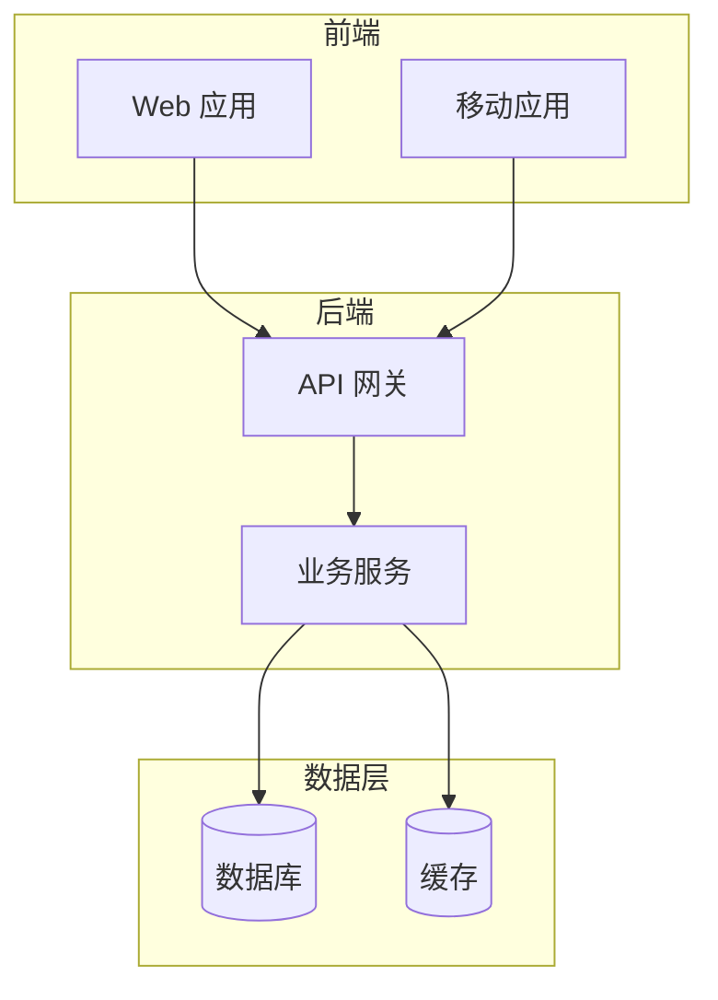

# 文档模板参考

本文档包含软件开发文档体系中各类文档的标准模板。

## 0. Spec 模板（结构化需求输入）

文件位置：`docs/spec/YYYY-MM-DD-<spec-name>.md`

```markdown
# <项目/功能名称> Spec

> 修改记录：执行 `lore log docs/spec/<filename>.md`
> 来源：用户想法 / 客户需求 / 会议纪要 / 访谈记录
> 接力状态：待提纯 PRD | 已提纯 PRD

## 1. 问题陈述

[描述当前问题、现状和目标状态]

## 2. 目标用户

| 用户角色 | 描述 | 核心诉求 |
|---------|------|---------|
| [角色 1] | [描述] | [诉求] |

## 3. v1 功能边界

### 3.1 v1 必做

| 功能 | 解决什么 | 验收标准 |
|------|----------|----------|
| [功能 1] | [痛点] | [可测标准] |

### 3.2 v1 推迟

| 功能 | 推迟理由 | 何时再评估 |
|------|----------|------------|
| [功能 1] | [理由] | [时间/条件] |

### 3.3 永远不做

| 方向 | 不做原因 |
|------|----------|
| [方向] | [原因] |

## 4. 核心场景

[用用户语言描述 2-3 个关键使用流程]

## 5. 验收标准

- [ ] [功能验收]
- [ ] [业务验收]

## 6. 非功能需求

| 维度 | 需求 | 备注 |
|------|------|------|
| 性能 | [待定或具体要求] | [说明] |
| 安全 | [待定或具体要求] | [说明] |

## 7. 未决假设

| 假设 | 类型 | 验证方法 / 推翻后果 |
|------|------|---------------------|
| [假设] | 必假定 / 必验证 / 不成立 | [说明] |

## 8. 选型未决

技术选型不在本 Spec 范围，交由 PRD 阶段审视。

## 9. 参考材料

- [原始材料或链接]
```

## 1. PRD 模板（产品需求文档）

文件位置：`docs/prd/YYYY-MM-DD-<prd-name>.md`

```markdown
# <产品/功能名称> PRD

> 状态：草稿 | 评审中 | 已评审 | 已归档 | 已替换 | 已废弃
> 修改记录：执行 `lore log docs/prd/<filename>.md`
> 对应阶段：[TBD - 由 sdd-phase 补全](../phase/YYYY-MM-DD-<phase-name>.md)

## 1. 背景与目标

### 1.1 业务背景

[描述业务场景、痛点、机会]

### 1.2 产品目标

[明确、可衡量的目标，例如：提升 XX 效率 30%]

### 1.3 成功指标

- 指标 1：[具体数值或描述]
- 指标 2：[具体数值或描述]

## 2. 用户与场景

### 2.1 目标用户

| 用户角色 | 描述 | 核心诉求 |
|---------|------|---------|
| [角色 1] | [描述] | [诉求] |
| [角色 2] | [描述] | [诉求] |

### 2.2 使用场景

[描述典型使用场景，可配合流程图]

## 3. 功能需求

### 3.1 功能清单

| 功能模块 | 功能点 | 优先级 | 说明 |
|---------|--------|--------|------|
| [模块 1] | [功能点 1] | P0/P1/P2 | [简要说明] |
| [模块 1] | [功能点 2] | P0/P1/P2 | [简要说明] |

### 3.2 详细功能描述

#### 3.2.1 [功能点 1]

**功能说明**：[详细描述]

**输入/前置条件**：
- [条件 1]
- [条件 2]

**处理逻辑**：
1. [步骤 1]
2. [步骤 2]

**输出/后置条件**：
- [结果 1]
- [结果 2]

**异常处理**：
- [异常情况 1]：[处理方式]

## 4. 非功能需求

### 4.1 性能要求

- 响应时间：[具体要求]
- 并发用户数：[具体要求]
- 数据处理量：[具体要求]

### 4.2 安全要求

- 认证方式：[具体方式]
- 权限控制：[具体策略]
- 数据加密：[具体要求]

### 4.3 可用性要求

- 可用性目标：[如 99.9%]
- 备份策略：[具体策略]
- 灾难恢复：[具体方案]

## 5. 数据需求

### 5.1 数据模型

[描述核心数据实体及关系，可配合 ER 图]

### 5.2 数据迁移

[如涉及数据迁移，描述迁移策略]

## 6. 界面需求

### 6.1 页面结构

[描述页面层级和导航结构]

### 6.2 关键页面

[描述关键页面的布局、交互，可附线框图]

## 7. 集成需求

### 7.1 内部系统集成

| 系统名称 | 集成方式 | 数据流向 | 说明 |
|---------|---------|---------|------|
| [系统 1] | [API/消息/文件] | [双向/单向] | [说明] |

### 7.2 外部系统集成

[如有外部系统集成需求，描述集成方式]

## 8. 验收标准

### 8.1 功能验收

- [ ] [验收项 1]
- [ ] [验收项 2]

### 8.2 非功能验收

- [ ] [性能验收标准]
- [ ] [安全验收标准]

## 9. 上线计划

### 9.1 上线时间

- 计划上线日期：[日期]
- 灰度发布计划：[计划]

### 9.2 上线前准备

- [ ] [准备项 1]
- [ ] [准备项 2]

## 10. 风险与约束

### 10.1 已知风险

| 风险 | 影响 | 概率 | 应对措施 |
|------|------|------|---------|
| [风险 1] | [高/中/低] | [高/中/低] | [措施] |

### 10.2 约束条件

- [约束 1]
- [约束 2]

## 11. 附录

### 11.1 术语表

| 术语 | 定义 |
|------|------|
| [术语 1] | [定义] |

### 11.2 参考资料

- [资料 1]
- [资料 2]
```

## 2. Phase 模板（阶段文档）

文件位置：`docs/phase/YYYY-MM-DD-<phase-name>.md`

```markdown
# <阶段名称> 阶段文档

> 状态：未开始 | 进行中 | 已完成
> 修改记录：执行 `lore log docs/phase/<filename>.md`
> 对应 PRD：[<PRD 名称>](../prd/YYYY-MM-DD-<prd-name>.md)

## 1. 阶段目标

### 1.1 阶段定位

[描述本阶段在整体项目中的定位和作用]

### 1.2 阶段目标

[明确、可衡量的阶段目标]

### 1.3 完成标准

- [ ] [标准 1]
- [ ] [标准 2]

## 2. 任务分解

### 2.1 任务清单

| 任务 ID | 任务名称 | 负责人 | 预估工时 | 依赖 | 状态 |
|---------|---------|--------|---------|------|------|
| T001 | [任务名称] | [负责人] | [工时] | [依赖任务] | [未开始/进行中/已完成] |
| T002 | [任务名称] | [负责人] | [工时] | [依赖任务] | [未开始/进行中/已完成] |

### 2.2 任务详情

#### T001: [任务名称]

**任务描述**：[详细描述]

**验收标准**：
- [ ] [标准 1]
- [ ] [标准 2]

**涉及文档**：
- [文档 1](链接)
- [文档 2](链接)

**备注**：
[其他需要说明的事项]

## 3. 里程碑

| 里程碑 | 日期 | 交付物 | 状态 |
|--------|------|--------|------|
| [里程碑 1] | [日期] | [交付物] | [未达成/已达成] |
| [里程碑 2] | [日期] | [交付物] | [未达成/已达成] |

## 4. 风险与问题

### 4.1 阶段风险

| 风险 | 影响 | 概率 | 应对措施 | 责任人 |
|------|------|------|---------|--------|
| [风险 1] | [高/中/低] | [高/中/低] | [措施] | [负责人] |

### 4.2 待解决问题

| 问题 | 影响范围 | 优先级 | 状态 | 责任人 |
|------|---------|--------|------|--------|
| [问题 1] | [范围] | [高/中/低] | [待解决/已解决] | [负责人] |

## 5. 验收

### 5.1 验收清单

- [ ] [验收项 1]
- [ ] [验收项 2]
- [ ] [验收项 3]

### 5.2 验收记录

| 验收项 | 验收人 | 验收日期 | 结果 | 备注 |
|--------|--------|---------|------|------|
| [验收项 1] | [验收人] | [日期] | [通过/不通过] | [备注] |

## 6. 依赖与协作

### 6.1 前置依赖

- [ ] [依赖 1]：[说明]
- [ ] [依赖 2]：[说明]

### 6.2 协作需求

| 协作方 | 协作内容 | 时间节点 | 状态 |
|--------|---------|---------|------|
| [团队/人员] | [内容] | [时间] | [待开始/进行中/已完成] |
```

## 3. Architecture 模板（架构文档）

文件位置：`docs/architecture/<topic>.md`

### 3.1 架构总览模板（overview.md）

```markdown
# 架构总览

> 修改记录：执行 `lore log docs/architecture/overview.md`

## 1. 系统定位

[一句话描述系统的核心定位和价值]

## 2. 架构原则

- **原则 1**：[描述]
- **原则 2**：[描述]
- **原则 3**：[描述]

## 3. 系统架构

### 3.1 架构全景图

[使用 mermaid 或其他图表工具绘制架构图]



### 3.2 技术栈

| 层级 | 技术选型 | 版本 | 说明 |
|------|---------|------|------|
| 前端 | [技术] | [版本] | [说明] |
| 后端 | [技术] | [版本] | [说明] |
| 数据库 | [技术] | [版本] | [说明] |

## 4. 核心模块

### 4.1 模块清单

| 模块名称 | 职责 | 依赖 | 负责人 |
|---------|------|------|--------|
| [模块 1] | [职责] | [依赖] | [负责人] |
| [模块 2] | [职责] | [依赖] | [负责人] |

### 4.2 模块关系

[使用图表展示模块间的依赖和调用关系]

## 5. 数据架构

### 5.1 数据模型

[描述核心数据模型，可配合 ER 图]

### 5.2 数据存储

| 数据类型 | 存储方案 | 说明 |
|---------|---------|------|
| [类型 1] | [存储方案] | [说明] |
| [类型 2] | [存储方案] | [说明] |

## 6. 集成架构

### 6.1 内部集成

[描述系统内部各模块的集成方式]

### 6.2 外部集成

| 外部系统 | 集成方式 | 协议 | 说明 |
|---------|---------|------|------|
| [系统 1] | [方式] | [协议] | [说明] |

## 7. 部署架构

### 7.1 部署拓扑

[描述部署架构，可配合部署图]

### 7.2 环境规划

| 环境 | 用途 | 配置 | 访问方式 |
|------|------|------|---------|
| [开发环境] | [用途] | [配置] | [访问方式] |
| [测试环境] | [用途] | [配置] | [访问方式] |
| [生产环境] | [用途] | [配置] | [访问方式] |

## 8. 安全架构

### 8.1 认证与授权

[描述认证授权机制]

### 8.2 数据安全

[描述数据安全措施]

## 9. 架构决策记录

| 决策项 | 决策内容 | 原因 | 影响 |
|--------|---------|------|------|
| [决策 1] | [内容] | [原因] | [影响] |

## 10. 架构演进

### 10.1 当前版本

- 版本号：[版本]
- 发布日期：[日期]

### 10.2 演进路线

- [ ] [演进项 1]
- [ ] [演进项 2]
```

### 3.2 专题架构模板（<topic>.md）

```markdown
# <专题名称> 架构

> 修改记录：执行 `lore log docs/architecture/<filename>.md`
> 关联文档：[架构总览](overview.md)

## 1. 概述

[描述本专题架构的范围和目标]

## 2. 设计目标

- **目标 1**：[描述]
- **目标 2**：[描述]

## 3. 架构设计

### 3.1 架构图

[使用图表展示架构]

### 3.2 核心组件

| 组件 | 职责 | 接口 | 说明 |
|------|------|------|------|
| [组件 1] | [职责] | [接口] | [说明] |

## 4. 关键流程

### 4.1 [流程 1]

[使用流程图描述]

### 4.2 [流程 2]

[使用流程图描述]

## 5. 接口设计

### 5.1 接口清单

| 接口 | 方法 | 路径 | 说明 |
|------|------|------|------|
| [接口 1] | [GET/POST] | [路径] | [说明] |

### 5.2 接口详情

#### 5.2.1 [接口 1]

**请求**：
```json
{
  "field1": "value1"
}
```

**响应**：
```json
{
  "code": 200,
  "data": {}
}
```

## 6. 数据设计

### 6.1 数据模型

[描述相关数据模型]

### 6.2 数据流

[描述数据流转过程]

## 7. 约束与限制

- **约束 1**：[描述]
- **约束 2**：[描述]

## 8. 参考资料

- [资料 1](链接)
- [资料 2](链接)
```

## 4. Reference README 模板

文件位置：`docs/reference/README.md`

```markdown
# 参考资料索引

> 修改记录：执行 `lore log docs/reference/README.md`

本文档索引所有外部参考资料、规范文档、API 文档等。

## 1. 内部规范

| 文档名称 | 文件 | 说明 | 版本 |
|---------|------|------|------|
| [规范 1] | [文件名](文件路径) | [说明] | [版本] |
| [规范 2] | [文件名](文件路径) | [说明] | [版本] |

## 2. 外部系统文档

| 系统名称 | 文档链接 | 说明 | 最后更新 |
|---------|---------|------|---------|
| [系统 1] | [链接](URL) | [说明] | [日期] |
| [系统 2] | [链接](URL) | [说明] | [日期] |

## 3. API 文档

| API 名称 | 文档链接 | 提供方 | 说明 |
|---------|---------|--------|------|
| [API 1] | [链接](URL) | [提供方] | [说明] |
| [API 2] | [链接](URL) | [提供方] | [说明] |

## 4. 技术标准

| 标准名称 | 文档链接 | 发布机构 | 说明 |
|---------|---------|---------|------|
| [标准 1] | [链接](URL) | [机构] | [说明] |
| [标准 2] | [链接](URL) | [机构] | [说明] |

## 5. 其他资料

[其他需要归档的资料]
```

## 5. index.md 模板（文档总索引）

文件位置：`docs/index.md`

```markdown
# 项目文档索引

> 修改记录：执行 `lore log docs/index.md`

本文档是项目文档的总入口，维护所有文档的索引和状态。

## 快速导航

### 核心文档

| 文档类型 | 最新文档 | 状态 | 说明 |
|---------|---------|------|------|
| Spec | [最新 Spec](spec/YYYY-MM-DD-<name>.md) | [状态] | [简要说明] |
| PRD | [最新 PRD](prd/YYYY-MM-DD-<name>.md) | [状态] | [简要说明] |
| Phase | [最新 Phase](phase/YYYY-MM-DD-<name>.md) | [状态] | [简要说明] |
| 架构总览 | [架构总览](architecture/overview.md) | [状态] | [简要说明] |

## 结构化需求输入（Spec）

| 日期 | 文档名称 | 接力状态 | 对应 PRD | 说明 |
|------|---------|----------|----------|------|
| [YYYY-MM-DD] | [文档名称](spec/文件名) | [待提纯/已提纯] | [PRD 链接] | [说明] |

## 产品需求文档（PRD）

| 日期 | 文档名称 | 状态 | 对应 Phase | 说明 |
|------|---------|------|-----------|------|
| [YYYY-MM-DD] | [文档名称](prd/文件名) | [草稿/评审中/已评审] | [Phase 链接] | [说明] |

## 阶段文档（Phase）

| 日期 | 阶段名称 | 状态 | 对应 PRD | 说明 |
|------|---------|------|---------|------|
| [YYYY-MM-DD] | [阶段名称](phase/文件名) | [进行中/已完成] | [PRD 链接] | [说明] |

## 架构文档（Architecture）

| 文档名称 | 主题 | 最后更新 | 说明 |
|---------|------|---------|------|
| [架构总览](architecture/overview.md) | 系统架构全景 | [日期] | [说明] |
| [文档名称](architecture/文件名) | [主题] | [日期] | [说明] |

## 参考资料（Reference）

| 资料名称 | 类型 | 最后更新 | 说明 |
|---------|------|---------|------|
| [资料名称](reference/文件名或链接) | [规范/API/文档] | [日期] | [说明] |

详细索引见 [参考资料索引](reference/README.md)

## 贡献指南

- [文档贡献指南](CONTRIBUTING.md)：了解如何参与文档编写和维护

## 文档统计

- PRD 总数：[数量]
- Spec 总数：[数量]
- Phase 总数：[数量]
- 架构文档：[数量]
- 参考资料：[数量]

最后更新：[YYYY-MM-DD]
```

## 6. CONTRIBUTING.md 模板（贡献指南）

文件位置：`docs/CONTRIBUTING.md`

```markdown
# 文档贡献指南

> 修改记录：执行 `lore log docs/CONTRIBUTING.md`

本文档说明如何参与项目文档的编写、审核和维护。

## 1. 文档结构

项目文档采用以下结构：

```
docs/
├── index.md              # 文档总索引
├── CONTRIBUTING.md       # 本文档
├── spec/                 # 结构化需求输入
├── prd/                  # 产品需求文档
├── phase/                # 阶段文档
├── architecture/         # 架构文档
└── reference/            # 参考资料
```

详细说明见 [文档规范](#3-文档规范)。

## 2. 工作流程

### 2.1 创建新文档

1. **查询 lore 约束**：
   ```bash
   lore constraints docs/<目录> --json
   ```

2. **复制模板**：
   - PRD：复制 `docs/prd/_template.md` 并按模板填写
   - Phase：复制 `docs/phase/_template.md` 并按模板填写
   - Spec：复制 `docs/spec/_template.md` 并按模板填写
   - Architecture：参考 `references/templates.md` 中的架构模板

3. **命名文件**：
   - PRD/Phase：使用 `YYYY-MM-DD-<名称>.md` 格式
   - Architecture：使用 `<主题>.md` 格式

4. **更新索引**：
   - 更新 `docs/index.md` 的对应章节
   - 更新相关目录的 `README.md`（如存在）

5. **提交变更**：
   ```bash
   echo '{
     "intent": "docs: 添加 XX 文档",
     "trailers": {
       "Directive": ["遵循文档规范"]
     }
   }' | lore commit
   ```

### 2.2 修改现有文档

1. **查询约束**：
   ```bash
   lore constraints docs/<文件路径> --json
   lore rejected docs/<文件路径> --json
   ```

2. **检查冲突**：如果有 Constraint 或 Rejected，遵守约束，避免重复已否决方案

3. **修改文档**：按照文档规范进行修改

4. **同步更新**：
   - 如果修改影响其他文档，同步更新相关文档
   - 更新索引（如有需要）

5. **提交变更**：使用 lore 提交，说明变更内容

### 2.3 审核文档

1. **检查规范**：对照文档规范检查格式、命名、结构
2. **验证链接**：确保文档内的链接有效
3. **检查索引**：确保索引已更新
4. **提出反馈**：在代码审查中提出修改建议

## 3. 文档规范

### 3.1 命名规范

- **PRD**：`YYYY-MM-DD-<prd-name>.md`
  - 示例：`2026-06-23-user-authentication.md`
- **Spec**：`YYYY-MM-DD-<spec-name>.md`
  - 示例：`2026-06-23-user-authentication.md`
- **Phase**：`YYYY-MM-DD-<phase-name>.md`
  - 示例：`2026-06-23-foundation-setup.md`
- **Architecture**：`<topic>.md`
  - 示例：`overview.md`、`api-design.md`、`security.md`
- **Reference**：`<source-name>.md`
  - 示例：`pdm2-api.md`、`oauth2-spec.md`

### 3.2 结构规范

- 每个文档必须包含修改记录查询指令（见模板）
- PRD 和 Phase 必须一一对应
- Architecture 文档必须在 index.md 中有索引
- Reference 文档必须在 `reference/README.md` 中有索引

### 3.3 内容规范

- 使用 Markdown 格式
- 标题层级清晰（h1 用于文档标题，h2 用于主要章节）
- 表格对齐，易于阅读
- 链接使用相对路径
- 代码块标注语言类型

## 4. Lore 协议

### 4.1 查询约束

修改文档前必须查询：

```bash
lore constraints <path> --json
lore rejected <path> --json
lore directives <path> --json
```

### 4.2 提交变更

```bash
echo '{
  "intent": "<简短描述>",
  "body": "<详细说明>",
  "trailers": {
    "Constraint": ["<硬规则>"],
    "Rejected": ["<否决方案 | 原因>"],
    "Directive": ["<团队约定>"],
    "Confidence": "low|medium|high",
    "Tested": ["<已验证内容>"],
    "Not-tested": ["<未验证内容>"]
  }
}' | lore commit
```

## 5. 质量检查

提交前自查：

- [ ] 查询了 lore 约束
- [ ] 遵循命名规范
- [ ] PRD/Phase 一一对应（如适用）
- [ ] 更新了相关索引
- [ ] 检查了文档内链接
- [ ] 使用 lore 提交

## 6. 常见问题

### Q: 如何选择合适的文档类型？

- **PRD**：描述产品需求、功能规格
- **Phase**：描述阶段任务、实施计划
- **Architecture**：描述系统设计、技术架构
- **Reference**：归档外部资料、规范文档

### Q: 文档冲突如何处理？

查询 `lore rejected`，避免重复已否决方案。如有新的约束冲突，在 PR 中说明并请求决策。

### Q: 如何追溯文档变更？

使用 `lore log <文档路径>` 查看完整变更历史，每次提交都记录了 intent 和 trailers。

## 7. 联系方式

如有文档相关问题，请联系：
- 文档负责人：[负责人]
- 技术支持：[支持渠道]
```
