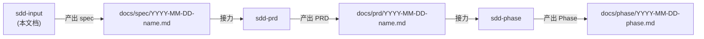
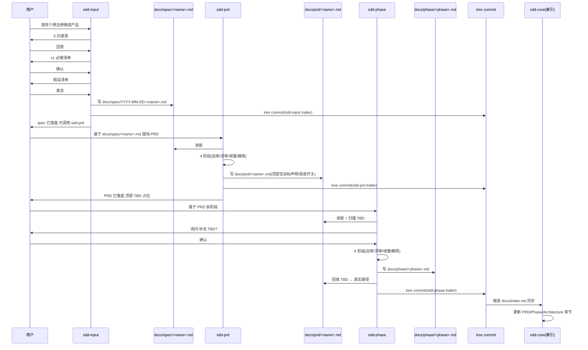

# 与 sdd-prd 的接口约定(sdd-input → sdd-prd 接力)

> 本文档定义 `sdd-input` 和 `sdd-prd` 两个技能如何**接力工作**——构成 sdd-core 文档体系内"想法→PRD"的端到端流程。
> sdd-prd 是 sdd-core 文档体系下的 PRD 编写辅助(原 sdd-prd 已重命名)。

---

## 1. 整体关系

两个技能构成**sdd-core 文档体系内**的端到端"想法→产品文档"工作流:



**关键差异**:

| 维度 | sdd-input                    | sdd-prd                            |
| ---- | ---------------------------- | ---------------------------------- |
| 模式 | **对话驱动**——必须等用户回答 | **自动推进**——4 阶段有产物即可向下 |
| 输入 | 想法/笔记/纪要/邮件          | 结构化 spec(sdd-core 体系下)       |
| 输出 | spec 文档                    | PRD + ADR                          |
| 路径 | `docs/spec/`                 | `docs/prd/`                        |
| 命名 | `YYYY-MM-DD-<name>.md`       | `YYYY-MM-DD-<name>.md`             |

这种差异是有意设计——上游需要用户参与(创造),下游是结构化加工(优化)。

---

## 2. 接口约定

### 2.1 文件层接口

| 接口     | sdd-input 侧                            | sdd-prd 侧                                                                    |
| -------- | --------------------------------------- | ----------------------------------------------------------------------------- |
| 输入文件 | 用户原始材料(笔记、纪要、邮件)          | sdd-input 产出的 `docs/spec/YYYY-MM-DD-<name>.md`                             |
| 输出文件 | `docs/spec/YYYY-MM-DD-<name>.md`        | `docs/prd/YYYY-MM-DD-<name>.md` + ADR 合并入 `docs/architecture/decisions.md` |
| 默认目录 | `docs/spec/`                            | `docs/prd/`                                                                   |
| 提交     | lore commit                             | lore commit                                                                   |
| 临时产物 | `docs/spec/.working/YYYY-MM-DD-<name>/` | `docs/prd/.working/YYYY-MM-DD-<name>/`                                        |

### 2.2 格式层接口

spec 的 9 个章节 = sdd-prd 阶段 1 自审的"输入截面":

| spec 章节      | sdd-prd 阶段 1 怎么用                                                |
| -------------- | -------------------------------------------------------------------- |
| 1. 问题陈述    | 验证 v1 必做是否真的"解决问题"——功能 vs 问题映射                     |
| 2. 目标用户    | 检查权限、UX、API 设计是否覆盖用户角色                               |
| 3. v1 功能边界 | 检查 v1 必做与不做之间是否有矛盾("v1 必做"是否依赖"v1 不做"的子能力) |
| 4. 核心场景    | 验证数据流、API 路径、状态机是否覆盖                                 |
| 5. 验收标准    | 转化为实施检查清单                                                   |
| 6. 非功能需求  | 转化为阶段 3 的实施约束                                              |
| 7. 未决假设    | **重点扫描对象**——sdd-prd 阶段 2 会优先质疑                          |
| 8. 选型未决    | 显式声明选型空间——sdd-prd 阶段 2 充分质疑                            |
| 9. 参考材料    | 保留可追溯性                                                         |

### 2.3 语义层接口

`sdd-input` 必须**严格不写**:

- 任何具体技术选型(前端框架、数据库、部署方案)
- 实施细节(API 路径、字段名、状态码)
- 性能指标的"测量方法"(只写"指标值",不写"怎么测")

`sdd-input` 必须**充分写**:

- 用户角色和场景(让 sdd-prd 阶段 1 能交叉对照)
- 验收标准(让 sdd-prd 阶段 3 能转成约束)
- 隐含假设(让 sdd-prd 阶段 2 能质疑)

---

## 3. 接力流程

### 3.1 完整的 idea → PRD 流程

**步骤 1:调用 sdd-input**

```
用户:"我有个想法想做成产品"
→ sdd-input 启动
→ 阶段 1-4 对话,产出 docs/spec/YYYY-MM-DD-<name>.md
```

**步骤 2:用户确认 spec**

```
用户审阅 docs/spec/YYYY-MM-DD-<name>.md
→ 确认 / 反馈修改 / 拒收
```

**步骤 3:调用 sdd-prd**

```
用户:"基于 docs/spec/YYYY-MM-DD-<name>.md 提纯 PRD"
→ 加载 spec
→ 调用 sdd-prd 技能
→ 阶段 1-4 自动推进,产出 PRD + ADR
```

**步骤 4(可选):调用 sdd-phase**

```
用户:"基于 PRD 拆解为阶段任务"
→ 加载 PRD
→ 调用 sdd-phase 技能
→ 阶段 1-4 自动推进,产出 Phase 文档
→ 回填 PRD 顶部 > 对应阶段:TBD 占位
```

### 3.2 单个技能调用 vs 端到端

两种使用模式:

**模式 A:分多次调用**(推荐)

- 第一次:sdd-input 产出 spec
- 用户审阅 spec
- 第二次:sdd-prd 产出 PRD
- 第三次:sdd-phase 产出 Phase
- 优势:用户可以在每个阶段做对齐——避免在下游才发现"做错了"
- 适用:复杂项目、高风险产品、需要多方审阅

**模式 B:一次调用端到端**

- 一次说明想法
- 主上下文顺序调用 sdd-input → sdd-prd → sdd-phase
- 优势:速度快
- 风险:跳过用户对每一步的审阅

**默认建议模式 A**——产品质量更高。

---

## 4. 共同维护的产物

3 个技能的所有产物都在 sdd-core 文档体系下:

```
{user-workspace}/
└── docs/
    ├── index.md                       # 索引(sdd-core 管)
    ├── CONTRIBUTING.md                # 贡献指南(sdd-core 管)
    ├── spec/                          # sdd-input 产物
    │   ├── YYYY-MM-DD-<name>.md       # 结构化 spec
    │   └── .working/                  # 临时目录
    │       └── YYYY-MM-DD-<name>/
    │           ├── questions-asked.md
    │           └── assumptions.md
    ├── prd/                           # sdd-prd 产物
    │   ├── YYYY-MM-DD-<name>.md       # 目标驱动 PRD
    │   ├── _template.md
    │   └── .working/                  # 临时目录
    │       └── YYYY-MM-DD-<name>/
    │           ├── problem-list.md
    │           ├── adr-set.md
    │           └── constraint-set.md
    ├── phase/                         # sdd-phase 产物
    │   ├── YYYY-MM-DD-<phase>.md      # 阶段任务
    │   └── .working/
    ├── architecture/                  # 架构(sdd-core 管 + sdd-prd 写 decisions.md)
    │   ├── overview.md
    │   └── decisions.md
    └── reference/                     # 参考资料(sdd-core 管)
```

---

## 5. 双向引用约定

### 5.1 spec 应包含(sdd-core 体系下)

```markdown
# {产品名} Spec v1.0

> 来源:由 `sdd-input` 技能产出,基于 {N} 轮用户对话澄清
> 下游消费者:`sdd-prd` 技能 → `docs/prd/YYYY-MM-DD-<name>.md`
> 提交:{lore commit hash}
> 修改记录:执行 `lore log docs/spec/<filename>.md`
```

### 5.2 sdd-prd 产物应包含

```markdown
# {产品名} PRD v1.0

> 来源:基于 `docs/spec/YYYY-MM-DD-<name>.md` 提纯
> 关联:由 `sdd-input` 产出 spec 后由 sdd-prd 提纯
> 对应阶段: [TBD - 由其他技能补全](../phase/YYYY-MM-DD-<phase-name>.md)
```

### 5.3 sdd-phase 产物应包含

```markdown
# {阶段名} 阶段文档

> 来源:基于 `docs/prd/YYYY-MM-DD-<name>.md` 拆解
> 关联:由 `sdd-prd` 产出 PRD 后由 sdd-phase 拆解
> 对应 PRD:[{PRD 名称}](../prd/YYYY-MM-DD-<prd-name>.md)
```

---

## 6. 兼容性矩阵

`sdd-prd` 接受任何结构化 spec——不仅限于 `sdd-input` 产出。

| spec 来源                       | sdd-prd 兼容性                           |
| ------------------------------- | ---------------------------------------- |
| `sdd-input` 产出的 spec(9 章节) | **完全兼容**——9 章节格式直接对应         |
| 传统手写 spec(无 9 章节)        | 兼容但降级——自审会发现更多"未澄清项"     |
| 客户提供的 spec                 | 兼容但需适配——客户 spec 可能夹杂技术选型 |
| 纯用户故事集(如 US-1, US-2...)  | 兼容——但需要先转 9 章节格式              |
| `docs/spec/` 下任何 .md         | 兼容——sdd-core 路径优先                  |

---

## 7. 错误处理

### 7.1 spec 章节空白

如果 `sdd-input` 产出的 spec 有空白章节:

- sdd-prd 阶段 1 自审会发现"该章未澄清"
- **建议回到 `sdd-input` 补全**,而不是在 sdd-prd 阶段 1 补全
- 原因:sdd-input 的对话追问更高效(用户参与),sdd-prd 自审只能发现"矛盾"不能补"信息"

### 7.2 spec 包含技术选型

如果 `sdd-input` 不小心写了"应该用 X":

- sdd-prd 阶段 1 自审会发现
- 选项 1:回到 `sdd-input` 删除(保持"选型未决"原则)
- 选项 2:在 sdd-prd 阶段 2 把"应该用 X"作为待质疑的输入——但这会引入不必要的复杂度

**默认建议选项 1**。

### 7.3 spec 用户拒收

如果用户对 `sdd-input` 产出的 spec 拒收:

- 回到对应阶段(1, 2, 3, 4 任一)
- 重新走对话
- 不直接跳到 `sdd-prd`

### 7.4 sdd-core 未初始化

如果用户工作区无 `docs/` 目录:

- `sdd-input` 提示用户先用 `sdd-core` 场景 4 初始化 docs/ 体系
- 初始化完成后,再走 sdd-input 流程

---

## 8. 接力时序图



---

## 9. 协同模式总结

```
[用户输入:想法/笔记/纪要/邮件]
  ↓
[sdd-input 阶段 1:澄清] ← 对话驱动,等用户回答
  ↓
[sdd-input 阶段 2:定边界] ← 对话驱动
  ↓
[sdd-input 阶段 3:显性化假设] ← 对话驱动
  ↓
[sdd-input 阶段 4:交付] ← 写 spec 文档
  ↓
[docs/spec/YYYY-MM-DD-<name>.md] ← 用户审阅
  ↓
[sdd-prd 阶段 1:自审] ← 自动
  ↓
[sdd-prd 阶段 2:深审] ← 自动(质疑 spec 选型未决项)
  ↓
[sdd-prd 阶段 3:增量] ← 自动
  ↓
[sdd-prd 阶段 4:精简] ← 自动
  ↓
[docs/prd/YYYY-MM-DD-<name>.md + ADR] ← 输出
  ↓
[sdd-phase 阶段 1-4] ← 自动
  ↓
[docs/phase/YYYY-MM-DD-<phase>.md] ← 输出 + 回填 PRD TBD
```

端到端约 30-60 分钟(取决于 spec 复杂度),但产物质量远高于"一次写完"的传统方式。
