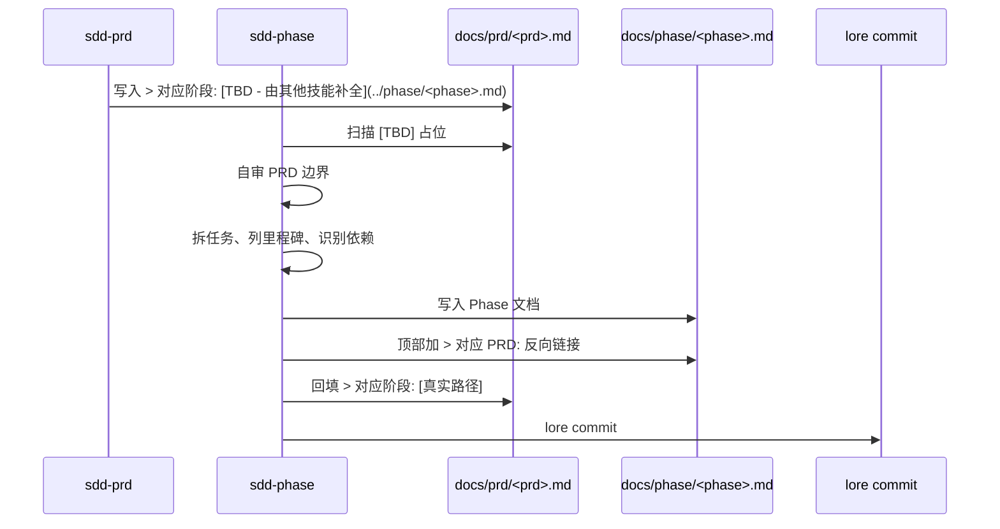

# sdd-phase:Phase 编写辅助 + PRD 双向引用闭环

> 本技能是 `sdd-core` 的"Phase 编写辅助",与 `sdd-prd` 互补。
> sdd-prd 写 PRD 时 Phase 留 `TBD` 占位;本技能负责**补全该占位**,形成 PRD ↔ Phase 双向引用闭环。
> 与 sdd-core 的协作边界见 `references/sdd-collaboration.md`。

---

## 1. 这个技能做什么

你有一份 PRD(由 sdd-prd 产出,或其他来源),需要把它**拆解**为一份**可执行阶段任务文档**。本技能帮你分 4 阶段、有节奏地完成这件事——不是一次性写完再审,而是**边写边验**。

### 1.1 核心原则

- **边写边验**——每写一段就立刻找矛盾和缺口。
- **任务粒度匹配阶段**——Phase 文档的任务应能在该阶段内完成,跨阶段任务需拆为多个子任务。
- **PRD ↔ Phase 双向引用**——Phase 头部必含 `> 对应 PRD:` 反向链接(对齐 conventions.md §3.3)。
- **与 sdd-prd 互补**——sdd-prd 写 PRD 时 Phase 留 `TBD`;本技能负责把 `TBD` 替换为真实路径。

### 1.2 与 sdd-core 的边界

| 维度                                        | sdd-core 管                   | sdd-phase 管                                                                         |
| ------------------------------------------- | ----------------------------- | ------------------------------------------------------------------------------------ |
| `docs/phase/YYYY-MM-DD-<phase>.md` 编写     | 不主动写                      | 本技能唯一交付                                                                       |
| `docs/phase/YYYY-MM-DD-<phase>.md` 命名     | 遵循 conventions.md §2.2      | 遵循                                                                                 |
| `docs/phase/YYYY-MM-DD-<phase>.md` 必填章节 | conventions.md §4 强制 5 章节 | 遵循 + 顶部含 PRD 反向链接                                                           |
| `docs/prd/...`                              | 由 sdd-prd 写                 | 不写,但会**引用**与**补全 TBD**                                                      |
| `docs/index.md` / `docs/CONTRIBUTING.md`    | sdd-core 管                   | 阶段 4 同步必要索引                                                                  |
| lore commit 提交                            | 协议本身                      | 本技能走此提交                                                                       |
| 索引同步                                    | 规则与模板来源                | 按 `rule://docs-update-guard` 在提交前同步 `docs/index.md` 和 `docs/phase/README.md` |

### 1.3 与 sdd-prd 的互补关系



### 1.4 输出物

- **Phase 主文档**:`docs/phase/YYYY-MM-DD-<phase-name>.md`(唯一交付)
- **PRD 占位回填**:`docs/prd/YYYY-MM-DD-<prd-name>.md` 顶部的 `> 对应阶段:` 行,从 `[TBD - ...]` 替换为真实路径

工作产物(阶段 4 后清理):

- `docs/phase/.working/YYYY-MM-DD-<phase-name>/problem-list.md`(阶段 1)
- `docs/phase/.working/YYYY-MM-DD-<phase-name>/task-breakdown.md`(阶段 2)
- `docs/phase/.working/YYYY-MM-DD-<phase-name>/milestone-set.md`(阶段 3)

---

## 2. 适用与不适用

**适用:**

- 已有 PRD(由 sdd-prd 产出或独立来源),需要拆解为可执行阶段任务
- PRD 顶部有 `> 对应阶段: [TBD - ...]` 占位,需要补全
- 中型项目(5-15 人)需要明确阶段、任务、里程碑、风险
- 需要 PRD ↔ Phase 双向引用闭环

**不适用:**

- **多文档初始化**——首次创建 `docs/` 体系,改用 `sdd-core`(场景 4)
- **PRD 编写**——从 spec 提纯为 PRD,改用 `sdd-prd`
- **纯架构专题**——只写架构决策,无阶段任务,改用 `sdd-core` 直接写 `docs/architecture/`
- **多角色需求推演**——评估一个功能对多角色的影响,改用 `multi-role-requirement-analysis`
- **无 PRD 的阶段**——Phase 必须有对应 PRD(对齐 conventions.md §3.3),无 PRD 时先调用 `sdd-prd` 写 PRD

---

## 3. 与 sdd-core 的协作模式(强制)

### 3.1 路径与命名

- Phase 写入 `docs/phase/YYYY-MM-DD-<phase-name>.md`(遵循 conventions.md §2.2)
- 命名规则:与对应 PRD 使用**相同日期前缀**(conventions.md §2.2 强制)
- `<phase-name>` 描述阶段主题,如 `foundation-setup`、`api-development`
- **禁止**:`2026-06-24-foundation-setup.md` 与 PRD `2026-06-23-foundation-setup.md` 日期不一致(conventions.md §2.2 反例)

### 3.2 必填章节(基于 conventions.md §4)

Phase 必含 sdd-core 强制 5 章节(conventions.md §4.1):

| #                  | 章节                             | 来源                     | 强制级别 |
| ------------------ | -------------------------------- | ------------------------ | -------- |
| §1                 | 阶段目标(阶段定位/目标/完成标准) | conventions.md §4.1 强制 | 必填     |
| §2                 | 任务分解(任务清单/任务详情)      | conventions.md §4.1 强制 | 必填     |
| §3                 | 里程碑(关键节点/交付物)          | conventions.md §4.1 强制 | 必填     |
| §4                 | 风险与问题(阶段风险/待解决问题)  | conventions.md §4.1 强制 | 必填     |
| §5                 | 验收(验收清单/验收记录)          | conventions.md §4.1 强制 | 必填     |
| §6                 | 依赖与协作(可选)                 | conventions.md §4.2 可选 | 按需     |
| 顶部 `> 对应 PRD:` | 反向链接                         | conventions.md §4.3 强制 | 必填     |
| 顶部 `> 状态:`     | 未开始/进行中/已完成             | conventions.md §4.4 强制 | 必填     |

### 3.3 模板来源

模板由 `sdd propose` CLI 命令（`src/cli/lib/template-engine.ts`）在代码内联生成，**不依赖项目内 `_template.md` 文件**。`sdd-core/references/templates.md` §2 仅作为技能自身参考，展示模板的结构和字段说明。

sdd-phase 自带的 `templates/phase-outline-template.md` 仅作本技能参考，不参与运行时优先级链。

**实际操作**：

- 用 `sdd propose` CLI 生成 Phase 框架（模板由 `template-engine.ts` 内联生成）
- 在 `> 对应 PRD:` 行后**确认**有反向链接（若模板已有则跳过）
- 其余章节按生成的框架填充

### 3.4 提交协议

**强制走 lore commit**。完整 JSON trailer schema 见 `rule://lore-protocol` 和 sdd-core §核心工作流程→提交变更。本技能推荐的 trailers:

| Trailer      | 推荐内容                                                       |
| ------------ | -------------------------------------------------------------- |
| `intent`     | "补全 PRD 阶段占位并产出 Phase 文档"                           |
| `Constraint` | `Phase 必含 conventions.md §4.1 的 5 章节 + 顶部 PRD 反向链接` |
| `Rejected`   | `独立路径 prd-outputs/phase/ \| 与 conventions.md §1.1 冲突`   |
| `Directive`  | `PRD ↔ Phase 双向引用由 conventions.md §3.3/§4.3 强制`         |
| `Tested`     | `PRD 顶部 TBD 已被替换为真实路径`, `Phase 顶部含 PRD 反向链接` |

---

## 4. 4 阶段工作流


**进入下一阶段的前提:当前阶段产物已产生并被用户确认。**
不能跨阶段跳跃——跳过阶段 1 直接做阶段 2,可能会"任务拆完后才发现 PRD 边界不清"。

---

### 阶段 1:自审(PRD 边界审视)

**目标**:在 PRD 内部找到会**影响任务拆解**的矛盾、缺定义、悬空引用。不找新问题,只找**已写出来但互相打架**的问题。

**进入条件**:

- 已有 PRD(sdd-prd 产出或独立来源)
- PRD 顶部 `> 对应阶段:` 行存在(占位 `TBD` 或已存在)

**操作步骤**:

1. 通读 PRD 全文,建立心智地图——识别功能边界、非功能需求、验收标准
2. **PRD 边界审查**——找影响任务拆解的问题:
   - **范围不清**:"v1 做 X" vs "v1 不做 X"——任务拆解无法开始
   - **依赖未识别**:PRD 提到 Y 但未说依赖谁——任务依赖链断裂
   - **验收标准缺失**:无 NFR 阈值或验收条件——任务完成无法判断
   - **悬空引用**:Phase 写完后会引用不存在的章节/接口
3. 找 3 类信号:
   - **矛盾**(范围/依赖/验收标准)
   - **缺定义**(字段/接口/阈值)
   - **悬空引用**(链接到不存在的章节)

**产物**:`docs/phase/.working/YYYY-MM-DD-<phase-name>/problem-list.md`

按优先级分类:

- **必修**:不修就无法进入阶段 2
- **应修**:影响任务拆解质量但不阻塞
- **可选**:锦上添花

模板:`templates/problem-list.md`

**反模式**:

- 跳过阶段 1 直接拆任务——PRD 边界不清时任务必拆错
- 把"缺验收标准"归到"应修"——无验收,任务完成无法判定
- 主上下文自己审完就觉得没问题——空清单大概率审视不够深

**完成标志**:

- 问题清单已生成,每条都有具体位置(PRD 章节/行引用)
- 每条已被分类为必修/应修/可选
- 用户确认清单完成

---

### 阶段 2:深度审视(任务分解)

**目标**:基于 PRD 边界,把功能需求**拆解为可执行任务**。**任务粒度 = 1-3 天可完成**——粒度太粗,无法追踪;太细,文档臃肿。

**进入条件**:

- 阶段 1 完成,PRD 边界矛盾已修
- PRD 功能需求 §3 清晰

**操作步骤**:

1. **逐条扫描 PRD §3 功能需求**,每条 P0/P1 功能映射为 ≥1 个任务
2. **建立任务粒度**:
   - **太粗**:"实现用户系统"(无法追踪)→ 拆为"建表/建 API/写测试/部署"
   - **太细**:"写注册接口的一个 if 分支"(太琐碎)→ 合并到"实现注册接口"
   - **合适**:"实现用户注册 API + 单元测试"(1-3 天)
3. **识别任务依赖**:
   - 数据库 schema 必须先于 API
   - API 必须先于前端调用
   - 测试可与实现并行,但验收必须最后
4. **分配任务属性**:
   - **任务 ID**:`T001`、`T002`...
   - **任务名称**:动词开头,如"实现用户注册 API"
   - **负责人**:占位(待定)
   - **预估工时**:人天
   - **依赖**:`T001`、`[无]`、`[外部:DB schema 设计]`
   - **状态**:`未开始/进行中/已完成`(conventions.md §4.4)

**产物**:`docs/phase/.working/YYYY-MM-DD-<phase-name>/task-breakdown.md`

每条任务详情(对齐 conventions.md §4.1 阶段文档模板):

```markdown
#### T001: 实现用户注册 API

**任务描述**:
基于 PRD §3.2.1 用户注册功能,实现 POST /api/v1/users 端点,含参数校验、密码哈希、邮箱唯一性检查。

**验收标准**:

- [ ] POST /api/v1/users 返回 201/400/409
- [ ] 密码使用 bcrypt 哈希(对齐 §4.2 NFR)
- [ ] 邮箱重复返回 409(对齐业务规则)
- [ ] 单元测试覆盖率 ≥ 80%
- [ ] 集成测试通过

**涉及文档**:

- [PRD §3.2.1 用户注册](../prd/2026-06-23-user-authentication.md)
- [ADR-001 前后端选型](../architecture/decisions.md#adr-001)

**备注**:
密码哈希成本因子 = 12(对齐 §4.2 安全要求)
```

模板:`templates/task-breakdown.md`

**反模式**:

- 任务粒度不统一(混用 0.5 天和 5 天的任务)——无法估算整体工期
- 任务依赖未识别——下游任务无依据启动
- 验收标准不可测——任务"完成"无客观判定

**完成标志**:

- 至少 8 个任务(若 PRD 功能点少于 8 个,按实际)
- 每个任务都有 ID/名称/工时/依赖/状态/验收标准
- 任务覆盖 PRD §3 全部 P0/P1 功能
- 用户确认任务清单

---

### 阶段 3:增量设计(里程碑、风险、依赖)

**目标**:在任务清单之上,识别**里程碑节点、阶段风险、协作需求**。**对齐 conventions.md §4.1 阶段目标/§4 风险/§5 依赖**。

**进入条件**:

- 阶段 2 完成,任务清单已定
- 用户已确认任务分解

**操作步骤**:

1. **列里程碑节点**(3-5 个):
   - 每个里程碑 = 一组任务的完成点 + 可交付物
   - 典型:M0 环境就绪 / M1 后端 API 完成 / M2 前端联调完成 / M3 上线
2. **识别阶段风险**(对齐 conventions.md §4 风险与问题):
   - **技术风险**:未掌握的技术、依赖外部系统的稳定性
   - **资源风险**:关键人员离职、工期冲突
   - **业务风险**:PRD 业务规则理解偏差
3. **列依赖与协作**(对齐 conventions.md §4.2 可选章节):
   - 前置依赖:必须先完成的外部任务
   - 协作需求:跨团队/外部供应商
4. **设计阶段验收清单**(对齐 conventions.md §4.1 §5 验收):
   - 阶段级完成标准(可独立判定)
   - 与 PRD 验收 §5 的对应关系

**产物**:`docs/phase/.working/YYYY-MM-DD-<phase-name>/milestone-set.md`

模板:`templates/milestone-set.md`

**反模式**:

- 里程碑过多(> 5 个)——节奏碎片化
- 风险识别空泛("可能延期")——不可操作
- 协作需求未点名("与后端协调")——无具体负责人

**完成标志**:

- 里程碑 3-5 个,每个有日期+交付物+状态
- 阶段风险 ≥ 3 个,每个有影响+概率+措施+责任人
- 协作需求表完整
- 用户确认

---

### 阶段 4:精简与提交

**目标**:交付的 Phase 文档**精炼、内部一致、可执行**。**信号噪声比 > 信息量**——任务描述每段都不可替代。

**进入条件**:

- 阶段 3 完成,里程碑/风险/协作已定
- 完整 Phase 文档已生成
- 用户已确认**这份 Phase 的目标陈述**

**操作步骤**:

1. **合并工作产物到 Phase 文档**:把 `task-breakdown.md`、`milestone-set.md` 内容并入 Phase 主文档对应章节
2. **删冗余**:任务描述与 PRD §3 重复时,只留引用("详见 PRD §3.2.1")
3. **加反向链接**:Phase 顶部 `> 对应 PRD:` 确认指向真实 PRD 文件
4. **回填 PRD 占位**:更新对应 PRD 顶部 `> 对应阶段:` 行,把 `TBD` 替换为真实 Phase 路径
5. **子代理做最终审查**。**主上下文写文档,子代理做最后一遍对照**——主上下文有认知偏差。子代理应执行 5 项审查:
   - **PRD ↔ Phase 一致性**:Phase 任务是否覆盖 PRD §3 全部 P0/P1 功能?
   - **任务依赖闭环**:每个任务的依赖是否都存在?
   - **验收标准可测**:每个任务的验收标准是否客观可判定?
   - **里程碑合理性**:里程碑是否均匀分布,无聚集?
   - **sdd-core 一致性**:对照 conventions.md §4.1 的 5 必填章节,逐条打勾;命名是否符合 §2.2;双向引用是否完整
6. **同步索引**:按 `rule://docs-update-guard` 和 sdd-core 规则更新 `docs/index.md` 和 `docs/phase/README.md`(若存在),并把验证结果写入 lore `Tested`
7. **清理工作产物**:删除 `docs/phase/.working/YYYY-MM-DD-<phase-name>/` 整个目录
8. **单次提交**:所有变更(Phase 新建 + PRD 顶部回填 + 索引同步)在一个 `lore commit` 里

**产物**:

- **Phase 主文档**:`docs/phase/YYYY-MM-DD-<phase-name>.md`(精炼版,含 conventions.md §4.1 5 必填章节)
- **PRD 占位回填**:对应 PRD 顶部的 `> 对应阶段:` 行已更新

模板:

- 用 `sdd propose` CLI 生成 Phase 框架（模板由 `template-engine.ts` 内联生成）
- 本技能参考:`templates/phase-outline-template.md`(不参与运行时优先级)

**完成标志**:

- 子代理 5 项审查完成,无遗留问题
- workspace 中 grep 确认零悬空引用
- 用户确认基线完整
- **PRD ↔ Phase 双向引用已建立**(都从 TBD 变为真实路径)
- lore commit 单次提交完成

---

## 5. PRD 占位回填(本技能独家能力)

### 5.1 触发场景

- 用户调用本技能时,先扫描 `docs/prd/*.md` 找 `> 对应阶段: [TBD - ...]` 占位(兼容无空格旧格式)
- 找到则询问用户:"是否要补全该占位为 Phase 文档?"
- 用户确认后,把 TBD 替换为新创建的 Phase 路径

### 5.2 物理动作

```bash
# 1. 创建新 Phase 文档
echo "# 阶段文档" > docs/phase/2026-06-23-foundation-setup.md

# 2. 修改对应 PRD 顶部
sed -i 's|> 对应阶段: \[TBD - 由其他技能补全\](../phase/2026-06-23-foundation-setup.md)|> 对应阶段: [基础搭建阶段](../phase/2026-06-23-foundation-setup.md)|' \
  docs/prd/2026-06-23-foundation-setup.md
```

### 5.3 占位回填的反模式

- **禁止** 直接修改 PRD 顶部而不创建 Phase 文档(会留下悬空引用)
- **禁止** 在 Phase 文档没完成阶段 4 之前就回填 PRD 占位
- **禁止** 回填后不复查 PRD 顶部实际状态(必须 grep 确认)

---

## 6. 协作角色(建议,非强制)

| 角色         | 阶段 1            | 阶段 2               | 阶段 3             | 阶段 4                   |
| ------------ | ----------------- | -------------------- | ------------------ | ------------------------ |
| PM           | 主导 PRD 边界审视 | 协助任务粒度切分     | 提供里程碑节奏输入 | 确认任务覆盖 PRD 全部 P0 |
| 后端/架构    | 协助 API 边界识别 | 主导后端任务拆解     | 主导技术风险识别   | 主导任务依赖闭环审查     |
| 前端/设计    | 协助 UI 边界识别  | 主导前端任务拆解     | 协作里程碑节点确认 | 协助任务验收标准审查     |
| 数据/运营    | 协助业务规则识别  | 协助数据相关任务拆解 | 协助协作需求识别   | 协助验收记录             |
| 测试(必要时) | 协助验收标准审查  | 拆解测试任务         | 识别测试里程碑     | 主导验收标准审查         |

---

## 7. 输入太短的情况

如果 PRD 较短(只有 §1-§3,无 §4-§5):

- **阶段 1 降级**:重点找"显式矛盾"和"明显缺定义",无需"对偶压力"
- **阶段 2 简化**:任务粒度适当放大(避免无意义的细分)
- **阶段 3 仍要做**:即使简短 PRD,也有里程碑和风险
- **阶段 4 仍要做**:精简和子代理审查同样适用

如果只有几句话的需求(无 PRD):

- **先和用户对齐"输入模式"**——是"已有 PRD 请拆解",还是"无 PRD 先用 sdd-prd 写 PRD"
- 无 PRD 时**不启动**本技能,改用 `sdd-prd` 写 PRD 后再回来

---

## 8. 跨阶段通用原则

| 原则                         | 含义                                                                   |
| ---------------------------- | ---------------------------------------------------------------------- |
| **任务粒度 1-3 天**          | 拆任务时以"1 个工程师 1-3 天可完成"为单位                              |
| **任务依赖显性化**           | 每个任务的依赖必须明确写出,不靠"心照不宣"                              |
| **验收标准可测**             | 任务验收标准必须客观可判定,无"友好/流畅"等形容词                       |
| **PRD ↔ Phase 双向引用**     | conventions.md §3.3/§4.3 强制,缺一不可                                 |
| **子代理做最终审查**         | 主上下文负责写,子代理负责审——避免"我写的都对"                          |
| **单次 commit 表达完整事件** | Phase 编写 + PRD 占位回填是同一事件,不拆成多个提交                     |
| **每阶段产物明确**           | 自审问题清单;深审任务分解;增量里程碑/风险;精简最终 Phase——不跨阶段跳跃 |
| **本技能不写 PRD**           | PRD 由 sdd-prd 写;本技能只引用与回填占位                               |

---

## 9. 使用流程总览

当用户说"我有个 PRD 要拆成 Phase"或 sdd-prd 留下 `> 对应阶段: [TBD]` 占位时:

1. **确认 sdd-core 已初始化**:`docs/phase/` 存在?若不存在则调用 `sdd-core` 场景 4 初始化
2. **确认有对应 PRD**:PRD 存在?若不存在,改用 `sdd-prd` 先写 PRD
3. **走阶段 1**:自审 PRD 边界,产出 `problem-list.md`,用户确认
4. **走阶段 2**:拆任务、识别依赖,产出 `task-breakdown.md`,用户确认
5. **走阶段 3**:列里程碑、风险、协作,产出 `milestone-set.md`,用户确认
6. **走阶段 4**:精简 + 顶部加"对应 PRD"反向链接 + 子代理 5 项审查 + 回填 PRD 占位 + 清理工作产物 + lore commit,交付 Phase

每个阶段完成后,向用户展示产物,确认后再进入下一阶段。
如果用户说"跳过某阶段",解释该阶段的价值,但若用户坚持则尊重决定。

### 阶段 4 之后:状态推进

Phase 阶段 4 完成后,Phase 文档状态字段 `> 状态:` 从"未开始"进入"进行中"(conventions.md §4.4)。
任务状态在实施过程中由项目组推进(`未开始/进行中/已完成`)。

---

## 10. 参考与模板

### 10.1 模板

- `templates/problem-list.md` — 阶段 1 问题清单
- `templates/task-breakdown.md` — 阶段 2 任务分解
- `templates/milestone-set.md` — 阶段 3 里程碑/风险/依赖
- `templates/phase-outline-template.md` — 阶段 4 Phase 大纲(对齐 conventions.md §4.1 5 必填)

### 10.2 参考

- `references/phase-1-self-review.md` — 阶段 1 详细操作
- `references/phase-2-task-breakdown.md` — 阶段 2 详细操作
- `references/phase-3-milestone.md` — 阶段 3 详细操作
- `references/phase-4-slim-commit.md` — 阶段 4 详细操作
- **`references/sdd-collaboration.md` — 与 sdd-core/sdd-prd 的协作边界(必读)**
- `references/prd-tbd-filler.md` — PRD TBD 占位回填的详细操作

### 10.3 sdd-core 引用

- `sdd-core/references/conventions.md` — 命名规范、必填章节、状态管理
- `sdd-core/references/templates.md` §2 — Phase 内置模板(fallback)
- `sdd-prd` — PRD 编写辅助(本技能上游)
- `docs-update-guard` rule — 提交前 doc 更新检查
