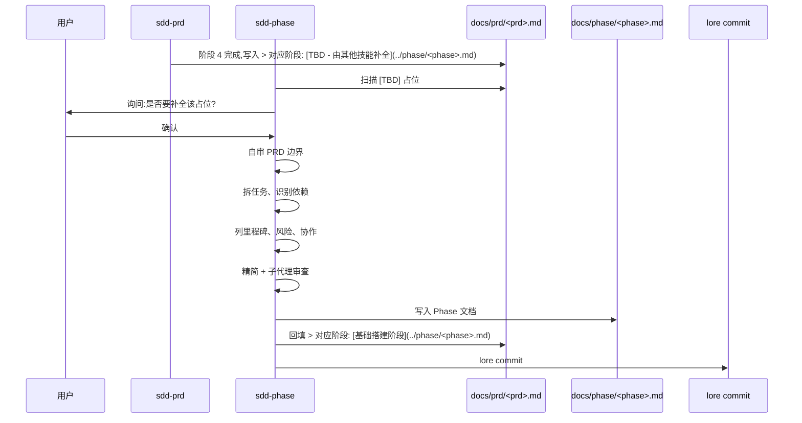
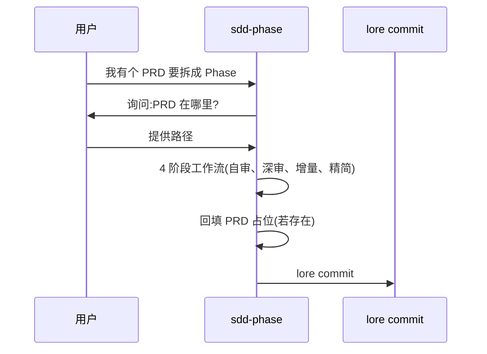
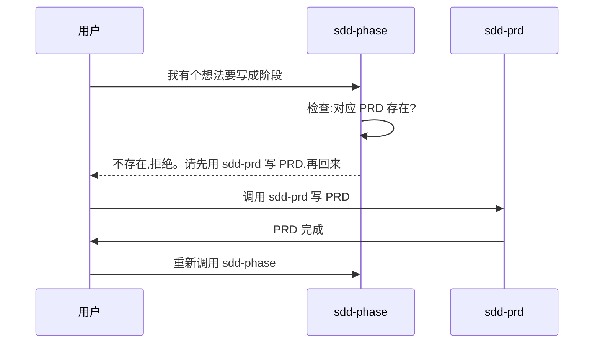

# 与 sdd-core / sdd-prd 的协作边界(sdd-phase 必读)

> 本文件是 sdd-phase 与 sdd-core、sdd-prd 协作的**唯一权威说明**。
> 任何对边界的疑问,先查本文件。

---

## 1. 角色定位

| 技能                  | 角色                       | 管什么                                                           |
| --------------------- | -------------------------- | ---------------------------------------------------------------- |
| **sdd-core**          | 软件开发文档体系管理者     | `docs/` 整个目录结构、命名规范、必填章节、状态机、索引、提交协议 |
| **sdd-prd**           | sdd-core 的 PRD 编写辅助   | 单一 PRD 的 4 阶段质量审视 + 目标驱动归档                        |
| **sdd-phase**(本技能) | sdd-core 的 Phase 编写辅助 | 单一 Phase 的 4 阶段质量审视 + PRD ↔ Phase 双向引用闭环          |

**核心边界**:sdd-phase 是 sdd-core 的"子集"——只做 Phase,不做 PRD / Architecture 总览 / Reference / 索引。
**与 sdd-prd 互补**:sdd-prd 写 PRD 时 Phase 留 `TBD` 占位;sdd-phase 负责**补全该占位**。

---

## 2. 文件级边界(权威清单)

| 路径                               | sdd-core 管   | sdd-prd 管           | sdd-phase 管                  |
| ---------------------------------- | ------------- | -------------------- | ----------------------------- |
| `docs/index.md`                    | 管            | 不写                 | 不写                          |
| `docs/CONTRIBUTING.md`             | 管            | 不写                 | 不写                          |
| `docs/prd/YYYY-MM-DD-<name>.md`    | 命名/规范     | 内容(本技能唯一交付) | 不写,但**引用**与**回填 TBD** |
| `docs/phase/YYYY-MM-DD-<phase>.md` | 命名/规范     | 不写                 | **本技能唯一交付**            |
| `docs/phase/.working/...`          | 不主动建      | 不建                 | **sdd-phase 管**(临时目录)    |
| `docs/architecture/...`            | 命名/规范     | `decisions.md` 内容  | 不写,但**引用**               |
| `docs/reference/...`               | 管            | 不写                 | 不写                          |
| lore commit 提交                   | 协议本身      | 走此提交             | 走此提交                      |
| 索引同步                           | 场景 1 步骤 6 | 通过 trailer 触发    | 通过 trailer 触发             |

---

## 3. 章节级边界(Phase 内容)

Phase 由 sdd-phase 写,必填章节对齐 sdd-core conventions §4.1:

| 章节                                | 强制级别           | 来源          | sdd-phase 适配                 |
| ----------------------------------- | ------------------ | ------------- | ------------------------------ |
| §1 阶段目标(阶段定位/目标/完成标准) | sdd-core §4.1 必填 | sdd-core 强制 | 保持原样                       |
| §2 任务分解(任务清单/任务详情)      | sdd-core §4.1 必填 | sdd-core 强制 | sdd-phase 强化:任务粒度 1-3 天 |
| §3 里程碑(关键节点/交付物)          | sdd-core §4.1 必填 | sdd-core 强制 | 保持原样                       |
| §4 风险与问题(阶段风险/待解决问题)  | sdd-core §4.1 必填 | sdd-core 强制 | 保持原样                       |
| §5 验收(验收清单/验收记录)          | sdd-core §4.1 必填 | sdd-core 强制 | 保持原样                       |
| §6 依赖与协作(前置依赖/协作需求)    | sdd-core §4.2 可选 | sdd-core 可选 | sdd-phase 强化:协作必须点名    |
| 顶部 `> 对应 PRD:`                  | sdd-core §4.3 必填 | sdd-core 强制 | **本技能重点维护**             |
| 顶部 `> 状态:`                      | sdd-core §4.4 必填 | sdd-core 强制 | sdd-phase 保持                 |

**关键**:

- 顶部 `> 对应 PRD:` 是 sdd-core §4.3 强制反向链接,**本技能必须建立**
- 任务粒度由本技能阶段 2 强化(1-3 天)
- 协作需求由本技能阶段 3 强化(必须点名 `@人`)

---

## 4. 命名规范(继承 sdd-core §2.2)

Phase 命名:`docs/phase/YYYY-MM-DD-<phase-name>.md`

| 规则 | 示例                                                    |
| ---- | ------------------------------------------------------- |
| 正确 | `2026-06-23-foundation-setup.md`                        |
| 错误 | `Phase-001.md`(无日期)                                  |
| 错误 | `2026-6-23-foundation.md`(日期格式错)                   |
| 错误 | `2026-06-24-foundation-setup.md`(与对应 PRD 日期不一致) |

**与对应 PRD 的日期一致性**(sdd-core §2.2 强制):

- 对应 PRD `2026-06-23-foundation-setup.md` → Phase 也用 `2026-06-23-...`
- **禁止** Phase 用 `2026-06-24-...` 而 PRD 是 `2026-06-23-...`(sdd-core §2.2 反例)

---

## 5. 提交协议(继承 docs-update-guard + sdd-core)

**所有变更必须走 `lore commit`**,使用 sdd-core 标准 JSON trailer(参考 sdd-core SKILL.md L96-107):

```json
{
  "intent": "补全 PRD 阶段占位并产出 Phase 文档",
  "body": "...",
  "trailers": {
    "Constraint": ["..."],
    "Rejected": ["..."],
    "Directive": ["..."],
    "Confidence": "high|medium|low",
    "Tested": ["..."],
    "Not-tested": ["..."]
  }
}
```

**禁止**:`git commit` 直接提交(由 `rule://lore-commit-guard` 拦截)。

---

## 6. 触发条件(sdd-phase vs sdd-prd vs sdd-core)

| 用户表达 / 场景         | 触发 sdd-core | 触发 sdd-prd       | 触发 sdd-phase   |
| ----------------------- | ------------- | ------------------ | ---------------- |
| "初始化 docs"           | 触发          | 不触发             | 不触发           |
| "创建新 PRD"            | 场景 1        | 触发               | 不触发           |
| "从 spec 写 PRD"        | 不触发        | 触发               | 不触发           |
| "审视 PRD"              | 不触发        | 触发               | 不触发           |
| "写 phase"              | 不触发        | 不触发             | 触发             |
| "补全阶段"              | 不触发        | 不触发             | 触发             |
| "创建阶段任务"          | 不触发        | 不触发             | 触发             |
| PRD 顶部有 `[TBD]` 占位 | 不触发        | 不触发             | 触发(询问用户后) |
| "归档 PRD"              | 不触发        | 触发(目标驱动归档) | 不触发           |
| "更新 architecture"     | 触发(场景 2)  | 不触发             | 不触发           |
| "添加 reference"        | 触发(场景 3)  | 不触发             | 不触发           |

**判断规则**:

- 用户说"初始化/管理文档体系" → sdd-core
- 用户说"从 spec 写 PRD/审视/归档" → sdd-prd
- 用户说"写 phase/补全阶段/创建任务/PRD 顶部 TBD 占位" → sdd-phase

---

## 7. sdd-phase 与 sdd-prd 的协作流程

### 场景 A:sdd-prd 完成后,自动补全 TBD



### 场景 B:独立触发(已有 PRD,无 sdd-prd 来源)



### 场景 C:无 PRD 时的拒绝



---

## 8. sdd-phase 的"越界"与"不越界"

### sdd-phase 允许做的事

- 写 `docs/phase/YYYY-MM-DD-<phase>.md` 内容
- 创建 `docs/phase/.working/` 临时工作目录
- **修改** 对应 PRD 顶部的 `> 对应阶段:` 行(从 TBD 替换为真实路径)
- 触发 lore commit

### sdd-phase 禁止做的事

- 写 `docs/index.md`(由 sdd-core 维护)
- 写 `docs/CONTRIBUTING.md`(由 sdd-core 维护)
- **写** `docs/prd/...`(由 sdd-prd 写;本技能只**引用**与**回填占位**)
- 写 `docs/architecture/overview.md`(sdd-core 场景 4 初始化)
- 写 `docs/reference/...`(sdd-core 管外部资料)
- 改 PRD 其他章节(只允许改 `> 对应阶段:` 这一行)
- 跳过 lore commit 直接 `git commit`

---

## 9. 边界冲突的处理

如果 sdd-phase 与 sdd-core、sdd-prd 在某点上**似乎**冲突:

1. **先查本文件**——大多数冲突本文件已明确说明
2. **查 sdd-core SKILL.md / conventions.md**——确认 sdd-core 实际约束
3. **查 sdd-prd/SKILL.md**——确认 sdd-prd 实际约束
4. **查 docs-update-guard**——确认提交时 doc 更新规则
5. **如果仍然模糊**——停手,向用户说明冲突点,请求决策

**禁止**:在模糊时单方面决策、编造规则、或破坏 sdd-core / sdd-prd 现有约束。

---

## 10. 与 docs-update-guard 的配合

`docs-update-guard` 在 `git commit` / `lore commit` 前拦截。

sdd-phase 的所有提交都触发此规则:

- sdd-phase 自检:本次提交是否含 Phase 变更?
- 若含 → 已在 sdd-phase 工作流中处理(4 阶段 + PRD 占位回填)
- 若同时含 PRD 变更(占位回填) → 已在工作流中处理

**操作建议**:

- 触发 sdd-phase 时,先确认 commit 内容是 Phase 相关
- 提交应同时含 Phase 新建 + PRD 顶部回填(单次 commit)

---

## 11. 总结:一句话边界

> **sdd-core 是文档体系的地基,sdd-prd 在地基上做 PRD,sdd-phase 在地基上做 Phase 并与 PRD 形成双向引用闭环。**
> sdd-phase 不替代 sdd-core,不与 sdd-prd 平行,**只填补 sdd-prd 留下的 TBD 占位**。
> 当你不确定一个动作归谁——查本文件,查 sdd-core,查 sdd-prd,然后才动手。
