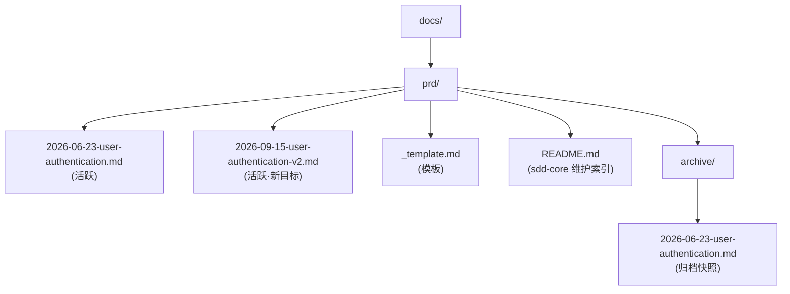

# 归档机制(sdd-prd 独家 · 防污染关键)

> 加载时机:阶段 4 完成、用户提→"归档"、"目标达成了"、agent 加载已归档的 PRD 时。
> 本机制是 sdd-prd 独家能力——sdd-core 没有归档概念,本技能在 sdd-core 状态机之上增加"目标达成"维度。

---

## 1. 为什么需要归档

### 1.1 反复加载的污染风险

PRD 不是"写一次就完"——它会被 agent 反复加载。每次加载都会让 agent 在以下场景中"补全"PRD:

- "PRD 没说 X,我猜用户是想加 X"——加上 X
- "PRD 提→ Y 但没说清楚,我推断了 Y 的具体值"——加上具体值
- "PRD 上次说 Z,现在应该是 Z' 吧"——改了 Z

这些"补全"在短期内是合理的(修正小歧义、补全缺定义)。但**累积 5-10 次 agent 加载后**:

- PRD 表面看起来"完整"
- 实际已经偏离原始意图
- 团队成员读→这份 PRD 时,不知道"什么是原始需求、什么是 agent 推断"
- 修改时不知道哪部分能改、哪部分不能改

### 1.2 归档的根本性作用

**归档不是"文档过期了"——归档是"文档冻结了"**。

归档后的 PRD 是不再被加载的"历史快照"——它记录了"那个时刻我们是怎么想的",**不参与后续决策**。

新需求产生新 PRD。旧 PRD 保留为可追溯的档案。

---

## 2. 归档与 sdd-core 状态机的关系

状态值域由 conventions.md §3.4 统一定义:**草稿 / 待评审 / 已评审 / 已规划任务 / 进行中 / 已归档**（含 ArchiveReason：已完成 / 已中止）。

sdd-prd 的归档机制**统一到** conventions.md §3.4 的状态值域(不再叠加第二套 HTML 注释标记):

| 维度     | conventions.md §3.4 定义                        | sdd-prd 触发                               |
| -------- | ----------------------------------------------- | ------------------------------------------ |
| 状态值域 | 草稿/待评审/已评审/已规划任务/进行中/已归档（含 ArchiveReason：已完成/已中止） | sdd-prd 负责已归档（含 ArchiveReason）的触发判定 |
| 文件位置 | `docs/prd/`(活跃) / `docs/prd/archive/`(已归档) | 归档时移动,已替换/已中止原地标注               |
| 状态字段 | `> 状态: 已归档` 等(唯一标记)                   | 不使用 `<!-- archived -->` 等第二套标记    |
| 索引同步 | conventions.md §7 定义规则                      | 按 `rule://docs-update-guard` 在提交前同步 |

**核心原则**:状态字段是唯一事实来源——归档（含 ArchiveReason：已完成/已中止/已替换）都通过 `> 状态:` 表达,agent 加载时只读这一处。

---

## 3. 归档触发条件(任一满足)

1. **业务验收开关全部勾选** — 业务目标已达成
   - 可按目标维度分项勾选:若"用户增长"目标达成但"商业化"目标未达成,可部分归档(拆为两份 PRD)或推迟归档
2. **技术验收开关全部勾选** — 技术目标已达成(同上可分项)
3. **用户明确说"目标达成,PRD 归档"**
4. **目标中止** — 用户说"这个项目不做了"
5. **目标替换** — 新 PRD 替代旧 PRD 的目标(即使旧 PRD 开关未全勾也归档)

**与原 spec-to-prd 的差异**:原版要求"业务+技术全部勾选"才归档,在分批交付场景下几乎不可达。新版放宽为"按目标维度分项勾选 + 替换即归档"。

---

## 4. 归档操作(agent 执行)

### 4.1 标准归档流程

```bash
# 1. 创建归档目录
mkdir -p docs/prd/archive/

# 2. 移动文件(不是复制——归档是不可变的快照)
mv docs/prd/2026-06-23-user-authentication.md \
   docs/prd/archive/2026-06-23-user-authentication.md

# 3. 修改归档文件顶部状态字段(唯一标记,不加 HTML 注释)
```

归档文件顶部修改为:

```markdown
# 用户认证 PRD v1.0

> 状态：已归档 | 归档日期：2026-06-30 | 归档路径：docs/prd/archive/2026-06-23-user-authentication.md
>
> **重要:本 PRD 已归档**。如需修改请:
>
> 1. 说明原因(修 bug?目标变更?新需求?)
> 2. 引导用户创建新 PRD 或更新归档版本
>
> 不要再直接修改本文件——避免污染历史快照。
>
> 对应阶段: [TBD - 由其他技能补全](../phase/YYYY-MM-DD-<phase-name>.md)
```

### 4.2 目标替换(不移动)

```bash
# 旧 PRD 不移动,只在顶部加标注
```

```markdown
# 用户认证 PRD v1.0

> **状态:已归档 | 归档原因：已替换** | 替换日期:2026-09-15 | 替代 PRD:2026-09-15-user-authentication-v2.md
>
> 本 PRD 已被新 PRD 替代,不再被加载。如需了解历史决策,请直接阅读本文件。
```

### 4.3 目标中止

```markdown
# 用户认证 PRD v1.0

> **状态:已归档 | 归档原因：已中止** | 中止日期:2026-08-01 | 原因:项目延期
```

---

## 5. 归档后行为

### 5.1 索引同步

归档后,agent **必须**按 `rule://docs-update-guard` 同步索引,并在 lore commit 中记录验证结果:

```bash
echo '{
  "intent": "归档用户认证 PRD v1.0",
  "body": "目标达成,移动→ docs/prd/archive/。需 sdd-core 同步 docs/index.md 移入归档分区。",
  "trailers": {
    "Constraint": ["归档 PRD 必须移→ docs/prd/archive/"],
    "Directive": ["归档 PRD 不再参与活跃 PRD 扫描"],
    "Tested": ["归档文件顶部含 archived 注释", "docs/index.md 已移入归档分区"]
  }
}' | lore commit
```

同次变更必须:

1. 更新 `docs/index.md` 把该 PRD 移入"归档"分区
2. 同步更新 `docs/prd/README.md` 状态表(如果存在)

### 5.2 agent 加载检查清单

**任何 agent 加载 `docs/prd/*.md` 前必做**:

```markdown
# 加载检查清单

1. [ ] 读取状态字段 `> 状态:`（唯一标记，无需读 HTML 注释）
   - 已归档 → 停止处理,提示用户:
     > "该 PRD 已归档→ `docs/prd/archive/2026-06-23-user-authentication.md`,归档日期 2026-06-30。
     > 归档意味着该目标已达成、被替换或已中止。
     > 如果你要修改,请告诉我原因(修 bug?目标变更?新需求?),不要直接修改归档文档。"
   - 草稿/待评审/已评审/已规划任务/进行中 → 正常处理
2. [ ] 读取 sdd-prd "目标声明"——确认目标还在不在
3. [ ] 读取 sdd-prd "目标验收开关"——是否全部勾选
4. [ ] 如果全部勾选 + 用户意图是"修改":主动提示归档
```

这个清单**必须在加载后立即执行**——在 agent 决定如何处理 PRD 之前。

### 5.3 Phase 占位处理

归档时如果 Phase 文档仍为 TBD:

- **不阻塞归档**——归档的是 PRD 目标,不是 Phase
- 归档文件保留"对应阶段: [TBD]"占位行
- 其他技能补全 Phase 后,sdd-core 会更新双向引用

---

## 6. 不归档的情况

| 情况                               | 为什么不归档        |
| ---------------------------------- | ------------------- |
| 业务验收开关没全部勾选(且无替换)   | 目标还没达成        |
| 技术验收开关没全部勾选(且无替换)   | 技术还没做完        |
| 用户明确说"先不归档,继续维护"      | 显式反对            |
| 业务验收 100% 但用户临时想加新功能 | 目标在扩展,不能归档 |

---

## 7. 多 PRD 并存

归档后,新需求可以创建新 PRD。多个 PRD 在 `docs/prd/` 并存:



新 PRD 是**针对新目标**——不是"修改旧 PRD"。如果旧 PRD 的某部分在新目标下仍然适用,可以**引用**归档版本,而不是复制。

---

## 8. "我只是想改个小错"——边界情况

如果归档后用户说"只是改个 typo"或"小错":

1. **修改归档版本**(`docs/prd/archive/.../*.md`)——但**记录**修改
2. 归档目录里的文件不变(仍然显示"已归档")
3. 修改归档版本时**在顶部加 changelog**:

```markdown
# 用户认证 PRD v1.0

> 状态：已归档 | 归档日期：2026-06-30
> changelog：2026-07-03 修正 §3 的 typo（管理员→管理）
> changelog：2026-08-12 补充 §6 的实施检查清单遗漏项
```

### 8.1 不要做的事

**不要做的事**:

- **禁止** 把归档文档"复活"——归档意味着冻结,不是临时隐藏
- **禁止** 在 `docs/prd/` 活跃区直接修改归档文档——破坏归档的不可变性
- **禁止** 归档后还在活跃区维护——归档就是归档,不是"半归档"

---

## 9. 归档与 lore commit 的配合

### 9.1 单次提交 vs 多次提交

**单次 commit**(推荐):

- "PRD 全面定型"——一次提交一个完整事件
- lore commit 的 `intent` 写 WHY(意图)不写 WHAT

**归档是单独 commit**:

- 归档时主区 PRD 改了"已归档"注释——但**这不是"功能变更"**
- 建议单独 commit,更清晰:

```bash
echo '{
  "intent": "归档用户认证 PRD v1.0:业务+技术验收全部达成",
  "body": "目标达成,移动→ docs/prd/archive/。",
  "trailers": {
    "Constraint": ["归档 PRD 必须移→ docs/prd/archive/"],
    "Directive": ["sdd-core 需同步 docs/index.md 移入归档分区"]
  }
}' | lore commit
```

---

## 10. 归档常见问题

### Q: 归档后用户问"PRD 还在不在?"

A: 在。`docs/prd/archive/` 里有完整快照。但**活跃区版本会显示"已归档"**——这是设计,不是 bug。

### Q: 用户想"复活"归档的 PRD 怎么办?

A: 不要"复活"——而是**创建新 PRD**。新 PRD 可以引用归档版本作为历史。

### Q: 如果归档后 3 个月用户想加新功能?

A: 创建新 PRD。新 PRD 的目标陈述 = "{原目标} 后续:{新目标}"。

### Q: 多份归档可以合并吗?

A: 谨慎。归档合并意味着历史快照被改写。原则上**不合并**——历史是历史。

### Q: 归档后还能不能 grep 找内容?

A: 可以。归档目录里的文档是普通 markdown——grep 完全正常工作。

### Q: sdd-core 状态和 sdd-prd 归档状态冲突怎么办?

A: 不冲突。sdd-core 状态管"文档评审生命周期"(草稿/待评审/已评审/已规划任务/进行中),sdd-prd 归档状态管"目标驱动"(活跃/已归档，含 ArchiveReason：已完成/已中止)。两者正交,各自维护。

---

## 11. 与"持续演化"模型的对比

| 维度       | 持续演化(不推荐)       | 目标驱动 + 归档(本技能)   |
| ---------- | ---------------------- | ------------------------- |
| PRD 数量   | 1 份持续更新           | 多份并存,每份对应一个目标 |
| 加载风险   | 高(每次加载都可能污染) | 低(归档的不再被加载)      |
| 历史追溯   | 靠 CHANGELOG           | 归档目录自带时间戳        |
| 目标切换   | "PRD 改改改"           | "新目标 → 新 PRD"         |
| Agent 行为 | "修改当前 PRD"         | "检查归档状态,按规则处理" |

**核心区别**:

- 持续演化假设 PRD 是"无界文档"——任何修改都"加"上去
- 目标驱动假设 PRD 是"目标快照"——目标边界 = PRD 边界

后者更安全、更可追溯、更适合多 agent 协作场景。
