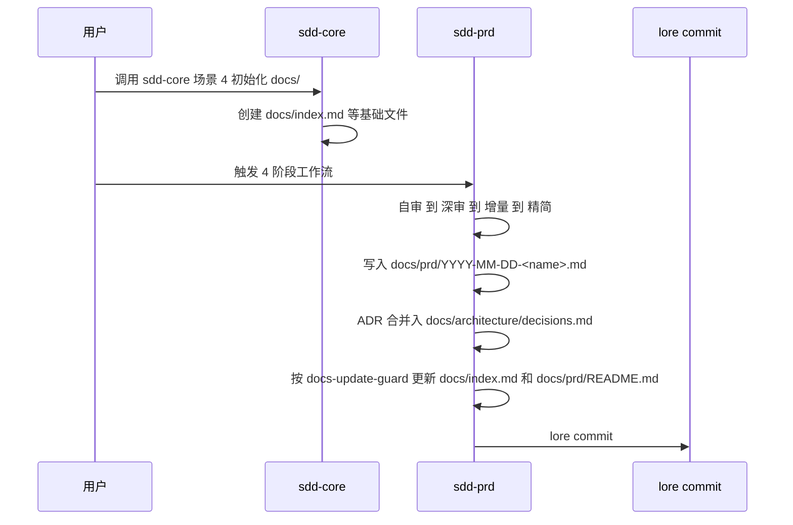
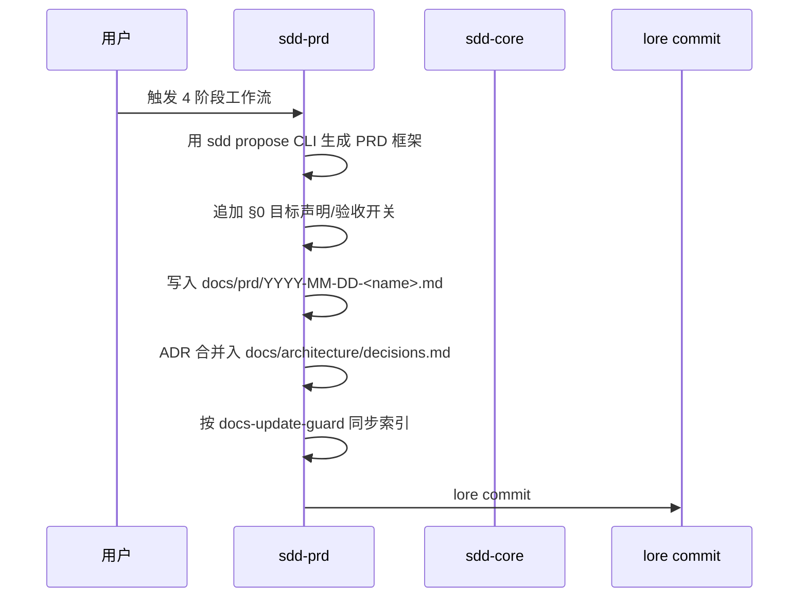
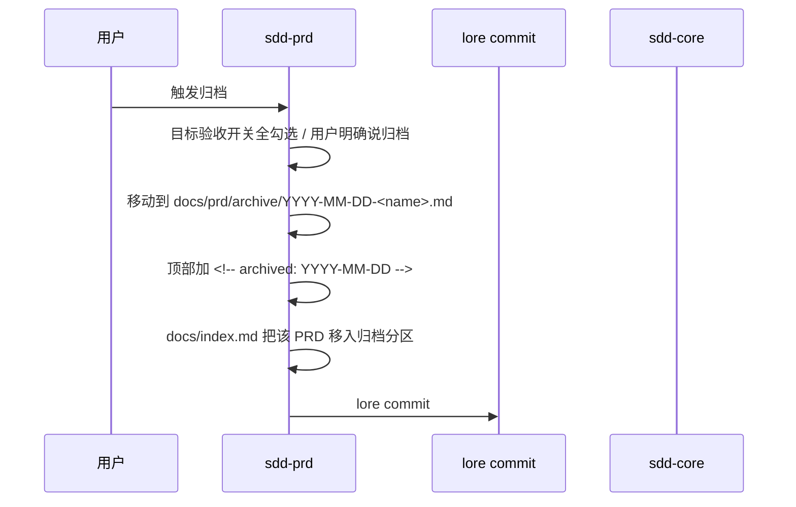

# 与 sdd-core 的协作边界(sdd-prd 必读)

> 本文件是 sdd-prd 与 sdd-core 协作的**唯一权威说明**。
> 任何对 sdd-core 与 sdd-prd 边界的疑问,先查本文件。

---

## 1. 角色定位

| 技能                | 角色                     | 管什么                                                           |
| ------------------- | ------------------------ | ---------------------------------------------------------------- |
| **sdd-core**        | 软件开发文档体系管理者   | `docs/` 整个目录结构、命名规范、必填章节、状态机、索引、提交协议 |
| **sdd-prd**(本技能) | sdd-core 的 PRD 编写辅助 | 单一 PRD 的 4 阶段质量审视 + 目标驱动归档                        |

**核心边界**:sdd-prd 是 sdd-core 的**子集**——只做 PRD,不做 Phase / Architecture 总览 / Reference；新增或归档 PRD 时按 sdd-core 规则同步必要索引。

---

## 2. 文件级边界(权威清单)

| 路径                            | sdd-core 管            | sdd-prd 管               | 备注                                    |
| ------------------------------- | ---------------------- | ------------------------ | --------------------------------------- |
| `docs/index.md`                 | **sdd-core 管**        | **同步必要条目**         | 无自动 guard 时,sdd-prd 阶段 4 直接同步 |
| `docs/CONTRIBUTING.md`          | **sdd-core 管**        | **不写**                 | sdd-core 维护                           |
| `docs/prd/YYYY-MM-DD-<name>.md` | **命名/规范**          | **内容(本技能唯一交付)** | sdd-prd 唯一交付                        |
| `docs/prd/.working/...`         | **不主动建**           | **sdd-prd 管**           | sdd-prd 阶段 1-3 工作产物,阶段 4 后清理 |
| `docs/prd/archive/...`          | **不主动建**           | **sdd-prd 管**           | sdd-prd 独家归档区                      |
| `docs/prd/README.md`            | **sdd-core 管**        | **同步必要条目**         | 若存在,与 PRD 新增/归档同次提交         |
| `docs/phase/...`                | **sdd-core 管**        | **不写**                 | sdd-core 管,其他技能(phase-\*)写        |
| `docs/architecture/overview.md` | **sdd-core 管**        | **不写**                 | sdd-core 场景 4 初始化                  |
| `docs/architecture/<topic>.md`  | **命名/规范**          | **`decisions.md` 内容**  | sdd-prd 写 ADR 集                       |
| `docs/reference/...`            | **sdd-core 管**        | **不写**                 | sdd-core 管外部资料                     |

---

## 3. 章节级边界(PRD 内容)

PRD 由 sdd-prd 写,但**必填章节**对齐 sdd-core conventions §3.1:

| 章节                    | 强制级别           | 来源          | sdd-prd 适配               |
| ----------------------- | ------------------ | ------------- | -------------------------- |
| §0 目标声明             | sdd-prd 必填       | sdd-prd 独家  | 归档触发器                 |
| §0 目标验收开关         | sdd-prd 必填       | sdd-prd 独家  | 归档触发器                 |
| §1 背景与目标           | sdd-core §3.1 必填 | sdd-core 强制 | 保持原样                   |
| §2 用户与场景           | sdd-core §3.1 必填 | sdd-core 强制 | 保持原样                   |
| §3 功能需求             | sdd-core §3.1 必填 | sdd-core 强制 | sdd-prd 强化业务规则显性化 |
| §4 非功能需求           | sdd-core §3.1 必填 | sdd-core 强制 | sdd-prd 归入 P0 约束       |
| §5 验收标准             | sdd-core §3.1 必填 | sdd-core 强制 | 保持原样                   |
| §6+ 数据/界面/集成/风险 | sdd-core §3.2 可选 | sdd-core 可选 | 按需                       |
| 顶部 `> 状态:`          | sdd-core §3.4 必填 | sdd-core 强制 | sdd-prd 保持               |
| 顶部 `> 对应阶段:`      | sdd-core §3.3 必填 | sdd-core 强制 | sdd-prd 写 **TBD 占位**    |

**关键**:

- §0 是 sdd-prd 独家,放在 sdd-core 强制 §1 之前,作为"目标驱动"信号
- `> 对应阶段:` 留 TBD 占位(因为 sdd-prd 不写 Phase)
- 完整 PRD 模板见 `templates/prd-outline-template.md`

---

## 4. 命名规范(继承 sdd-core §2.1)

PRD 命名:`docs/prd/YYYY-MM-DD-<prd-name>.md`

| 规则     | 示例                                 |
| -------- | ------------------------------------ |
| **正确** | `2026-06-23-user-authentication.md`  |
| **错误** | `PRD-001.md`(无日期)                 |
| **错误** | `2026-6-23-user-auth.md`(日期格式错) |
| **错误** | `User_Auth.md`(下划线大写)           |

ADR 命名(归入 `docs/architecture/decisions.md`):每条 ADR 编号 `ADR-001`、`ADR-002`、...

---

## 5. 提交协议(继承 sdd-core)

**所有变更必须走 `lore commit`**,使用 sdd-core 标准 JSON trailer(参考 sdd-core SKILL.md L96-107):

```json
{
  "intent": "提纯 {spec-name} 为 PRD v1.0",
  "body": "...",
  "trailers": {
    "Constraint": ["..."],
    "Rejected": ["..."],
    "Directive": ["..."],
    "Confidence": "high|medium|low",
    "Tested": ["..."],
    "Not-tested": ["..."]
  }
}
```

**禁止**:`git commit` 直接提交(由 `rule://lore-commit-guard` 拦截)。

---

## 6. 触发条件(sdd-prd vs sdd-core)

| 用户表达            | 触发 sdd-core            | 触发 sdd-prd                    |
| ------------------- | ------------------------ | ------------------------------- |
| "初始化 docs"       | **触发**                 | **不触发**                      |
| "创建新 PRD"        | **场景 1**(直接模板填充) | **触发**(需要 4 阶段质量审视时) |
| "从 spec 写 PRD"    | **不触发**               | **触发**                        |
| "审视 spec"         | **不触发**               | **触发**                        |
| "评审 PRD"          | **不触发**               | **触发**                        |
| "归档 PRD"          | **不触发**               | **触发**(目标驱动归档)          |
| "更新 architecture" | **触发**(场景 2)         | **不触发**                      |
| "添加 reference"    | **触发**(场景 3)         | **不触发**                      |
| "写 phase"          | **不触发**(其他技能负责) | **不触发**                      |

**判断规则**:

- 用户说"初始化/创建/管理文档体系" → sdd-core
- 用户说"审视/提纯/写 PRD/评审 PRD/归档" → sdd-prd
- 用户说"phase/architecture/reference" → sdd-core(对 architecture/reference)或留 TBD(对 phase)

---

## 7. 调用顺序(典型场景)



### 场景 B:已有 sdd-core 体系,新增 PRD





---

## 8. sdd-prd 的"越界"与"不越界"

### sdd-prd 允许做的事

- 写 `docs/prd/YYYY-MM-DD-<name>.md` 内容
- 写 `docs/architecture/decisions.md`(ADR 集追加)
- 创建 `docs/prd/.working/` 临时工作目录
- 创建 `docs/prd/archive/` 归档目录
- 创建 `docs/architecture/api-reference.md` 等(API Schema 实施文档)
- 同步 `docs/index.md` 和 `docs/prd/README.md` 中与本 PRD 直接相关的条目
- 触发 lore commit

### sdd-prd 禁止做的事

- 写 `docs/CONTRIBUTING.md`(由 sdd-core 维护)
- 写 `docs/phase/...`(其他技能负责)
- 写 `docs/architecture/overview.md`(sdd-core 场景 4 初始化)
- 写 `docs/reference/...`(sdd-core 管外部资料,sdd-prd 不放实施文档)
- 跳过 lore commit 直接 `git commit`

---

## 9. 边界冲突的处理

如果 sdd-prd 与 sdd-core 在某点上**似乎**冲突:

1. **先查本文件**——大多数冲突本文件已明确说明
2. **查 sdd-core SKILL.md / conventions.md**——确认 sdd-core 实际约束
3. **查 docs-update-guard**——确认提交时 doc 更新规则
4. **如果仍然模糊**——停手,向用户说明冲突点,请求决策

**禁止**:在模糊时单方面决策、编造规则、或破坏 sdd-core 现有约束。

---

## 10. 与 docs-update-guard 的配合

`docs-update-guard` 在 `git commit` / `lore commit` 前拦截(条件 L3)。

sdd-prd 的所有提交都触发此规则:

- sdd-prd 自检:本次提交是否含 PRD 变更?
- 若含 → 已在 sdd-prd 工作流中处理(4 阶段 + 归档)
- 若无 → 提交可能不该发生(sdd-prd 不该产生非 PRD 变更)

**操作建议**:

- 触发 sdd-prd 时,先确认 commit 内容是 PRD 相关
- 如果 commit 同时含代码变更,先按 docs-update-guard 检查 doc 更新
- 详见 `rule://docs-update-guard`

---

## 11. 总结:一句话边界

> **sdd-core 是文档体系的地基,sdd-prd 是地基上"单一 PRD 质量审视"的工具。**
> sdd-prd 不替代 sdd-core,不与 sdd-core 平行,不重复 sdd-core 的约束。
> 当你不确定一个动作归谁——查本文件,查 sdd-core,然后才动手。
