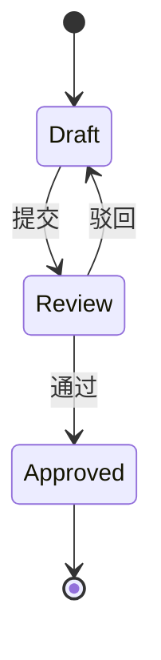

# PRD 大纲(sdd-prd 阶段 4 产物 · 目标驱动 + sdd-core 合规)

> 本模板是 sdd-prd 的 PRD 最终交付结构,目标是**与 sdd-core 文档体系完全兼容**。
> 顶部 §0 是 sdd-prd 独家(归档触发器);§1-§5 对齐 sdd-core conventions §3.1 的 5 必填章节;§6+ 是 sdd-core §3.2 可选章节。
> PRD 写入 `docs/prd/YYYY-MM-DD-<name>.md`,命名遵循 sdd-core §2.1。

---

## 模板使用优先级

1. **优先**:`docs/prd/_template.md`(项目团队确认的版本)
2. **Fallback**:`sdd-core/references/templates.md` §1(sdd-core 内置 PRD 模板)
3. **本技能模板**:本文件(sdd-prd 内置,已含 §0 目标声明/验收开关)

**实际操作**:

- 读项目内或 sdd-core 内置模板作基础
- 在 `> 对应阶段:` 行后**追加** §0 目标声明 + §0 目标验收开关 两章节
- 其余章节保持原样

---

## PRD 完整模板

````markdown
<!-- 如果归档,改为: archived: YYYY-MM-DD -->
<!-- 如果替换,改为: superseded-by: YYYY-MM-DD-{new-prd-name} -->
<!-- 如果废弃,改为: abandoned: YYYY-MM-DD reason=... -->

# {产品/功能名} PRD v{版本号}

> 状态:草稿 | 待评审 | 已评审 | 已规划任务 | 进行中 | 已归档(ADR-016 6 PrdStatus + 2 ArchiveReason)
> 归档日期:{YYYY-MM-DD,未归档填 "—"}
> 修改记录:执行 `lore log docs/prd/<filename>.md`
> 对应阶段: [TBD - 由其他技能补全](../phase/YYYY-MM-DD-<phase-name>.md)

---

## 0. 目标声明与验收开关(sdd-prd 必填 · 归档触发器)

> **本节是归档触发器**——agent 加载 PRD 时必读。
> 目标达成后,本节验收开关全部勾选,触发归档流程。
> 详见 `references/archival-mechanism.md`。

### 0.1 目标陈述

> 这份 PRD 是为达成**{具体目标}**而存在。
>
> **目标达成时间窗口**:{YYYY-MM-DD 之前 / 启动后 N 周}
> **目标达成的判定**:见下方验收开关

{一两句话说清"目标是什么、为何重要、何时达成"}

### 0.2 业务验收开关

- [ ] {业务目标 1 — 可观察的判定}
- [ ] {业务目标 2}
- [ ] ...
- [ ] {业务目标 N}

### 0.3 技术验收开关

- [ ] {技术目标 1 — 可测试的判定}
- [ ] {技术目标 2}
- [ ] ...
- [ ] {技术目标 N}

### 0.4 归档条件

> 业务验收开关 + 技术验收开关**全部勾选** = 可触发归档(可按目标维度分项勾选)。
> 归档流程见 `references/archival-mechanism.md`。

---

## 1. 背景与目标(sdd-core §3.1 必填)

### 1.1 业务背景

[描述业务场景、痛点、机会]

### 1.2 产品目标

[明确、可衡量的目标,例如:提升 XX 效率 30%]

### 1.3 成功指标

- 指标 1:[具体数值或描述]
- 指标 2:[具体数值或描述]

---

## 2. 用户与场景(sdd-core §3.1 必填)

### 2.1 目标用户

| 用户角色 | 描述   | 核心诉求 |
| -------- | ------ | -------- |
| [角色 1] | [描述] | [诉求]   |
| [角色 2] | [描述] | [诉求]   |

### 2.2 使用场景

[描述典型使用场景,可配合流程图]

---

## 3. 功能需求(sdd-core §3.1 必填)

### 3.1 功能清单

| 功能模块 | 功能点     | 优先级   | 说明       |
| -------- | ---------- | -------- | ---------- |
| [模块 1] | [功能点 1] | P0/P1/P2 | [简要说明] |

### 3.2 详细功能描述

#### 3.2.1 [功能点 1]

**功能说明**:[详细描述]
**输入/前置条件**:[条件 1, 条件 2]
**处理逻辑**:[步骤 1, 步骤 2]
**输出/后置条件**:[结果 1, 结果 2]
**异常处理**:[异常 1 → 处理方式]

### 3.3 业务规则显性化(sdd-prd 强化)

任选一种形式表达关键业务规则(状态机 / 权限矩阵 / 计算公式 / 配额表):


````

---

## 4. 非功能需求(sdd-core §3.1 必填 + sdd-prd 阶段 3 约束归入处)

### 4.1 性能要求

- 响应时间:[具体要求,如 P99 ≤ 200ms]
- 并发用户数:[具体要求]
- 数据处理量:[具体要求]
- **SLO 阈值**:[可用性 ≥ 99.9%, 错误率 ≤ 0.1%]

### 4.2 安全要求

- 认证方式:[具体方式]
- 权限控制:[具体策略,RBAC/ABAC]
- 数据加密:[具体要求,静态/传输]
- **数据分级与脱敏**:[敏感字段识别、加密、脱敏规则]

### 4.3 可用性要求

- 可用性目标:[如 99.9%]
- 备份策略:[具体策略]
- 灾难恢复:[具体方案]
- **审计与合规边界**:[审计日志保留期,GDPR/等保/PCI 适用性]

### 4.4 约束归入(阶段 3 产物)

[此处并入阶段 3 约束集的内容——P0 约束按"必须/禁止/优先"格式呈现,带理由]

#### P0 约束(不做就阻塞)

| 卡点        | 约束                                          | 理由   |
| ----------- | --------------------------------------------- | ------ |
| [i18n 存储] | **必须**:JSON 字段存储;**优先**:嵌套 fallback | [理由] |
| [并发编辑]  | **必须**:乐观锁;**禁止**:悲观锁               | [理由] |
| [权限模型]  | **必须**:RBAC;**禁止**:硬编码权限             | [理由] |

#### P1 约束(早期做)

| 卡点       | 约束                                       | 理由   |
| ---------- | ------------------------------------------ | ------ |
| [错误码]   | **必须**:`DOMAIN_CODE` 格式                | [理由] |
| [API 版本] | **必须**:URL 路径版本;**禁止**:Header 版本 | [理由] |

#### P2 约束(可推迟)

[内容或留空,见附录]

---

## 5. 验收标准(sdd-core §3.1 必填)

### 5.1 功能验收

- [ ] [验收项 1]
- [ ] [验收项 2]

### 5.2 非功能验收

- [ ] [性能验收标准]
- [ ] [安全验收标准]
- [ ] [SLO 验收:可用性 ≥ 99.9%]

### 5.3 业务规则验收

- [ ] [状态机各状态可正常流转]
- [ ] [权限矩阵覆盖所有角色]

---

## 6. 数据需求(sdd-core §3.2 可选)

### 6.1 数据模型

[描述核心数据实体及关系,可配合 ER 图]

### 6.2 数据迁移

[如涉及数据迁移,描述迁移策略]

---

## 7. 界面需求(sdd-core §3.2 可选)

### 7.1 页面结构

[描述页面层级和导航结构]

### 7.2 关键页面

[描述关键页面的布局、交互,可附线框图]

---

## 8. 集成需求(sdd-core §3.2 可选)

### 8.1 内部系统集成

| 系统名称 | 集成方式        | 数据流向    | 说明   |
| -------- | --------------- | ----------- | ------ |
| [系统 1] | [API/消息/文件] | [双向/单向] | [说明] |

### 8.2 外部系统集成

[如有外部系统集成需求,描述集成方式]

---

## 9. 风险与约束(sdd-core §3.2 可选)

### 9.1 已知风险

| 风险     | 影响       | 概率       | 应对措施 |
| -------- | ---------- | ---------- | -------- |
| [风险 1] | [高/中/低] | [高/中/低] | [措施]   |

### 9.2 假设清单(sdd-prd 强化)

| 假设     | 若不成立 → 影响 | 兜底方案 |
| -------- | --------------- | -------- |
| [假设 1] | [影响]          | [方案]   |
| [假设 2] | [影响]          | [方案]   |

### 9.3 约束条件

- [约束 1]
- [约束 2]

---

## 10. 上线计划(sdd-core §3.2 可选)

### 10.1 上线时间

- 计划上线日期:[日期]
- 灰度发布计划:[计划]

### 10.2 上线前准备

- [ ] [准备项 1]
- [ ] [准备项 2]

---

## 11. 附录

### 11.1 ADR 引用

[关键决策引用 `docs/architecture/decisions.md` 的对应 ADR]

- 决策:用 Vite + React Router(ADR-001)
- 决策:用 PostgreSQL FTS 而非 Elasticsearch(ADR-002)
- 完整 ADR 集 → `docs/architecture/decisions.md`

### 11.2 参考资料

- [完整 API Schema] → `docs/architecture/api-reference.md`
- [完整配置说明] → `docs/architecture/config-reference.md`
- [完整部署脚本] → `docs/architecture/deployment-guide.md`
- [sdd-core 规范] → `sdd-core/references/conventions.md`
- [sdd-core 模板] → `sdd-core/references/templates.md` §1

### 11.3 术语表

| 术语     | 定义   |
| -------- | ------ |
| [术语 1] | [定义] |

```

---

## 精简检查清单

### 删除 4 类内容

- [ ] **具体代码** 已移?完整 Schema → `docs/architecture/api-reference.md`;配置文件 → `docs/architecture/config-reference.md`;部署脚本 → `docs/architecture/deployment-guide.md`
- [ ] **决策过程** 已移?"为什么选 A 不选 B"的推演 → `docs/architecture/decisions.md`;PRD 正文只写结论"用什么"
- [ ] **重复内容** 已消?同一信息出现多次时,只留最权威那处,其余用引用("参见 §X"或"详见 `docs/architecture/decisions.md#ADR-003`")
- [ ] **过时引用** 已清?`grep` 整个 workspace,确认所有交叉引用都有目标

### 子代理审查清单(5 项)

- [ ] 内部一致性:PRD 各章节说的是一回事吗?
- [ ] 过时引用:`grep -rn "见 §\|参见\|refer to" .` 所有目标都存在吗?
- [ ] 产物完整性:阶段 1/2/3 的所有产物都已整合进最终 PRD 吗?
- [ ] 信号噪声比:每段话删掉一半还能表达同样意思吗?能删的再删一轮
- [ ] **sdd-core 一致性**:
  - 命名符合 sdd-core §2.1:`YYYY-MM-DD-<name>.md`?
  - 顶部 `> 对应阶段:` 行存在(占位 TBD 可接受)?
  - 5 必填章节(§1-§5)齐备?
  - 状态字段 `> 状态:` 存在?

### 提交前检查

- [ ] **PRD 顶部有"目标声明"和"目标验收开关"**(归档触发器)
- [ ] **PRD 顶部有"对应阶段: [TBD]"占位行**(sdd-core §3.3 合规)
- [ ] **工作产物已清理**:`docs/prd/.working/<name>/` 已删除
- [ ] **ADR 已合并**:`docs/architecture/decisions.md` 已包含本 PRD 的所有 ADR
- [ ] **单次 lore commit**——"PRD 全面定型"是完整事件,不拆成多个小提交
- [ ] lore commit `intent` 写 WHY(意图)不写 WHAT(diff 已展示)

### 归档前自检

- [ ] 业务验收开关全部勾选(或目标替换)
- [ ] 技术验收开关全部勾选(或目标替换)
- [ ] 移动→ `docs/prd/archive/YYYY-MM-DD-<prd-name>.md`(物理移动,不是原地加标志)
- [ ] 顶部加 `<!-- archived: YYYY-MM-DD -->` HTML 注释
- [ ] 触发 sdd-core 同步 `docs/index.md`(通过 lore commit trailer)
- [ ] 用户确认归档
```
